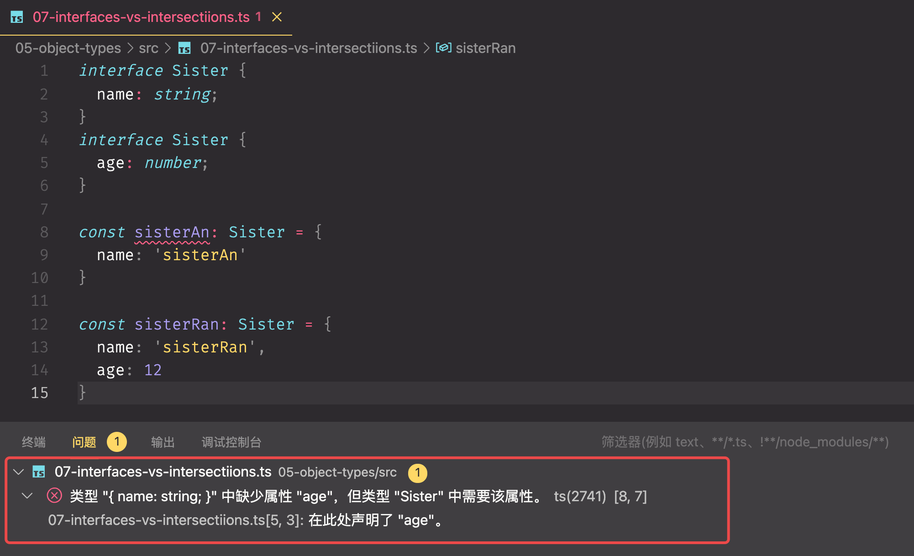
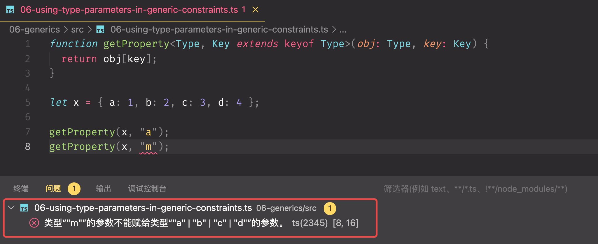

[toc]


**课程出自：千锋大前端教研院**
**主讲：古艺散人**
**公众号：大前端私房菜——回复“ts资料”领取相关学习资料**


# 〇、课程介绍

# 基础篇

# 一、TypeScript介绍

## 1.1 什么是TypeScript

在引入编程社区 20 多年后，JavaScript 现在已成为有史以来应用最广泛的跨平台语言之一。JavaScript 最初是一种用于向网页添加微不足道的交互性的小型脚本语言，现已发展成为各种规模的前端和后端应用程序的首选语言。虽然用 JavaScript 编写的程序的大小、范围和复杂性呈指数级增长，但 JavaScript 语言表达不同代码单元之间关系的能力却没有。结合 JavaScript 相当奇特的运行时语义，语言和程序复杂性之间的这种不匹配使得 JavaScript 开发成为一项难以大规模管理的任务。

程序员编写的最常见的错误类型可以描述为类型错误：在预期不同类型的值的地方使用了某种类型的值。这可能是由于简单的拼写错误、无法理解库的 API 表面、对运行时行为的错误假设或其他错误。TypeScript 的目标是成为 JavaScript 程序的静态类型检查器——换句话说，是一个在代码运行之前运行的工具（静态）并确保程序的类型正确（类型检查）。

TypeScript 是一种由微软开发的自由和开源的编程语言。它是 JavaScript 的一个超集，而且本质上向这个语言添加了可选的静态类型和基于类的面向对象编程。

TypeScript 是一种非常受欢迎的 JavaScript 语言扩展。它在现有的 JavaScript 语法之上加入了一层类型层，而这一层即使被删除，也丝毫不会影响运行时的原有表现。许多人认为 TypeScript "只是一个编译器"，但更好的理解其实是把 TypeScript 看作两个独立的系统：编译器（即处理语法的部分）和语言工具（即处理与编辑器集成的部分）。通过独立看待这两个系统，就可以得到能够解释我们之前所做决策的两个重要视角。

在 **npm**[3] 上，TypeScript 的下载量每年都在翻倍。截止2021 年 12 月 1 日，它的每周下载量超过为 2200 万次。而在去年 12 月，这一数字约为 1200 万次。它仍保持着高速增长的趋势，没有任何放缓的迹象。

从 2.0 版本开始，TypeScript 每两月定期发布一个 release。但是现在放缓了发布的节奏，改为每三个月发布一次。其中会花一个月编写新 features 并发布 beta 版本，剩下两个月对 beta 版进行测试和 bug 修复，这使得后续的发布更加稳定。

## 1.2 `JS`,`ES`,`TS`的关系

- **1995年：JavaScript**

当时的网景公司正凭借其Navigator浏览器成为Web时代开启时最著名的第一代互联网公司。

由于网景公司希望能在静态HTML页面上添加一些动态效果，于是 `Brendan Eich` 在两周之内设计出了JavaScript语言。

为什么起名叫JavaScript？原因是当时Java语言非常红火，所以网景公司希望借Java的名气来推广，但事实上JavaScript除了语法上有点像Java，其他部分基本上没啥关系。

- **1997年：ECMAScript**

因为网景开发了JavaScript，一年后微软又模仿JavaScript开发了JScript，为了让JavaScript成为全球标准，几个公司联合ECMA（European Computer Manufacturers Association）（欧洲计算机制造商协会）组织制定了JavaScript 语言的标准，被称为ECMAScript标准。

| 版本   | 发布时间       | 一般称呼        | 简称 |
| ------ | -------------- | --------------- | ---- |
| 第1版  | 1997年6月      | ECMAScript 1    | ES1  |
| 第2版  | 1998年4月      | ECMAScript 2    | ES2  |
| 第3版  | 1999年12月     | ECMAScript 3    | ES3  |
| 第4版  | 2007年10月草案 | ECMAScript 4    | ES4  |
| 第5版  | 2009年12月     | ECMAScript 5    | ES5  |
| 第6版  | 2015年6月      | ECMAScript 2015 | ES6  |
| 第7版  | 2016年6月      | ECMAScript 2016 | ES7  |
| 第8版  | 2017年6月      | ECMAScript 2017 | ES8  |
| 第9版  | 2018年6月      | ECMAScript 2018 | ES9  |
| 第10版 | 2019年6月      | ECMAScript 2019 | ES10 |
| 第11版 | 2020年6月      | ECMAScript 2020 | ES11 |
| 第12版 | 2021年6月      | ECMAScript 2021 | ES12 |

- **2015年：TypeScript**

TypeScript 是 JavaScript 的超集，即包含JavaScript 的所有元素，能运行JavaScript 的代码，并扩展了JavaScript 的语法。相比于JavaScript ，它还增加了静态类型、类、模块、接口和类型注解方面的功能，更易于大项目的开发。

TypeScript 提供最新的和不断发展的 JavaScript 特性，包括那些来自 2015 年的 ECMAScript 和未来的提案中的特性，比如异步功能和 Decorators，以帮助建立健壮的组件。下图显示了 TypeScript 与 ES5、ES2015+ 之间的关系：


## 1.3 TypeScript 与 JavaScript 的区别

| TypeScript                                     | JavaScript                                 |
| ---------------------------------------------- | ------------------------------------------ |
| JavaScript 的超集用于解决大型项目的代码复杂性  | 一种脚本语言，用于创建动态网页             |
| 可以在编译期间发现并纠正错误                   | 作为一种解释型语言，只能在运行时发现错误   |
| 强类型，支持静态和动态类型                     | 弱类型，没有静态类型选项                   |
| 最终被编译成 JavaScript 代码，使浏览器可以理解 | 可以直接在浏览器中使用                     |
| 支持模块、泛型和接口                           | 不支持模块、泛型或接口                     |
| 支持 ES3，ES4，ES5 和 ES6+功能                 | 不支持编译其他 ES3，ES4，ES5 或 ES6+ 功能  |
| 社区的支持仍在增长，而且还不是很大             | 大量的社区支持以及大量文档和解决问题的支持 |

## 1.4 TypeScript 的竞争者有哪些？

TypeScript 的目标是为人们提供编写大型 JavaScript 项目并对后期维护有信心的工具。JavaScript 本身没有的语法支持表示每个标识符的类型，除非运行 JavaScript 并在运行时进行检测。为了解决这个问题，TypeScript 添加了额外的语法。

所以，如果说我们的目标是作为工具提供支持，那么在这个领域有少数几个竞争者是 TypeScript 无法与之竞争的：

- ESLint 和 TSLint：与 TypeScript 的定位相同，它们都是用来突出代码中可能出现的错误，只是没有为检查过程添加新的语法。两者都不打算作为 IDE 集成的工具运行，而且 TS 和 TS/ESLint 经常会说那些对项目没有意义的特性“是对方的领域”。在现代代码中，TS/ESLint 的存在使得 TypeScript 可以做更少的检查，这些检查并不适用于所有代码库。虽然有一些功能重叠了，但可以把它们作为很好的补充工具。
- CoffeeScript：嘿，TypeScript 是 2012 年发布的！CoffeeScript 和 TypeScript 的区别在于 CoffeeScript 想要改进 JavaScript 语言，比如给 JavaScript 添加一些特性。这意味着要了解 CoffeeScript 与其输出的 JavaScript 的区别。随着时间推移，CoffeeScript 的最佳理念反而将其变成了另一个 JavaScript，人们为几乎成为了 JavaScript 的 CoffeeScript 感到困扰。
- Flow：这是 Facebook 的 JavaScript 类型检查工具和 IDE 工具语言。就像 TypeScript 一样，Flow 为 JavaScript 添加了一些额外的语法支持，让你拥有了一个更加丰富的类型系统，然后在编译时再将其删除。当我刚开始写 JavaScript 时，Flow 是我最先使用的工具，因为它更接近标准的 JavaScript。Flow 是一个很棒的类型系统，它与 TypeScript 有着不同的目标。任何看不见的类型层系统都必须不断做出“正确”或者“感觉足够正确”的决定，Flow 的目标是“正确”（译者注：Flow 偏向于 **soundness**[6]，在类型判断中更加悲观），而 TypeScript 的目标是“感觉上大部分情况都是正确的”（译者注：而 TS 官方声称 **TS 不是类型完备的**[7]，允许 unsound 行为，偏向于 completeness，在类型判断中更加乐观）。鱼和熊掌不可兼得，完备的类型推导、良好的开发体验和完美的 JS 协同（Perfect JavaScript Interop）只能取其二。

那么，为什么大多数开源 Flow 代码库最终都迁移到了 TypeScript 呢？在我看来，很大程度上是由两个团队不同的侧重点决定。Flow 是为了维护 Facebook 的代码库而建立的，而 TypeScript 是作为一种独立的语言建立的。这里有两个证据可以证明：

1. Facebook 的代码库是一个不能被分割的巨大的 monorepo，而 Flow 团队为了使类型运行在这样的**大代码库**[8]下做了**大量令人难以置信的工作**[9]。另一方面，TypeScript 可以说是“为构建小代码库服务（use projects to make sets of smaller codebases）”，因为这符合人们在开源社区中编写 JavaScript 模块的方式。我认为这么说很合理，TypeScript 不能像 Flow 一样运行在 Facebook 的代码库上，它要么需要大量重写 Facebook 的代码来构建项目，要么需要对 TypeScript 进行大量修改，这可能会影响到 TypeScript 整体开发者的体验。
2. 对比 DefinitelyTyped 和 Flow 对类型的做法，TypeScript 团队会轮值一名编译器工程师为 DefinitelyTyped 支持我们的构建工具，并帮助管理社区。而 Flow，它几乎完全由社区维护。DT 现在规模更大了，因为它们一直致力于非 Facebook 代码的开发，这将很难获得 Flow 团队的资金支持。

微软给 TypeScript 在内部创造的独立环境让它可以自由专注于工具开发和整个生态系统的维护，而不是只专注于解决某个特别困难的问题。这让 TypeScript 团队能够与许多人合作，不断发布社区想要的功能。随着时间的推移，我猜想因为外部的需求增长放缓，Flow 团队越来越难为社区工作分配时间。这就形成了一个恶性循环。这使得 Flow 今天不再是 TypeScript 的直接“竞争者”，而是一个关于如何从不同的角度，使用不同的约束去解决类似的问题的有趣视角。

## 1.5 TypeScript的未来

### 1.5.1 **对 TypeScript 的未来怎么看？**

目前阻碍人们使用 TypeScript 的最大障碍是它需要构建工具。我认为类型语法不太可能被加入 JavaScript 中，但是在 JavaScript 中“用注释的方式定义类型”的可能性非常大。

这个想法是为 TypeScript 这样的类型系统创建一套语法，但是不定义 JS 运行时会发生什么。

```tsx
const a: string = "1234"

// 将会变成这样
const a/*: string */ = "1234"

// 传入 JS 引擎
```

在这个例子中，JS 引擎会知道 : string 是一个类型注释，在 = 处结尾。这实际的工作方式是复杂的，需要时间来弄清楚。然而，让 TypeScript 能在 JavaScript 中“原生地”运行将降低它被使用的障碍。它会像 Babel 添加 TypeScript 支持时一样对 TypeScript 施加一些约束。但我觉得这是值得的。

Deno 是一个消除所有 TS 障碍的关键例子，它通过运行一个 Rust 编写的工具，能够非常快速地将 TS 编译到 JS，模拟了当前 JavaScript 引擎对原生 TypeScript 的支持。

### 1.5.2 如今的竞争者

- JetBrains WebStorm - 这是一个有高级 JavaScript 工具支持的 IDE。他们有自己的引擎用于重构、代码流分析并对 JavaScript 语法进行检查。这很好，JetBrains 在他们所有的 IDE 上都做了扎实的工作。我过去经常使用 AppCode 处理 iOS 的工作。当你有一个 TypeScript 项目时，WebStorm 会将 TypeScript 的语言工具和自己的工具混合在一起，这对你来说是双赢的。
- 编译到 JS 的语言 - 目前的例子有 Elm，ReScript，KotlinScript，这些语言的核心目标是与 JavaScript 交互。对于 TypeScript 来说，这些都是很有趣的语言，它们有一个干净的环境来实现类型系统 —— 也就是，没有 JS 包袱。作为竞争对手，它们倾向于更细分的市场，因为它们的核心不是 JavaScript ，并且社区也被从 CoffeeScript 迁移所困扰过。
- WASM - 我听到 WASM 作为 TypeScript 竞争者的观点是，WASM 可以作为语言取代 JS 控制浏览器 DOM。反对这一观点的人普遍认为，WASM 没有 DOM 绑定，而且可能永远不会有。TypeScript 包含了 JavaScript 的缺点，如果你在 JavaScript 运行时中加入过 WASM 的话，你几乎总是会更加喜欢它。也就是说，AssemblyScript 在这方面做了一些很好的工作。也许把 WASM 想成 JSON 会更好，它是另一个组成项目的工具，不太可能成为 JavaScript 的竞争者，除非 WASM 和 DOM 的交互方式有所改变。
- 编译到 WASM 的语言 - 比如 Rust，Go，Swift，等其它可以编译到 WASM 的语言。这些语言都可能占据 TypeScript 目前作为工具和 web 核心构建模块的位置，不过世事难料，谁知道会怎么样呢？这些语言能够提供各种不同的基本类型，并且基于不同的目标从头构建。如果 WASM 和 WASI 最终获得成功，那么我认为将会与平台相关（想想 apps 等功能实现），看看它们的发展方向会很有趣。说心里话，它们不会是 TypeScript 的竞争者，而是 JavaScript 的。

### 1.5.3 TypeScript 怎么看它在生态中的位置？

TypeScript 希望在类型系统和编辑器工具领域进行创新。我们拥有在主流编程语言中表达能力最强的类型系统之一。

TypeScript 最初被创建时，对 JavaScript 进行修改的流程和现在非常不同，所以 TypeScript 中有一些特性实际上是 TC39 的领域，但仍然需要向后兼容。这些特性可能在 JavaScript 中存在很多年，并且经过了多次迭代，这意味着 TypeScript 必须维护一个特定语言特性的两种版本。

所以我们的目标是成为 TC39 JavaScript 语言委员会的优秀成员，就编辑器支持的语言特性进行反馈，支持 TypeScript 用户想要看到的特性。通过这种协作方式，TC39 控制了 JavaScript，TypeScript 也支持他们。

### 1.5.4 TypeScript 怎么看它的受众？

TypeScript 的受众主要有:

- JavaScript 用户（作为语言工具）
- JS + JSDoc 用户（作为语言工具）
- TypeScript 用户（作为编译器，语言工具）
- TypeScript 严格模式（作为编译器，语言工具）

虽然项目使用 babel / swc / sucrase / esbuild 等工具构建时，tsc 是可选的，但是上面的几种受众仍然可以在每次或至少每两次 TS 版本发布中获得新特性（译者注：babel、esbuild 等会更新支持 TS 新特性。可能是 TS 团队直接去这些项目里做，也可能会在没有 tsc 的情况下为这些项目提供特性，比如通过 vscode。在 **TS roadmap**[10] 中可以了解更多发布计划）。

### 1.5.5 TypeScript 是如何跟踪 JS 生态的？

团队从以下几个方式听取反馈：

- GitHub issues 有持续不断的评论洪流
- 微软内部团队要求提供特性，或者要求我们帮忙调试他们缓慢的代码库
- 通过 Gitter 或者 TypeScript 社区的 Discord 与社区建立联系
- 通过微团的内部工具对想法 / 设计进行用户测试
- 与 VS Code 有着非常紧密的联系，许多语言工具的反馈都来自于他们
- 我们会阅读每一条 @ TypeScript 团队的推特
- 我们会跟踪迁移到 TypeScript 和从 TypeScript 迁走的博客文章
- 我们会跟踪行业调查和编程语言概述


# 二、TypeScript入门

## 2.1 发现问题

JavaScript 中的每个值都有一组行为，您可以通过运行不同的操作来观察。这听起来很抽象，我们来举一个简单的例子，考虑我们可能对名为`message`的变量运行的一些操作：

```js
// 在 'message' 上访问属性 'toLowerCase'，并调用它
message.toLowerCase();
// 调用 'message'
message();
```

如果我们分解它，第一行可运行的代码访问一个属性`toLowerCase`，然后调用它。第二个尝试 `message` 直接调用。

但是假设我们不知道`message`。这很常见——我们无法可靠地说出尝试运行任何这些代码会得到什么结果。每个操作的行为完全取决于我们最初给`message`的赋值。

- 可以调用`message`吗？
- 它有`toLowerCase`这个属性吗？
- 如果能，`toLowerCase`可以调用吗？
- 如果这两个值都是可调用的，它们返回什么？

这些问题的答案通常是我们在编写 JavaScript 时牢记在心的东西，我们必须希望所有细节都正确。

假设`message`按以下方式定义：

```js
const message = "Hello World!";
```

正如您可能猜到的，如果我们尝试运行`message.toLowerCase()`，我们只会得到相同的小写字符串。

那第二行代码呢？如果您熟悉 JavaScript，您就会知道这会失败并出现异常：

```shell
TypeError: message is not a function
```

如果我们能避免这样的错误，那就太好了。

当我们运行我们的代码时，我们的 JavaScript 运行时选择做什么的方式是通过确定值的*类型*——它具有什么样的行为和功能。这`TypeError`就是暗指的一部分- 它说字符串`"Hello World!"`不能作为函数调用。

对于某些值，例如基本类型`string`和`number`，我们可以在运行时使用`typeof`运算符识别它们的类型。但是对于函数之类的其他东西，没有相应的运行时机制来识别它们的类型。例如，考虑这个函数：

```js
function fn(x) {
  return x.flip();
}
```

我们可以通过阅读代码*观察*到这个函数只有在给定一个具有可调用`flip`属性的对象时才能工作，但是 JavaScript 并没有以我们可以在代码运行时检查的方式来显示这些信息。在纯 JavaScript 中，告诉`fn`特定值做什么的**唯一方法**是调用它并查看会发生什么。这种行为使得在运行之前很难预测代码会做什么，这意味着在编写代码时更难知道代码会做什么。

这样看来，*类型*是描述可以传递给`fn`哪些值会崩溃的概念。JavaScript 只真正提供*动态*类型——运行代码看看会发生什么。

另一种方法是使用*静态*类型系统*在*运行*之前*预测预期的代码。

## 2.2 **静态类型检查**

回想一下`TypeError`我们之前尝试将 `string`作为函数调用的情况。 *大多数人*不喜欢在运行他们的代码时出现任何类型的错误 - 这些被认为是错误！当我们编写新代码时，我们会尽量避免引入新的错误。

理想情况下，我们可以有一个工具来帮助我们*在*代码运行*之前*发现这些错误。这就是像 TypeScript 这样的静态类型检查器所做的。 *静态类型系统*描述了当我们运行程序时我们的值的形状和行为。像 TypeScript 这样的类型检查器，告诉我们什么时候事情可能会出轨。


在我们运行代码之前，使用 TypeScript 运行最后一个示例会给我们一条错误消息。

## 2.3 **非异常故障**

到目前为止，我们一直在讨论运行时错误——JavaScript 运行时告诉我们它认为某些东西是无意义的情况。出现这些情况是因为[ECMAScript 规范](https://tc39.github.io/ecma262/)明确说明了语言在遇到意外情况时应该如何表现。

例如，规范说尝试调用不可调用的东西应该抛出错误。也许这听起来像是“明显的行为”，但您可以想象访问对象上不存在的属性也应该抛出错误。相反，JavaScript 给了我们不同的行为并返回值`undefined`：

```js
const user = {
  name: "小千",
  age: 26,
};
user.location; // 返回 undefined
```

最终，静态类型系统要求必须调用哪些代码，应该在其系统中标记，即使它是不会立即抛出错误的“有效”JavaScript。比如：在 TypeScript 中，以下代码会产生关于`location`未定义的错误：


TypeScript 可以在我们的程序中捕获*很多*合法的错误。例如：

- 错别字


- 未调用的函数


- 或基本逻辑错误


## 2.4 **使用工具**

当我们在代码中出错时，TypeScript 可以捕获错误。这很好，但 TypeScript 也*可以首先*防止我们犯这些错误。

类型检查器有能力帮助我们来检查，诸如是否正在访问变量和其他属性的正确属性。一旦有了这些信息，它还可以开始*建议*您可能想要使用的属性。

这意味着当利用工具来编辑 TypeScript  代码，核心类型检查器可以在编辑器中键入代码时，提供错误消息和代码完成。这是我们在谈论 TypeScript 中的工具时经常提到的部分内容。


TypeScript 非常重视工具。支持 TypeScript 的编辑器可以提供“快速修复”以自动修复错误、重构以轻松重新组织代码的能力，以及用于跳转到变量定义或查找给定变量的所有引用的有用导航功能。所有这些都建立在类型检查器之上，并且是完全跨平台的，因此[您最喜欢的编辑器](https://github.com/Microsoft/TypeScript/wiki/TypeScript-Editor-Support)可能[具有可用的 TypeScript 支持](https://github.com/Microsoft/TypeScript/wiki/TypeScript-Editor-Support)。

## 2.5 `tsc`编译器

我们一直在谈论类型检查，但我们还没有使用我们的类型*检查器*。让我们认识一下我们的新朋友`tsc`TypeScript 编译器。首先，我们需要通过 npm 获取它。

```she
npm install -g typescript
```

这将全局安装 TypeScript 编译器。

现在让我们移动到一个空文件夹，并尝试编写我们的第一个 TypeScript 程序`hello.ts`：

**01-ts-basics/hello.ts**

```ts
// 你好，世界
console.log('Hello World')
```

注意这里没有多余的装饰；这个“hello world”程序看起来与您在 JavaScript 中为“hello world”程序编写的程序相同。现在让我们通过运行`tsc`由`typescript`包为我们打包编译它：

```shell
[felix] 01-ts-basics $ tsc hello.ts 
```

我们跑了`tsc`，什么也没发生！嗯，没有类型错误，所以我们没有在控制台中得到任何输出，因为没有什么可报告的。


但是再检查一下 - 我们得到了一些*文件*输出。如果我们查看当前目录，我们会发现有两个文件`hello.js`在`hello.ts`. 这是我们的`hello.ts`文件在`tsc` *编译*或*转换*为纯 JavaScript 文件后的输出。


如果我们检查`hello.js`，我们将看到 TypeScript 在处理`.ts`文件后吐出的内容：

```js
// 你好，世界
console.log('Hello World');
```

在这种情况下，TypeScript 几乎没有要转换的内容，因此它看起来与我们编写的内容相同。编译器会尝试编译出清晰可读的代码，看起来像一个人写的东西。注释也给我们保留下来。

如果我们*确实*引入了类型检查错误呢？让我们重写`hello.ts`：

```ts
function greet(person, date) {
  console.log(`Hello ${person}, today is ${date}!`);
}
 
greet("小千");
```

如果我们`tsc hello.ts`再次运行，我们在命令行上收到了错误！


TypeScript 告诉我们忘记将参数传递给`greet`函数，这是理所当然的。到目前为止，我们只编写了标准的 JavaScript，但是类型检查仍然能够发现我们代码的其他问题。感谢TypeScript！

## 2.6 发出错误

从上一个示例中，你可能没有注意到的一件事，就是是我们的`hello.js`文件再次更改。如果我们打开该文件，那么我们会看到内容仍然与我们的输入文件基本相同。

```js
// 你好，世界
console.log('Hello World');
function greet(person, date) {
    console.log("Hello " + person + ", today is " + date + "!");
}
greet("小千");
```

鉴于`tsc`报告了有关我们代码的错误这一事实，这可能有点令人惊讶，但这是基于 TypeScript 的核心价值观之一：大多数情况下，*你*会比 TypeScript 更了解发生了什么。

再回顾一下前面的内容，类型检查代码限制了我们可以运行的程序种类，因此需要权衡类型检查器认为可接受的类型。大多数情况下这没问题，但在某些情况下，这些检查会妨碍到我们。例如，想象自己将 JavaScript 代码迁移到 TypeScript 并引入类型检查错误。最终，你将开始为类型检查器进行代码清理，但原始 JavaScript 代码已经可以运行了！为什么非要将我们的JS代码转换为 TypeScript 代码，来去阻止运行它呢？

所以 TypeScript 默认不会妨碍我们代码的运行，因为这些JS在宿主环境里运行时没有问题的。当然，随着时间的推移，我们可能希望对错误更加防御，并使 TypeScript 的行为更加严格。在这种情况下，我们可以使用[`noEmitOnError`](https://www.typescriptlang.org/tsconfig#noEmitOnError)编译器选项。尝试更改我们的`hello.ts`文件，并`tsc`使用该选项重新编译：

```
tsc --noEmitOnError hello.ts
```


你会注意到`hello.js`永远不会更新。

## 2.7 显式类型

到现在为止，我们还没有告诉 typescript `person`或者`date`是什么类型。当我们编辑代码时会告诉 TypeScript `person`是一个`string`，那`date`应该是一个`Date`对象。

有了这个，TypeScript 可以告诉我们其他`greet`可能被错误调用的情况。例如修改一下 `hello.ts`代码：

```js
function greet(person: string, date: Date) {
  console.log(`Hello ${person}, today is ${date.toDateString()}!`);
}
```


嗯？TypeScript 在我们的第二个参数上报告了一个错误，这是为什么呢？

也许令人惊讶的是，`Date()`在 JavaScript 中调用会返回一个`string`。可以使用`new Date()`满足我们的期望,快速修复错误：

```js
function greet(person: string, date: Date) {
  console.log(`Hello ${person}, today is ${date.toDateString()}!`);
}
 
greet("小锋", new Date());
```


成功的编译输出了 `hello.js`。

请记住，我们并不总是必须给变量编写明确的类型注释。在许多情况下，TypeScript 可以为我们自动*推断*（或“找出”）类型，即使我们忽略定义这些类型。比如：


这里没有给 msg 指定具体的类型，typescript 会根据函数的实参来自动推断类型。这是一个特性，当类型系统最终会推断出相同的类型时，最好不要添加类型注释。

## 2.8 擦除类型

让我们来仔细看看，当我们 `tsc`编译上面的代码会输出的什么样的JavaScript，观察 `hello.js`


这里要注意两点：

1. 我们的`person`和`date`参数不再有类型注释。
2. 我们的“模板字符串” - 使用反引号（`字符）的字符串 - 被转换为带有连接 ( + ) 的纯字符串。

稍后会详细介绍第二点，现在让我们专注于第一点。类型注释不是 JavaScript 的一部分（或者说 ECMAScript 是落后的），因此实际上没有任何浏览器，或其他运行时可以不加修改地运行 TypeScript。这就是 TypeScript 首先需要编译器的原因——它需要某种方式来剥离或转换任何特定于 TypeScript 的代码，以便我们可以运行它。大多数 TypeScript 特定的代码都被删除了。

>**请记住**：类型注释永远不会改变程序的运行时行为。

## 2.9 降级编译

与上面的另一个区别是我们的模板字符串是从：

```js
`Hello ${person}, today is ${date.toDateString()}!`
```

到：

```js
"Hello " + person + ", today is " + date.toDateString() + "!";
```

为什么会这样？

模板字符串是 ECMAScript 版本的一个特性，称为 ECMAScript 2015（又名 ECMAScript 6、ES2015、ES6 等）。TypeScript 能够将代码从较新版本的 ECMAScript 重写为旧版本，例如 ECMAScript 3 或 ECMAScript 5（又名 ES3 和 ES5）。这种从更新或“更高”版本的 ECMAScript ，向下移动到旧版本或“更低”版本的过程有时称为*降级*。

默认情况下，TypeScript 以 ES3 为目标，这是一个非常旧的 ECMAScript 版本。通过使用[`target`](https://www.typescriptlang.org/tsconfig#target)选项，我们可以选择更新一些的内容。运行`--target es2015`TypeScript 以针对 ECMAScript 2015进行更改，这意味着代码应该能够在支持 ECMAScript 2015 的任何地方运行。所以运行`tsc --target es2015 hello.ts`会给我们以下输出：


>虽然默认目标是 ES3，但当前绝大多数浏览器都支持 ES2015。因此，大多数开发人员可以安全地将 ES2015 或更高版本指定为目标，除非考虑与某些旧浏览器的兼容性。

## 2.10 严格模式

不同的用户使用 TypeScript 在类型检查器中，希望检查的严格程度不同。有些人正在寻找更宽松的验证体验，它可以帮助仅验证其程序的某些部分，并且仍然拥有不错的工具。这是 TypeScript 的默认体验，其中类型是可选的，推理采用最宽松的类型，并且不检查潜在的`null`/`undefined`值，就像`tsc`面对错误时如何编译生成JS文件一样。如果你要迁移现有的 JavaScript，这可能是理想的第一步。

相比之下，许多用户更喜欢让 TypeScript 尽可能多地立即验证，这就是该语言也提供严格性设置的原因。这些严格性设置将静态类型检查，从开关（无论您的代码是否被检查）转变为更接近于拨号的东西。你把这个拨盘调得越远，TypeScript 就会为你检查越多。这可能需要一些额外的工作，但总的来说，从长远来看，它是物有所值的，并且可以实现更彻底的检查和更准确的工具。如果可能，新的代码库应该始终打开这些严格性检查。

TypeScript 有几个可以打开或关闭的类型检查严格标志，除非另有说明，否则我们所有的示例都将在启用所有这些标志的情况下编写。在命令行里设置[`strict`](https://www.typescriptlang.org/tsconfig#strict) ，或在[`tsconfig.json`](https://www.typescriptlang.org/docs/handbook/tsconfig-json.html)中配置`"strict": true` 将它打开。


以上两个案例错误是因为我们配置了 `--strict true`。

同时我们可以单独选择配置它们。我们应该知道的最典型的两个是[`noImplicitAny`](https://www.typescriptlang.org/tsconfig#noImplicitAny)和[`strictNullChecks`](https://www.typescriptlang.org/tsconfig#strictNullChecks)。

- **`noImplicitAny`**

回想一下，在某些地方，TypeScript 不会尝试为我们推断类型，而是退回到最宽松的类型：`any`。这并不是可能发生的最糟糕的事情——毕竟，`any`无论如何，都能退回到普通的 JavaScript 体验。

但是，使用`any`通常首先会破坏使用 TypeScript 的目的。你的程序类型越多，你获得的验证和工具就越多，这意味着你在编写代码时会遇到更少的错误。打开该[`noImplicitAny`](https://www.typescriptlang.org/tsconfig#noImplicitAny)标志将对类型隐式推断为，当任何变量发出错误时都应用 `any` 类型。


- **`strictNullChecks`**

默认情况下，值为`null`和`undefined`可分配给任何其他类型。这可以使编写一些代码更容易，但忘记处理`null`并且`undefined`是你代码无数错误的元凶 - 有些人认为这是一个[十亿美元的错误](https://www.youtube.com/watch?v=ybrQvs4x0Ps)！该[`strictNullChecks`](https://www.typescriptlang.org/tsconfig#strictNullChecks)标志，使得操作`null`和`undefined`更加明确，它使我们不用担心是否*忘记*处理`null`和`undefined`。


# 三、常用类型

在本章中，我们将介绍一些在 JavaScript 代码中最常见的值类型，并解释在 TypeScript 中描述这些类型的相应方法。这不是一个详尽的列表，未来的章节将描述命名和使用其他类型的更多方法。

类型还可以出现在更多的*地方，*而不仅仅是类型注释。当我们了解类型本身时，我们还将了解可以引用这些类型以形成新结构的地方。

我们将首先回顾你在编写 JavaScript 或 TypeScript 代码时，可能遇到的最基本和最常见的类型，它是形成更复杂类型的核心构建块。

## 3.0 TypeScript配置文件

为了方便学习，我们可以在一个单独的配置文件中保存命令行中的参数，应用 `tsc` 生成配置文件：


在项目根目录下生成了一个配置文件 `tsconfig.json`。这里给出我们自己的配置：

```json
{
	"compilerOptions": {
		/* Language and Environment */
		"target": "es6", 
		/* Modules */
		"rootDir": "./src",
		/* Emit */
		"outDir": "./dist",
		/* Type Checking */
		"strict": true,
	}
}
```

## 3.1 基元类型`string`,`number`, 和`boolean`

JavaScript有三个非常常用的[原语](https://developer.mozilla.org/en-US/docs/Glossary/Primitive)：`string`，`number`，和`boolean`。每个在 TypeScript 中都有对应的类型。我们发现，这些名称与我们在 JavaScript 应用`typeof`返回的类型的名称相同：

- `string` 表示字符串值，如 `"Hello, world"`
- `number`表示数字值，如 `42`。JavaScript 没有一个特殊的整数运行时值，所以没有等价于`int`或 `float`类型， 一切都只是`number`
- `boolean`只有两个值`true`和`false`

>类型名称`String`, `Number`, 和`Boolean`（以大写字母开头）是合法的，但指的是一些很少出现在代码中的特殊内置类型。对于类型，*始终*使用`string`, `number`, 或`boolean`。

```js
let str: string = 'hello typescript'
let num: number = 100
let bool: boolean = true
```

 ## 3.2 数组

数组是指定形如`[1, 2, 3]`数据，可以使用语法`number[]`来定义; 此语法适用于任何类型（例如`string[]`，字符串数组等）。

你也可以写成`Array<number>`。`T<U>`当介绍*泛型*时，我们将了解更多有关这个语法的更多信息。

**02-everyday-types/src/02-array.ts**

```ts
let arr: number[] = [1, 2, 3]
let arr2: Array<number> = [1, 2, 3]
```

## 3.3 any

TypeScript 还有一个特殊类型 `any`，当你不希望某个特定值导致类型检查错误时，可以使用它。

当一个值的类型是`any`时，可以访问它的任何属性，将它分配给任何类型的值，或者几乎任何其他语法上的东西都合法的：

```tsx
let obj: any = { x: 0 };
// 以下代码行都不会抛出编译器错误。
// 使用'any'将禁用所有进一步的类型检查
obj.foo();
obj();
obj.bar = 100;
obj = "hello";
const n: number = obj;
```

但在运行环境下执行代码可能是错误的：


进入到 `dist`目录中，在 node 环境里运行代码，果然报错了。

当你不想写出长类型只是为了让 TypeScript 相信特定的代码行没问题时，`any`类型很有用。

- **noImplicitAny**

当不指定类型时，并且 TypeScript 无法从上下文推断它时，编译器通常会默认为`any`.

但是，您通常希望避免这种情况，因为`any`没有进行类型检查。使用编译器标志[`noImplicitAny`](https://www.typescriptlang.org/tsconfig#noImplicitAny)将任何隐式标记`any`为错误。这个配置我们在前面讲到过。

## 3.4  变量上的类型注释

当你使用`const`, `var`, 或声明变量时`let`，可以选择添加类型注释来显式指定变量的类型：

```ts
let myName: string = "Felixlu";
```

>TypeScript 不使用“左边的类型”风格的声明，比如`int x = 0;` 类型注解总是*在*被输入的东西*之后*。

但是，在大多数情况下，这不是必需的。只要有可能，TypeScript 就会尝试自动*推断*代码中的类型。例如，变量的类型是根据其初始化器的类型推断出来的：

```tsx
// 不需要类型定义--“myName”推断为类型“string”
let myName = "Felixlu";
```

大多数情况下，不需要明确学习推理规则。如果你刚开始，请尝试使用比你想象的更少的类型注释 - 你可能会惊讶——TypeScript 完全了解正在发生的事情。

## 3.5 函数

函数是在 JavaScript 中传递数据的主要方式。TypeScript 允许您指定函数的输入和输出值的类型。

- 参数类型注释

声明函数时，可以在每个参数后添加类型注解，以声明函数接受的参数类型。参数类型注释位于参数名称之后：

```tsx
// 参数类型定义
function greet(name: string) {
  console.log("Hello, " + name.toUpperCase() + "!!");
}
```

当参数具有类型注释时，将检查该函数的参数：

```tsx
// 如果执行，将是一个运行时错误！
greet(42);
```


>即使您的参数上没有类型注释，TypeScript 仍会检查您是否传递了正确数量的参数。

- 返回类型注释

你还可以添加返回类型注释。返回类型注释出现在参数列表之后：

```tsx
function getFavoriteNumber(): number {
  return 26;
}
```

与变量类型注释非常相似，通常不需要返回类型注释，因为 TypeScript 会根据其`return`语句推断函数的返回类型。上面例子中的类型注释不会改变任何东西。某些代码库会出于文档目的明确指定返回类型，以防止意外更改或仅出于个人偏好。

- 匿名函数

匿名函数与函数声明有点不同。当一个函数出现在 TypeScript 可以确定它将如何被调用的地方时，该函数的参数会自动指定类型。

下面是一个例子：

```tsx
// 这里没有类型注释，但是TypeScript可以发现错误
const names = ["Alice", "Bob", "Eve"];
 
// 函数上下文类型
names.forEach(function (s) {
  console.log(s.toUppercase());
});
 
// 上下文类型也适用于箭头函数
names.forEach((s) => {
  console.log(s.toUppercase());
})
```


即使参数`s`没有类型注释，TypeScript 也会使用`forEach`函数的类型，以及数组的推断类型来确定`s`的类型。

这个过程称为*上下文类型，*因为函数发生在其中的*上下文*通知它应该具有什么类型。

与推理规则类似，你不需要明确了解这是如何发生的，但了解它的机制*确实*可以帮助你注意何时不需要类型注释。稍后，我们将看到更多关于*值出现的上下文*如何影响其类型的示例。

## 3.6 对象类型

除了`string`，`number`，`boolean`类型（又称基元类型）外，你将遇到的最常见的类型是*对象类型*。这指的是任何带有属性的 JavaScript 值，几乎是所有属性！要定义对象类型，我们只需列出其属性及其类型。

例如，这是一个接受点状对象的函数：

```tsx
// 参数的类型注释是对象类型
function printCoord(pt: { x: number; y: number }) {
  console.log("坐标的x值为： " + pt.x);
  console.log("坐标的y值为： " + pt.y);
}
printCoord({ x: 3, y: 7 });
```

在这里，我们使用具有两个属性的类型注释参数 -`x`和`y`- 这两个属性都是 `number`类型。你可以以使用`,`或`;`来分隔属性，最后一个分隔符是可选的。

每个属性的类型部分也是可选的。如果你不指定类型，则将假定为`any`。

- 可选属性

对象类型还可以指定其部分或全部属性是*可选的*。为此，请在属性名称后添加一个`?`：

**02-everyday-types/src/05-object.ts**

```tsx
function printName(obj: { first: string; last?: string }) {
  // ...
}
// 两种传递参数都可以
printName({ first: "Felix" });
printName({ first: "Felix", last: "Lu" });
```

在 JavaScript 中，如果访问一个不存在的属性，将获得值`undefined`而不是运行时错误。因此，当你*读取*可选属性时，必须使用它之前用`undefined`进行检查。

```tsx
function printName(obj: { first: string; last?: string }) {
  // 错误 - 'obj.last' 可能不存在!
  console.log(obj.last.toUpperCase());
  
  if (obj.last !== undefined) {
    // 这样可以
    console.log(obj.last.toUpperCase());
  }
 
  // 使用现代JavaScript语法的安全替代方案：
  console.log(obj.last?.toUpperCase());
}
```

## 3.7 联合类型

TypeScript 的类型系统允许你使用多种运算符，从现有类型中构建新类型。现在我们知道如何编写几种类型，是时候开始以有趣的方式*组合*它们了。

- 定义联合类型

第一种组合类型的方法是*联合*类型。联合类型是由两个或多个其他类型组成的类型，表示可能是这些类型中的*任何一种*的值。我们将这些类型中的每一种称为*联合类型的成员*。

让我们编写一个可以对字符串或数字进行操作的函数：

```tsx
function printId(id: number | string) {
  console.log("Your ID is: " + id);
}
// 正确
printId(101);
// 正确
printId("202");
// 错误
printId({ myID: 22342 });
```


- 使用联合类型

*提供*匹配联合类型的值很容易- 只需提供匹配任何联合成员的类型。如果你*有*一个联合类型的值，你如何使用它？

如果联合的*每个*成员都有效，TypeScript 将只允许你使用联合做一些事情。例如，如果你有联合类型 `string | number`，则不能只使用一种类型的操作，比如`string`：

```tsx
function printId(id: number | string) {
  console.log(id.toUpperCase());
}
```


解决方案是用代码*缩小*联合，就像在没有类型注释的 JavaScript 中一样。 当 TypeScript 可以根据代码结构为值推断出更具体的类型时，就会发生*缩小*。

例如，TypeScript 知道只有一个`string`值才会有一个`typeof`值`"string"`：

```tsx
function printId(id: number | string) {
  if (typeof id === "string") {
    // 在此分支中，id的类型为“string”
    console.log(id.toUpperCase());
  } else {
    // 此处，id的类型为“number”
    console.log(id);
  }
}
```

另一个例子是使用如下函数`Array.isArray`：

```tsx
function welcomePeople(x: string[] | string) {
  if (Array.isArray(x)) {
    // 此处: 'x' 的类型是 'string[]'
    console.log("Hello, " + x.join(" and "));
  } else {
    // 此处: 'x' 的类型是 'string'
    console.log("Welcome lone traveler " + x);
  }
}
```

请注意，在`else`分支中，我们不需要做任何特别的事情——如果`x`不是 `string[]`，那么它一定是 `string`。

有时你会有一个 `union`，所有成员都有一些共同点。例如，数组和字符串都有一个`slice`方法。如果联合中的每个成员都有一个共同的属性，则可以使用该属性而不会缩小范围：

```tsx
// 返回类型推断为 number[] | string
function getFirstThree(x: number[] | string) {
  return x.slice(0, 3);
}
```

## 3.8 类型别名

我们一直在通过直接在类型注释中编写对象类型和联合类型来使用它们。这很方便，但是想要多次使用同一个类型，并用一个名称来引用它是很常见的。

一个*类型别名*正是一个*名称*为任何*类型*的定义。类型别名的语法是：

```tsx
type Point = {
  x: number;
  y: number;
};
 
// 与前面的示例完全相同
function printCoord(pt: Point) {
  console.log("坐标x的值是： " + pt.x);
  console.log("坐标y的值是： " + pt.y);
}
 
printCoord({ x: 100, y: 100 });
```

实际上，你可以使用类型别名为任何类型命名，而不仅仅是对象类型。例如，类型别名可以命名联合类型：

```tsx
type ID = number | string;
```

请注意，别名*只是*别名 - 你不能使用类型别名来创建相同类型的不同“版本”。当你使用别名时，就像你编写了别名类型一样。换句话说，这段代码可能*看起来不*合法，但根据 TypeScript 是可以的，因为这两种类型都是同一类型的别名：

```tsx
type UserInputSanitizedString = string;
 
function sanitizeInput(str: string): UserInputSanitizedString {
  return str.slice(0, 2)
}
 
// 创建经过 sanitize 的输入
let userInput = sanitizeInput('hello');
 
// 但仍可以使用字符串重新分配值
userInput = "new input";
```

## 3.9 接口

一个*接口声明*是另一种方式来命名对象类型：

```tsx
interface Point {
  x: number;
  y: number;
}
 
function printCoord(pt: Point) {
  console.log("坐标x的值是： " + pt.x);
  console.log("坐标y的值是： " + pt.y);
}
 
printCoord({ x: 100, y: 100 });
```

就像我们在上面使用类型别名时一样，该示例就像我们使用了匿名对象类型一样工作。TypeScript 只关心我们传递给的值的*结构*`printCoord`——它只关心它是否具有预期的属性。只关心类型的结构和功能，是我们将 TypeScript 称为*结构类型*类型系统的原因。

- 类型别名和接口之间的差异

类型别名和接口非常相似，在很多情况下你可以自由选择它们。几乎所有的功能都在`interface`中可用`type`，关键区别在于扩展新类型的方式不同：

```tsx
// 扩展接口
interface Animal {
  name: string
}

interface Bear extends Animal {
  honey: boolean
}

const bear: Bear = {
  name: 'winnie',
  honey: true
}
bear.name
bear.honey
```

```tsx
// 通过交叉点扩展类型
type Animal = {
  name: string
}

type Bear = Animal & { 
  honey: boolean 
}

const bear: Bear = {
  name: 'winnie',
  honey: true
} 
bear.name;
bear.honey;
```

```tsx
// 向现有接口添加新字段
interface MyWindow {
  title: string
}

interface MyWindow {
  count: number
}

const w: MyWindow = {
  title: 'hello ts',
  count: 100
}
```

```tsx
// 类型创建后不可更改
type MyWindow = {
  title: string
}

type MyWindow = {
  count: number
}
```


>- 在 TypeScript 4.2 版之前，类型别名[*可能*出现在错误消息中](https://www.typescriptlang.org/play?#code/PTAEGEHsFsAcEsA2BTATqNrLusgzngIYDm+oA7koqIYuYQJ56gCueyoAUCKAC4AWHAHaFcoSADMaQ0PCG80EwgGNkALk6c5C1EtWgAsqOi1QAb06groEbjWg8vVHOKcAvpokshy3vEgyyMr8kEbQJogAFND2YREAlOaW1soBeJAoAHSIkMTRmbbI8e6aPMiZxJmgACqCGKhY6ABGyDnkFFQ0dIzMbBwCwqIccabcYLyQoKjIEmh8kwN8DLAc5PzwwbLMyAAeK77IACYaQSEjUWZWhfYAjABMAMwALA+gbsVjoADqgjKESytQPxCHghAByXigYgBfr8LAsYj8aQMUASbDQcRSExCeCwFiIQh+AKfAYyBiQFgOPyIaikSGLQo0Zj-aazaY+dSaXjLDgAGXgAC9CKhDqAALxJaw2Ib2RzOISuDycLw+ImBYKQflCkWRRD2LXCw6JCxS1JCdJZHJ5RAFIbFJU8ADKC3WzEcnVZaGYE1ABpFnFOmsFhsil2uoHuzwArO9SmAAEIsSFrZB-GgAjjA5gtVN8VCEc1o1C4Q4AGlR2AwO1EsBQoAAbvB-gJ4HhPgB5aDwem-Ph1TCV3AEEirTp4ELtRbTPD4vwKjOfAuioSQHuDXBcnmgACC+eCONFEs73YAPGGZVT5cRyyhiHh7AAON7lsG3vBggB8XGV3l8-nVISOgghxoLq9i7io-AHsayRWGaFrlFauq2rg9qaIGQHwCBqChtKdgRo8TxRjeyB3o+7xAA)，有时会代替等效的匿名类型（这可能是可取的，也可能是不可取的）。接口将始终在错误消息中命名。
>- 类型别名可能不参与[声明合并，但接口可以](https://www.typescriptlang.org/play?#code/PTAEEEDtQS0gXApgJwGYEMDGjSfdAIx2UQFoB7AB0UkQBMAoEUfO0Wgd1ADd0AbAK6IAzizp16ALgYM4SNFhwBZdAFtV-UAG8GoPaADmNAcMmhh8ZHAMMAvjLkoM2UCvWad+0ARL0A-GYWVpA29gyY5JAWLJAwGnxmbvGgALzauvpGkCZmAEQAjABMAMwALLkANBl6zABi6DB8okR4Jjg+iPSgABboovDk3jjo5pbW1d6+dGb5djLwAJ7UoABKiJTwjThpnpnGpqPBoTLMAJrkArj4kOTwYmycPOhW6AR8IrDQ8N04wmo4HHQCwYi2Waw2W1S6S8HX8gTGITsQA)。
>- 接口只能用于[声明对象的形状，不能重命名基元](https://www.typescriptlang.org/play?#code/PTAEAkFMCdIcgM6gC4HcD2pIA8CGBbABwBtIl0AzUAKBFAFcEBLAOwHMUBPQs0XFgCahWyGBVwBjMrTDJMAshOhMARpD4tQ6FQCtIE5DWoixk9QEEWAeV37kARlABvaqDegAbrmL1IALlAEZGV2agBfampkbgtrWwMAJlAAXmdXdy8ff0Dg1jZwyLoAVWZ2Lh5QVHUJflAlSFxROsY5fFAWAmk6CnRoLGwmILzQQmV8JmQmDzI-SOiKgGV+CaYAL0gBBdyy1KCQ-Pn1AFFplgA5enw1PtSWS+vCsAAVAAtB4QQWOEMKBuYVUiVCYvYQsUTQcRSBDGMGmKSgAAa-VEgiQe2GLgKQA)。
>- 接口名称将[*始终*以其原始形式出现在](https://www.typescriptlang.org/play?#code/PTAEGEHsFsAcEsA2BTATqNrLusgzngIYDm+oA7koqIYuYQJ56gCueyoAUCKAC4AWHAHaFcoSADMaQ0PCG80EwgGNkALk6c5C1EtWgAsqOi1QAb06groEbjWg8vVHOKcAvpokshy3vEgyyMr8kEbQJogAFND2YREAlOaW1soBeJAoAHSIkMTRmbbI8e6aPMiZxJmgACqCGKhY6ABGyDnkFFQ0dIzMbBwCwqIccabcYLyQoKjIEmh8kwN8DLAc5PzwwbLMyAAeK77IACYaQSEjUWY2Q-YAjABMAMwALA+gbsVjNXW8yxySoAADaAA0CCaZbPh1XYqXgOIY0ZgmcK0AA0nyaLFhhGY8F4AHJmEJILCWsgZId4NNfIgGFdcIcUTVfgBlZTOWC8T7kAJ42G4eT+GS42QyRaYbCgXAEEguTzeXyCjDBSAAQSE8Ai0Xsl0K9kcziExDeiQs1lAqSE6SyOTy0AKQ2KHk4p1V6s1OuuoHuzwArMagA)错误消息中，但*仅*当它们按名称使用时。
>
>大多数情况下，你可以根据个人喜好进行选择，TypeScript 会告诉你是否需要其他类型的声明。如果您想要启发式，请使用`interface`，然后在需要时使用`type`。

## 3.10 类型断言

有时，你会获得有关 TypeScript 不知道的值类型的信息。

例如，如果你正在使用`document.getElementById`，TypeScript 只知道这将返回*某种*类型的`HTMLElement`，但你可能知道你的页面将始终具有`HTMLCanvasElement`给定 ID 的值 。

在这种情况下，你可以使用*类型断言*来指定更具体的类型：

```tsx
const myCanvas = document.getElementById("main_canvas") as HTMLCanvasElement;
```

与类型注释一样，类型断言由编译器删除，不会影响代码的运行时行为。

还可以使用尖括号语法（除非代码在`.tsx`文件中），它是等效的：

```tsx
const myCanvas = <HTMLCanvasElement>document.getElementById("main_canvas");
```

>提醒：因为类型断言在编译时被移除，所以没有与类型断言相关联的运行时检查。`null`如果类型断言错误，则不会出现异常。

TypeScript 只允许类型断言转换为*更具体*或*不太具体*的类型版本。此规则可防止“不可能”的强制，例如：

```tsx
const x = "hello" as number;
```


将类型`string`转换为类型`number`可能是错误的，因为两种类型都没有充分重叠。如果这是有意的，请先将表达式转换为 `any` 或 `unknown`（`unknown`，我们将在后面介绍），然后是所需的类型：

```tsx
const x = ("hello" as unknown) as number;
```

## 3.11 文字类型

除了一般类型`string`和`number`，我们可以在类型位置引用*特定的*字符串和数字。

一种方法是考虑 JavaScript 如何以不同的方式声明变量。`var`而`let`两者都允许更改变量中保存的内容，`const`不允许，这反映在 TypeScript 如何为文字创建类型上。

```tsx
let testString = "Hello World";
testString = "Olá Mundo";

//'testString'可以表示任何可能的字符串，那
//TypeScript是如何在类型系统中描述它的
testString;
 
const constantString = "Hello World";
//因为'constantString'只能表示1个可能的字符串，所以
//具有文本类型表示
constantString;
```

就其本身而言，文字类型并不是很有价值：

```tsx
let x: "hello" = "hello";
// 正确
x = "hello";
// 错误
x = "howdy";
```


拥有一个只能有一个值的变量并没有多大用处！

但是通过*将*文字*组合*成联合，你可以表达一个更有用的概念——例如，只接受一组特定已知值的函数：

```tsx
function printText(s: string, alignment: "left" | "right" | "center") {
  // ...
}
printText("Hello, world", "left");
printText("G'day, mate", "centre"); 
```


数字文字类型的工作方式相同：

```tsx
function compare(a: string, b: string): -1 | 0 | 1 {
  return a === b ? 0 : a > b ? 1 : -1;
}
```

当然，你可以将这些与非文字类型结合使用：

```tsx
interface Options {
  width: number;
}
function configure(x: Options | "auto") {
  // ...
}
configure({ width: 100 });
configure("auto");
configure("automatic");
```


还有一种文字类型：布尔文字。只有两种布尔文字类型，它们是类型`true`和`false`。类型`boolean`本身实际上只是联合类型 `union` 的别名`true | false`。

- 文字推理

当你使用对象初始化变量时，TypeScript 假定该对象的属性稍后可能会更改值。例如，如果你写了这样的代码：

```tsx
const obj = { counter: 0 };
if (someCondition) {
  obj.counter = 1;
}
```

TypeScript 不假定先前具有的字段值`0`，后又分配`1`是错误的。另一种说法是`obj.counter`必须有 `number`属性， 而非是 `0`，因为类型用于确定*读取*和*写入*行为。

这同样适用于字符串：

```tsx
function handleRequest(url: string, method: 'GET' | 'POST' | 'GUESS') {
  // ...
}

const req = { url: 'https://example.com', method: 'GET' };
handleRequest(req.url, req.method);
```


在上面的例子`req.method`中推断是`string`，不是`"GET"`。因为代码可以在创建`req`和调用之间进行评估，TypeScript 认为这段代码有错误。

有两种方法可以解决这个问题。

**1. 可以通过在任一位置添加类型断言来更改推理：**

```tsx
// 方案 1:
const req = { url: "https://example.com", method: "GET" as "GET" };
// 方案 2
handleRequest(req.url, req.method as "GET");
```

方案 1 表示“我打算`req.method`始终拥有*文字类型* `"GET"`”，从而防止之后可能分配`"GUESS"`给该字段。

方案 2 的意思是“我知道其他原因`req.method`具有`"GET"`值”。

**2. 可以使用`as const`将整个对象转换为类型文字：**

```tsx
const req = { url: "https://example.com", method: "GET" } as const;
handleRequest(req.url, req.method);
```

该`as const`后缀就像`const`定义，确保所有属性分配的文本类型，而不是一个更一般的`string`或`number`。

## 3.12 `null` 和 `undefined`

JavaScript 有两个原始值用于表示不存在或未初始化的值：`null`和`undefined`.

TypeScript 有两个对应的同名*类型*。这些类型的行为取决于您是否设置[`strictNullChecks`](https://www.typescriptlang.org/tsconfig#strictNullChecks)选择。

- `strictNullChecks` 关闭

使用*false*，仍然可以正常访问的值，并且可以将值分配给任何类型的属性。这类似于没有空检查的语言（例如 C#、Java）的行为方式。缺乏对这些值的检查往往是错误的主要来源；如果在他们的代码库中这样做可行，我们总是建议大家打开。

- `strictNullChecks` 打开

使用*true*，你需要在对该值使用方法或属性之前测试这些值。就像在使用可选属性之前检查一样，我们可以使用*缩小*来检查可能的值：

```tsx
function doSomething(x: string | null) {
  if (x === null) {
    // 做一些事
  } else {
    console.log("Hello, " + x.toUpperCase());
  }
}
```

- 非空断言运算符（`!`后缀）

TypeScript 也有一种特殊的语法`null`，`undefined`，可以在不进行任何显式检查的情况下，从类型中移除和移除类型。`!`在任何表达式之后写入实际上是一种类型断言，即该值不是`null`or `undefined`：

```tsx
function liveDangerously(x?: number | null) {
  // 正确
  console.log(x!.toFixed());
}
```

就像其他类型断言一样，这不会更改代码的运行时行为，因此仅`!`当你知道该值*不能*是`null`或 `undefined`时使用才是重要的。

## 3.13 枚举

枚举是 TypeScript 添加到 JavaScript 的一项功能，它允许描述一个值，该值可能是一组可能的命名常量之一。与大多数 TypeScript 功能不同，这*不是*JavaScript 的类型级别的添加，而是添加到语言和运行时的内容。因此，你确定你确实需要枚举在做些事情，否则请不要使用。可以在[Enum 参考页 中](https://www.typescriptlang.org/docs/handbook/enums.html)阅读有关枚举的更多信息。

```tsx
// ts源码
enum Direction {
  Up = 1,
  Down,
  Left,
  Right,
}
console.log(Direction.Up) // 1
```

```tsx
// 编译后的js代码
"use strict";
var Direction;
(function (Direction) {
    Direction[Direction["Up"] = 1] = "Up";
    Direction[Direction["Down"] = 2] = "Down";
    Direction[Direction["Left"] = 3] = "Left";
    Direction[Direction["Right"] = 4] = "Right";
})(Direction || (Direction = {}));
console.log(Direction.Up);
```


## 3.14 不太常见的原语

值得一提的是 JavaScript 中一些较新的原语，它们在 TypeScript 类型系统中也实现了。我们先简单的看两个例子：

- #### `bigint`

从 ES2020 开始，JavaScript 中有一个用于非常大的整数的原语`BigInt`：

```tsx
// 通过bigint函数创建bigint
const oneHundred: bigint = BigInt(100);
 
// 通过文本语法创建BigInt
const anotherHundred: bigint = 100n;
```

你可以在[TypeScript 3.2 发行说明 中](https://www.typescriptlang.org/docs/handbook/release-notes/typescript-3-2.html#bigint)了解有关 BigInt 的更多信息。

- #### `symbol`

JavaScript 中有一个原语`Symbol()`，用于通过函数创建全局唯一引用：

```tsx
const firstName = Symbol("name");
const secondName = Symbol("name");
 
if (firstName === secondName) {
  // 这里的代码不可能执行
}
```


此条件将始终返回 `false`，因为类型 `typeof firstName`和`typeof secondName`没有重叠。


# 四、类型缩小

假设我们有一个名为`padLeft`的函数：

```tsx
function padLeft(padding: number | string, input: string): string {
  throw new Error("尚未实现!");
}
```

我们来扩充一下功能：如果`padding`是  `number`，它会将其视为我们想要添加到`input`的空格数；如果`padding`是  `string`，它只在`input`上做`padding` 。让我们尝试实现：

```tsx
function padLeft(padding: number | string, input: string) {
  return new Array(padding + 1).join(" ") + input;
}
```


呃-哦，在`padding + 1`处我们遇到错误。TypeScript 警告我们，运算符 `+` 不能应用于类型 `string | number`和 `number`，这是对的。换句话说，我们没有明确检查 `padding`是否为 `number`，也没有处理它是 `string` 的情况，所以我们这样做：

```tsx
function padLeft(padding: number | string, input: string) {
  if (typeof padding === "number") {
    return new Array(padding + 1).join(" ") + input;
  }
  return padding + input;
}
```

如果这大部分看起来像无趣的JavaScript代码，这也算是重点吧。除了我们设置的注解之外，这段TypeScript代码看起来就像JavaScript。我们的想法是，TypeScript的类型系统旨在使编写典型的JavaScript代码变得尽可能容易，而不需要弯腰去获得类型安全。

虽然看起来不多，但实际上有很多东西在这里。就像TypeScript使用静态类型分析运行时的值一样，它在JavaScript的运行时控制流构造上叠加了类型分析，如if/else、条件三元组、循环、真实性检查等，这些都会影响到这些类型。

在我们的if检查中，TypeScript看到 `typeof padding ==="number"`，并将其理解为一种特殊形式的代码，称为类型保护。TypeScript遵循我们的程序可能采取的执行路径，以分析一个值在特定位置的最具体的可能类型。它查看这些特殊的检查（称为类型防护）和赋值，将类型细化为比声明的更具体的类型的过程被称为缩小。在许多编辑器中，我们可以观察这些类型的变化，我们甚至会在我们的例子中这样做。

TypeScript 可以理解几种不同的缩小结构。

## 4.1 `typeof`类型守卫

正如我们所见，JavaScript 支持一个`typeof`运算符，它可以提供有关我们在运行时拥有的值类型的非常基本的信息。TypeScript 期望它返回一组特定的字符串：

- `"string"`
- `"number"`
- `"bigint"`
- `"boolean"`
- `"symbol"`
- `"undefined"`
- `"object"`
- `"function"`

就像我们在 `padLeft` 中看到的那样，这个运算符经常出现在许多 JavaScript 库中，TypeScript 可以理解为，它缩小在不同分支中的类型。

在 TypeScript 中，检查`typeof`的返回值是一种类型保护。因为 TypeScript 对`typeof`操作进行编码，从而返回不同的值，所以它知道对 JavaScript 做了什么。例如，请注意在上面的列表中，`typeof`不返回 string `null`。查看以下示例：

```tsx
function printAll(strs: string | string[] | null) {
  if (typeof strs === "object") {
    for (const s of strs) {
      console.log(s);
    }
  } else if (typeof strs === "string") {
    console.log(strs);
  } else {
    // 做点事
  }
}
```


在`printAll`函数中，我们尝试检查`strs`是否为对象，来代替检查它是否为数组类型（现在可能是强调数组是 JavaScript 中的对象类型的好时机）。但事实证明，在 JavaScript 中，`typeof null`实际上也是`"object"`! 这是历史上的不幸事故之一。

有足够经验的用户可能不会感到惊讶，但并不是每个人都在 JavaScript 中遇到过这种情况；幸运的是，typescript 让我们知道，`strs`只缩小到`string[] | null`，而不仅仅是`string[]`。

这可能是我们所谓的“真实性”检查的一个很好的过渡。

## 4.2 真值缩小

真值检查是我们在 JavaScript 中经常做的一件事。在 JavaScript 中，我们可以在条件、`&&`、`||`、`if`语句、布尔否定 ( `!`) 等中使用任何表达式。例如，`if`语句不希望它们的条件总是具有类型`boolean`。

```tsx
function getUsersOnlineMessage(numUsersOnline: number) {
  if (numUsersOnline) {
    return `现在共有 ${numUsersOnline} 人在线!`;
  }
  return "现在没有人在线. :(";
}
```

在 JavaScript 中，像这样的`if`条件语句，首先将它们的条件“强制”转化为`boolean` 以使其有意义，然后根据结果是`true`还是`false`来选择它们的分支。像这面这些值：

- `0`
- `NaN`
- `""` （空字符串）
- `0n`（`bigint`零的版本）
- `null`
- `undefined`

以上所有值强制都转换为`false`，其他值被强制转化为`true`。你始终可以在`Boolean`函数中运行值获得`boolean`，或使用较短的双布尔否定将值强制转换为`boolean`。（后者的优点是 TypeScript 推断出一个狭窄的文字布尔类型`true`，而将第一个推断为 `boolean`类型。）

```tsx
// 这两个结果都返回 true
Boolean("hello"); // type: boolean, value: true
!!"world"; // type: true, value: true
```

利用这种行为是相当流行的，尤其是在防范诸如`null`或`undefined`之类的值时。例如，让我们尝试将它用于我们的`printAll`函数。

```tsx
function printAll(strs: string | string[] | null) {
  if (strs && typeof strs === "object") {
    for (const s of strs) {
      console.log(s);
    }
  } else if (typeof strs === "string") {
    console.log(strs);
  }
}
```

你会注意到我们已经通过检查`strs`是否为真，消除了上述错误。这至少可以防止我们在运行代码时出现可怕的错误，例如：

```shell
TypeError: null is not iterable
```

但请记住，对原语的真值检查通常容易出错。例如，考虑改写`printAll`:

```tsx
function printAll(strs: string | string[] | null) {
  // !!!!!!!!!!!!!!!!
  //  别这样!
  //  原因在下边
  // !!!!!!!!!!!!!!!!
  if (strs) {
    if (typeof strs === "object") {
      for (const s of strs) {
        console.log(s);
      }
    } else if (typeof strs === "string") {
      console.log(strs);
    }
  }
}
```

我们将整个函数体包装在一个真实的检查中，但这有一个小的缺点：我们可能不再正确处理空字符串的情况。

TypeScript 在这里根本不会报错，但是如果你不太熟悉 JavaScript，这是值得注意的行为。TypeScript 通常可以帮助你及早发现错误，但是如果你选择对某个值不做*任何*处理，那么它可以做的就只有这么多，而不会考虑过多的逻辑方面的问题。如果需要，你可以确保使用 linter（程序规范性） 处理此类情况。

关于通过真实性缩小范围的最后一点，是通过布尔否定`!`把逻辑从否定分支中过滤掉。

```tsx
function multiplyAll(
  values: number[] | undefined,
  factor: number
): number[] | undefined {
  if (!values) {
    return values;
  } else {
    return values.map((x) => x * factor);
  }
}
```

## 4.3 等值缩小

typescript 也使用分支语句做`===`，`!==`，`==`，和`!=`等值检查，来实现类型缩小。例如：

```tsx
function example(x: string | number, y: string | boolean) {
  if (x === y) {
    // 现在可以在x,y上调用字符串类型的方法了
    x.toUpperCase();
    y.toLowerCase();
  } else {
    console.log(x);
    console.log(y);
  }
}
```

当我们在上面的示例中检查`x`和`y`是否相等时，TypeScript 知道它们的类型也必须相等。由于`string`是`x`和`y`都可以采用的唯一常见类型，因此TypeScript 知道`x`、`y`如果都是`string`，则程序走第一个分支中 。

检查特定的字面量值（而不是变量）也有效。在我们关于真值缩小的部分中，我们编写了一个`printAll`容易出错的函数，因为它没有正确处理空字符串。相反，我们可以做一个特定的检查来阻止`null`，并且 TypeScript 仍然正确地从`strs`里移除`null`。

```tsx
function printAll(strs: string | string[] | null) {
  if (strs !== null) {
    if (typeof strs === "object") {
      for (const s of strs) {
        console.log(s);
      }
    } else if (typeof strs === "string") {
      console.log(strs);
    }
  }
}
```

JavaScript 更宽松的相等性检查`==`和`!=`，也能被正确缩小。如果你不熟悉，如何检查某个变量是否`== null`，因为有时不仅要检查它是否是特定的值`null`，还要检查它是否可能是`undefined`。这同样适用于`== undefined`：它检查一个值是否为`null`或`undefined`。现在你只需要这个 `==`和`!=`就可以搞定了。

```tsx
interface Container {
  value: number | null | undefined;
}
 
function multiplyValue(container: Container, factor: number) {
  // 从类型中排除了undefined 和 null
  if (container.value != null) {
    console.log(container.value);
    // 现在我们可以安全地乘以“container.value”了
    container.value *= factor;
  }
}
```


前三个打印是通过的，第四个有问题了。

## 4.4 `in`操作符缩小

JavaScript 有一个运算符，用于确定对象是否具有某个名称的属性：`in`运算符。TypeScript 考虑到了这一点，以此来缩小潜在类型的范围。

例如，使用代码：`"value" in x`。这里的 `"value"`是字符串文字，`x`是联合类型。值为“true”的分支缩小，需要`x`具有可选或必需属性的类型的值；值为 “false” 的分支缩小，需要具有可选或缺失属性的类型的值。

```tsx
type Fish = { swim: () => void };
type Bird = { fly: () => void };
 
function move(animal: Fish | Bird) {
  if ("swim" in animal) {
    return animal.swim();
  }
 
  return animal.fly();
}
```

另外，可选属性还将存在于缩小的两侧，例如，人类可以游泳和飞行（使用正确的设备），因此应该出现在`in`检查的两侧：

```tsx
type Fish = { swim: () => void };
type Bird = { fly: () => void };
type Human = { swim?: () => void; fly?: () => void };
 
function move(animal: Fish | Bird | Human) {
  if ("swim" in animal) {
  	// animal: Fish | Human
    animal;
  } else {
  	// animal: Bird | Human
    animal;
  }
}
```

## 4.5 `instanceof`操作符缩小

JavaScript 有一个运算符来 `instanceof` 检查一个值是否是另一个值的“实例”。更具体地，在JavaScript中`x instanceof Foo` 检查`x`的*原型链*是否含有`Foo.prototype`。虽然我们不会在这里深入探讨，当我们进入 `类(class)`学习时，你会看到更多这样的内容，它们大多数可以使用`new`关键字实例化。 正如你可能已经猜到的那样，`instanceof`也是一个类型保护，TypeScript 在由`instanceof`保护的分支中实现缩小。

```tsx
function logValue(x: Date | string) {
  if (x instanceof Date) {
    console.log(x.toUTCString());
  } else {
    console.log(x.toUpperCase());
  }
}

logValue(new Date()) // Mon, 15 Nov 2021 22:34:37 GMT
logValue('hello ts') // HELLO TS
```

## 4.6 分配缩小

正如我们之前提到的，当我们为任何变量赋值时，TypeScript 会查看赋值的右侧并适当缩小左侧。

```tsx
// let x: string | number
let x = Math.random() < 0.5 ? 10 : "hello world!";

x = 1;
// let x: number
console.log(x);
           
x = "goodbye!";
// let x: string
console.log(x);
```

请注意，这些分配中的每一个都是有效的。即使在我们第一次赋值后观察到的类型`x`更改为 `number`，我们仍然可以将`string`赋值给`x`。这是因为*声明类型*的`x`-该类型`x`开始是`string | number`。

如果我们分配了一个`boolean`给 `x`，我们就会看到一个错误，因为它不是声明类型的一部分。

```tsx
let x = Math.random() < 0.5 ? 10 : "hello world!";
   
// let x: string | number
x = 1;
     
// let x: number
console.log(x);
 
// 出错了！
x = true;

// let x: string | number
console.log(x);
```


## 4.7 控制流分析

到目前为止，我们已经通过一些基本示例来说明 TypeScript 如何在特定分支中缩小范围。但是除了从每个变量中走出来，并在`if`、`while`、条件等中寻找类型保护之外，还有更多的事情要做。例如：

```tsx
function padLeft(padding: number | string, input: string) {
  if (typeof padding === "number") {
    return new Array(padding + 1).join(" ") + input;
  }
  return padding + input;
}
```

`padLeft`从其第一个 `if`块中返回。TypeScript 能够分析这段代码，并看到在 padding 是数字的情况下，主体的其余部分（`return padding + input;`）是不可达的。因此，它能够将数字从 `padding` 的类型中移除（从字符串|数字缩小到字符串），用于该函数的其余部分。

这种基于可达性的代码分析被称为控制流分析，TypeScript使用这种流分析来缩小类型，因为它遇到了类型守卫和赋值。当一个变量被分析时，控制流可以一次又一次地分裂和重新合并，该变量可以被观察到在每个点上有不同的类型。

```tsx
function example() {
  let x: string | number | boolean;
 
  x = Math.random() < 0.5;
 
  // let x: boolean
  console.log(x);
 
  if (Math.random() < 0.5) {
    x = "hello";
    // let x: string
    console.log(x);
  } else {
    x = 100;
    // let x: number
    console.log(x);
  }
 
  // let x: string | number
  return x;
}

let x = example()
x = 'hello'
x = 100
x = true // error
```


## 4.8 使用类型谓词

到目前为止，我们已经用现有的JavaScript结构来处理窄化问题，然而有时你想更直接地控制整个代码中的类型变化。

为了定义一个用户定义的类型保护，我们只需要定义一个函数，其返回类型是一个类型谓词。

```tsx
type Fish = {
  name: string
  swim: () => void
}

type Bird = {
  name: string
  fly: () => void
}

function isFish(pet: Fish | Bird): pet is Fish {
  return (pet as Fish).swim !== undefined
}
```

在这个例子中，`pet is Fish` 是我们的类型谓词。谓词的形式是 `parameterName is Type`，其中 `parameterName` 必须是当前函数签名中的参数名称。

任何时候 `isFish` 被调用时，如果原始类型是兼容的，TypeScript将把该变量缩小到该特定类型。

```tsx
function getSmallPet(): Fish | Bird {
  let fish: Fish = {
    name: 'gold fish',
    swim: () => {

    }
  }

  let bird: Bird = {
    name: 'sparrow',
    fly: () => {

    }
  }

  return true ? bird : fish
}

// 这里 pet 的 swim 和 fly 都可以访问了
let pet = getSmallPet()
if (isFish(pet)) {
  pet.swim()
} else {
  pet.fly()
}
```

注意，TypeScript不仅知道 `pet` 在 `if` 分支中是一条鱼；它还知道在 `else` 分支中，你没有一条 `Fish`，所以你一定有一只 `Bird`。

你可以使用类型守卫 `isFish` 来过滤 `Fish | Bird` 的数组，获得 `Fish` 的数组。

```tsx
const zoo: (Fish | Bird)[] = [getSmallPet(), getSmallPet(), getSmallPet()]
const underWater1: Fish[] = zoo.filter(isFish)
// 或者，等同于
const underWater2: Fish[] = zoo.filter(isFish) as Fish[]

// 对于更复杂的例子，该谓词可能需要重复使用
const underWatch3: Fish[] = zoo.filter((pet): pet is Fish => {
  if (pet.name === 'frog') {
    return false
  }
  return isFish(pet)
})
```

## 4.9 受歧视的 `unions`

到目前为止，我们所看的大多数例子都是围绕着用简单的类型（如`string`、`boolean`和`number`）来缩小单个变量。虽然这很常见，但在JavaScript中，大多数时候我们要处理的是稍微复杂的结构。

为了激发灵感，让我们想象一下，我们正试图对圆形和方形等形状进行编码。圆记录了它们的半径，方记录了它们的边长。我们将使用一个叫做 `kind` 的字段来告诉我们正在处理的是哪种形状。这里是定义 `Shape` 的第一个尝试。

```tsx
interface Shape {
  kind: "circle" | "square";
  radius?: number;
  sideLength?: number;
}
```

注意，我们使用的是字符串字面类型的联合。`"circle "`和` "square "`分别告诉我们应该把这个形状当作一个圆形还是方形。通过使用 `"circle" | "square "` 而不是 `string`，我们可以避免拼写错误的问题。

```tsx
function handleShape(shape: Shape) {
  // oops!
  if (shape.kind === "rect") {
    // ...
  }
}
```


我们可以编写一个 `getArea` 函数，根据它处理的是圆形还是方形来应用正确的逻辑。我们首先尝试处理圆形。

```tsx
function getArea(shape: Shape) {
  return Math.PI * shape.radius ** 2;
}
```


在 `strictNullChecks` 下，这给了我们一个错误——这是很恰当的，因为 `radius` 可能没有被定义。但是如果我们对 `kind` 属性进行适当的检查呢？

```tsx
function getArea(shape: Shape) {
  if (shape.kind === "circle") {
    return Math.PI * shape.radius ** 2;
  }
}
```


嗯，TypeScript 仍然不知道该怎么做。我们遇到了一个问题，即我们对我们的值比类型检查器知道的更多。我们可以尝试使用一个非空的断言 (`radius` 后面的那个叹号`!` ) 来说明 `radius` 肯定存在。

```tsx
function getArea(shape: Shape) {
  if (shape.kind === "circle") {
    return Math.PI * shape.radius! ** 2;
  }
}
```

但这感觉并不理想。我们不得不用那些非空的断言对类型检查器声明一个叹号（`！`），以说服它相信`shape.radius` 是被定义的，但是如果我们开始移动代码，这些断言就容易出错。此外，在 `strictNullChecks` 之外，我们也可以意外地访问这些字段（因为在读取这些字段时，可选属性被认为总是存在的）。我们绝对可以做得更好。

`Shape` 的这种编码的问题是，类型检查器没有办法根据种类属性知道 `radius` 或 `sideLength` 是否存在。我们需要把我们知道的东西传达给类型检查器。考虑到这一点，让我们再来定义一下Shape。

```tsx
interface Circle {
  kind: "circle";
  radius: number;
}
 
interface Square {
  kind: "square";
  sideLength: number;
}
 
type Shape = Circle | Square;
```

在这里，我们正确地将 `Shape` 分成了两种类型，为 `kind` 属性设置了不同的值，但是 `radius` 和 `sideLength` 在它们各自的类型中被声明为必需的属性。

让我们看看当我们试图访问 `Shape` 的半径时会发生什么。

```tsx
function getArea(shape: Shape) {
  return Math.PI * shape.radius ** 2;
}
```


就像我们对 `Shape` 的第一个定义一样，这仍然是一个错误。当半径是可选的时候，我们得到了一个错误（仅在`strictNullChecks` 中），因为 TypeScript 无法判断该属性是否存在。现在 `Shape` 是一个联合体，TypeScript 告诉我们 `shape` 可能是一个 `Square` ，而Square并没有定义半径 `radius`。 这两种解释都是正确的，但只有我们对 `Shape` 的新编码仍然在 `strictNullChecks` 之外导致错误。

但是，如果我们再次尝试检查kind属性呢？

```tsx
function getArea(shape: Shape) {
  if (shape.kind === "circle") {
    // shape: Circle
    return Math.PI * shape.radius ** 2;
  }
}
```

这就摆脱了错误! 当 `union` 中的每个类型都包含一个与字面类型相同的属性时，TypeScript 认为这是一个有区别的 `union` ，并且可以缩小 `union` 的成员。

在这种情况下，`kind` 就是那个共同属性（这就是 `Shape` 的判别属性）。检查 `kind` 属性是否为 `"circle"`，就可以剔除 `Shape` 中所有没有` "circle"` 类型属性的类型。这就把 `Shape` 的范围缩小到了`Circle`这个类型。

同样的检查方法也适用于 `switch` 语句。现在我们可以试着编写完整的 `getArea`，而不需要任何讨厌的叹号 `！`非空的断言。

```tsx
function getArea(shape: Shape) {
  switch (shape.kind) {
  	// shape: Circle
    case "circle":
      return Math.PI * shape.radius ** 2;
      
    // shape: Square
    case "square":
      return shape.sideLength ** 2;
  }
}
```

这里最重要的是 `Shape` 的编码。向 TypeScript 传达正确的信息是至关重要的，这个信息就是 `Circle`和`Square`实际上是具有特定种类字段的两个独立类型。这样做让我们写出类型安全的TypeScript代码，看起来与我们本来要写的JavaScript没有区别。从那里，类型系统能够做 "正确 "的事情，并找出我们 `switch`语句的每个分支中的类型。

>作为一个旁观者，试着玩一玩上面的例子，去掉一些返回关键词。你会发现，类型检查可以帮助避免在switch语句中不小心落入不同子句的bug。

辨证的联合体不仅仅适用于谈论圆形和方形。它们适合于在JavaScript中表示任何类型的消息传递方案，比如在网络上发送消息（`client/server`通信），或者在状态管理框架中编码突变。

## 4.10 `never`类型与穷尽性检查

在缩小范围时，你可以将一个联合体的选项减少到你已经删除了所有的可能性并且什么都不剩的程度。在这些情况下，TypeScript将使用一个`never`类型来代表一个不应该存在的状态。

`never` 类型可以分配给每个类型；但是，没有任何类型可以分配给never（除了never本身）。这意味着你可以使用缩小并依靠`never`的出现在 `switch` 语句中做详尽的检查。

例如，在我们的`getArea`函数中添加一个默认值，试图将形状分配给`never`，当每个可能的情况都没有被处理时，就会引发。

```tsx
type Shape = Circle | Square;
 
function getArea(shape: Shape) {
  switch (shape.kind) {
    case "circle":
      return Math.PI * shape.radius ** 2;
    case "square":
      return shape.sideLength ** 2;
    default:
      const _exhaustiveCheck: never = shape;
      return _exhaustiveCheck;
  }
}
```

在 `Shape` 联盟中添加一个新成员，将导致TypeScript错误。

```tsx
interface Triangle {
  kind: "triangle";
  sideLength: number;
}
 
type Shape = Circle | Square | Triangle;
 
function getArea(shape: Shape) {
  switch (shape.kind) {
    case "circle":
      return Math.PI * shape.radius ** 2;
    case "square":
      return shape.sideLength ** 2;
    default:
      const _exhaustiveCheck: never = shape;
      return _exhaustiveCheck;
  }
}
```


# 五、函数更多

函数是任何应用程序的基本构件，无论它们是本地函数，从另一个模块导入，还是一个类上的方法。它们也是值，就像其他值一样，TypeScript有很多方法来描述如何调用函数。让我们来学习一下如何编写描述函数的类型。

## 5.1 函数类型表达式

描述一个函数的最简单方法是用一个函数类型表达式。这些类型在语法上类似于箭头函数。

```tsx
function greeter(fn: (a: string) => void) {
  fn("Hello, World");
}
 
function printToConsole(s: string) {
  console.log(s);
}
 
greeter(printToConsole);
```

语法`(a: string) => void`意味着 "有一个参数的函数，名为 `a`，类型为字符串，没有返回值"。就像函数声明一样，如果没有指定参数类型，它就隐含为 `any` 类型。

当然，我们可以用一个类型别名来命名一个函数类型。

```tsx
type GreetFunction = (a: string) => void;
function greeter(fn: GreetFunction) {
  // ...
}
```

## 5.2 调用签名

在JavaScript中，除了可调用之外，函数还可以有属性。然而，函数类型表达式的语法不允许声明属性。如果我们想用属性来描述可调用的东西，我们可以在一个对象类型中写一个*调用签名*。

```tsx
type DescribableFunction = {
  description: string;
  (someArg: number): boolean;
}

function doSomething(fn: DescribableFunction) {
  console.log(fn.description + " returned " + fn(6));
}

function fn1() {
  return true
}
fn1.description = 'balabala...'

doSomething(fn1)
```

注意，与函数类型表达式相比，语法略有不同：在参数列表和返回类型之间使用`:`而不是`=>`。

## 5.3 构造签名

JavaScript函数也可以用 `new` 操作符来调用。TypeScript将这些称为构造函数，因为它们通常会创建一个新的对象。你可以通过在调用签名前面添加 `new` 关键字来写一个构造签名。

```tsx
class Ctor {
  s: string
  constructor(s: string) {
    this.s = s
  }
}

type SomeConstructor = {
  new (s: string): Ctor
}
function fn(ctor: SomeConstructor) {
  return new ctor("hello")
}

const f = fn(Ctor)
console.log(f.s)
```

有些对象，如 JavaScript 的 `Date` 对象，可以在有 `new` 或没有 `new` 的情况下被调用。你可以在同一类型中任意地结合调用和构造签名。

```tsx
interface CallOrConstruct {
  new (s: string): Date;
  (n?: number): number;
}

function fn(date: CallOrConstruct) {
  let d = new date('2021-11-20')
  let n = date(100)
}
```

再举一个例子：

```tsx
interface ClockConstructor {
  new (hour: number, minute: number): ClockInterface;
}

interface ClockInterface {
  tick(): void;
}

function createClock(
  ctor: ClockConstructor,
  hour: number,
  minute: number
): ClockInterface {
  return new ctor(hour, minute);
}

class DigitalClock implements ClockInterface {
  constructor(h: number, m: number) {}
  tick() {
    console.log("beep beep");
  }
}

class AnalogClock implements ClockInterface {
  constructor(h: number, m: number) {}
  tick() {
    console.log("tick tock");
  }
}

let digital = createClock(DigitalClock, 12, 17);
let analog = createClock(AnalogClock, 7, 32);
```

## 5.4 泛型函数

在写一个函数时，输入的类型与输出的类型有关，或者两个输入的类型以某种方式相关，这是常见的。让我们考虑一下一个返回数组中第一个元素的函数。

```tsx
function firstElement(arr: any[]) {
  return arr[0];
}
```

这个函数完成了它的工作，但不幸的是它的返回类型是 `any`。如果该函数返回数组元素的类型会更好。

在TypeScript中，当我们想描述两个值之间的对应关系时，会使用泛型。我们通过在函数签名中声明一个类型参数来做到这一点：

```tsx
function firstElement<Type>(arr: Type[]): Type | undefined {
  return arr[0];
}
```

通过给这个函数添加一个类型参数 `Type`，并在两个地方使用它，我们已经在函数的输入（数组）和输出（返回值）之间建立了一个联系。现在当我们调用它时，一个更具体的类型就出来了：

```tsx
// s 是 'string' 类型
const s = firstElement(["a", "b", "c"]);
// n 是 'number' 类型
const n = firstElement([1, 2, 3]);
// u 是 undefined 类型
const u = firstElement([]);
```

### 5.4.1 类型推断

请注意，在这个例子中，我们没有必要指定类型。类型是由TypeScript推断出来的--自动选择。

我们也可以使用多个类型参数。例如，一个独立版本的map看起来是这样的。

```tsx
function map<Input, Output>(arr: Input[], func: (arg: Input) => Output): Output[] {
  return arr.map(func);
}
 
// 参数'n'是'字符串'类型。
// 'parsed'是'number[]'类型。
const parsed = map(["1", "2", "3"], (n) => parseInt(n));
```

请注意，在这个例子中，TypeScript可以推断出输入类型参数的类型（从给定的字符串数组），以及基于函数表达式的返回值（数字）的输出类型参数。

### 5.4.2 限制条件

我们已经写了一些通用函数，可以对任何类型的值进行操作。有时我们想把两个值联系起来，但只能对某个值的子集进行操作。在这种情况下，我们可以使用一个约束条件来限制一个类型参数可以接受的类型。

让我们写一个函数，返回两个值中较长的值。要做到这一点，我们需要一个长度属性，是一个数字。我们通过写一个扩展子句将类型参数限制在这个类型上。

```tsx
function longest<Type extends { length: number }>(a: Type, b: Type) {
  if (a.length >= b.length) {
    return a;
  } else {
    return b;
  }
}
 
// longerArray 的类型是 'number[]'
const longerArray = longest([1, 2], [1, 2, 3]);
// longerString 是 'alice'|'bob' 的类型。
const longerString = longest("alice", "bob");
// 错误! 数字没有'长度'属性
const notOK = longest(10, 100);
```


在这个例子中，有一些有趣的事情需要注意。我们允许TypeScript推断 `longest` 的返回类型。返回类型推断也适用于通用函数。

因为我们将 Type 约束为` { length: number }`，所以我们被允许访问 `a` 和 `b` 参数的 `.length` 属性。如果没有类型约束，我们就不能访问这些属性，因为这些值可能是一些没有长度属性的其他类型。

`longerArray` 和 `longerString` 的类型是根据参数推断出来的。记住，泛型就是把两个或多个具有相同类型的值联系起来。

最后，正如我们所希望的，对 `longest(10, 100)` 的调用被拒绝了，因为数字类型没有一个`.length`属性。

### 5.4.3 使用受限值

这里有一个使用通用约束条件时的常见错误。

```tsx
function minimumLength<Type extends { length: number }>(
  obj: Type,
  minimum: number
): Type {
  if (obj.length >= minimum) {
    return obj
  } else {
    return { length: minimum }
  }
}
```


看起来这个函数没有问题--Type被限制为{ length: number }，而且这个函数要么返回Type，要么返回一个与该限制相匹配的值。问题是，该函数承诺返回与传入的对象相同的类型，而不仅仅是与约束条件相匹配的一些对象。如果这段代码是合法的，你可以写出肯定无法工作的代码。

```tsx
// 'arr' 获得值： { length: 6 }
const arr = minimumLength([1, 2, 3], 6);
//在此崩溃，因为数组有一个'切片'方法，但没有返回对象!
console.log(arr.slice(0));
```


### 5.4.4  指定类型参数

TypeScript 通常可以推断出通用调用中的预期类型参数，但并非总是如此。例如，假设你写了一个函数来合并两个数组：

```tsx
function combine<Type>(arr1: Type[], arr2: Type[]): Type[] {
  return arr1.concat(arr2);
}
```

通常情况下，用不匹配的数组调用这个函数是一个错误：

```tsx
const arr = combine([1, 2, 3], ["hello"]);
```


然而，如果你打算这样做，你可以手动指定类型：

```tsx
const arr = combine<string | number>([1, 2, 3], ["hello"]);
```

### 5.4.5 编写优秀通用函数的准则

编写泛型函数很有趣，而且很容易被类型参数所迷惑。有太多的类型参数或在不需要的地方使用约束，会使推理不那么成功，使你的函数的调用者感到沮丧。

- **类型参数下推**

下面是两种看似相似的函数写法。

```tsx
function firstElement1<Type>(arr: Type[]) {
  return arr[0];
}
 
function firstElement2<Type extends any[]>(arr: Type) {
  return arr[0];
}
 
// a: number (推荐)
const a = firstElement1([1, 2, 3]);
// b: any (不推荐)
const b = firstElement2([1, 2, 3]);
```

乍一看，这些可能是相同的，但 `firstElement1` 是写这个函数的一个更好的方法。它的推断返回类型是Type，但 `firstElement2` 的推断返回类型是 `any`，因为TypeScript必须使用约束类型来解析`arr[0]`表达式，而不是在调用期间 "等待 "解析该元素。

>**规则：**在可能的情况下，使用类型参数本身，而不是对其进行约束

- **使用更少的类型参数**

下面是另一对类似的函数。

```tsx
function filter1<Type>(arr: Type[], func: (arg: Type) => boolean): Type[] {
  return arr.filter(func);
}
 
function filter2<Type, Func extends (arg: Type) => boolean>(
  arr: Type[],
  func: Func
): Type[] {
  return arr.filter(func);
}
```

我们已经创建了一个类型参数 `Func`，它并不涉及两个值。这总是一个值得标记的坏习惯，因为它意味着想要指定类型参数的调用者必须无缘无故地手动指定一个额外的类型参数。`Func`除了使函数更难阅读和推理外，什么也没做。

>**规则：**总是尽可能少地使用类型参数

- **类型参数应出现两次**

有时我们会忘记，一个函数可能不需要是通用的：

```tsx
function greet<Str extends string>(s: Str) {
  console.log("Hello, " + s);
}
 
greet("world");
```

我们完全可以写一个更简单的版本：

```tsx
function greet(s: string) {
  console.log("Hello, " + s);
}
```

记住，类型参数是用来关联多个值的类型的。如果一个类型参数在函数签名中只使用一次，那么它就没有任何关系。

>**规则：**如果一个类型的参数只出现在一个地方，请重新考虑你是否真的需要它

##  5.5 可选参数

JavaScript中的函数经常需要一个可变数量的参数。例如，`number` 的 `toFixed`方法需要一个可选的数字计数。

```tsx
function f(n: number) {
  console.log(n.toFixed()); // 0 个参数
  console.log(n.toFixed(3)); // 1 个参数
}
```

我们可以在TypeScript中通过将参数用 `?`标记：

```tsx
function f(x?: number) {
  // ...
}
f(); // 正确
f(10); // 正确
```

虽然参数被指定为 `number` 类型，但 `x` 参数实际上将具有 `number | undefined` 类型，因为在JavaScript中未指定的参数会得到 `undefined` 的值。

你也可以提供一个参数默认值。	

```tsx
function f(x = 10) {
  // ...
}
```

现在在 `f` 的主体中，`x` 将具有 `number` 类型，因为任何 `undefined` 的参数将被替换为 `10`。请注意，当一个参数是可选的，调用者总是可以传递未定义的参数，因为这只是模拟一个 "丢失 "的参数：

```tsx
declare function f(x?: number): void;

// 以下调用都是正确的
f();
f(10);
f(undefined);
```

### 5.5.1  回调中的可选参数

一旦你了解了可选参数和函数类型表达式，在编写调用回调的函数时就很容易犯以下错误：

```tsx
function myForEach(arr: any[], callback: (arg: any, index?: number) => void) {
  for (let i = 0; i < arr.length; i++) {
    callback(arr[i], i);
  }
}
```

我们在写 `index?` 作为一个可选参数时，通常是想让这些调用都是合法的：

```tsx
myForEach([1, 2, 3], (a) => console.log(a));
myForEach([1, 2, 3], (a, i) => console.log(a, i));
```

这实际上意味着回调可能会被调用，只有一个参数。换句话说，该函数定义说，实现可能是这样的：

```tsx
function myForEach(arr: any[], callback: (arg: any, index?: number) => void) {
  for (let i = 0; i < arr.length; i++) {
    // 我现在不想提供索引
    callback(arr[i]);
  }
}
```

反过来，TypeScript会强制执行这个意思，并发出实际上不可能的错误：

```tsx
myForEach([1, 2, 3], (a, i) => {
  console.log(i.toFixed())
})
```


在JavaScript中，如果你调用一个形参多于实参的函数，额外的参数会被简单地忽略。TypeScript的行为也是如此。参数较少的函数（相同的类型）总是可以取代参数较多的函数的位置。

>当为回调写一个函数类型时，永远不要写一个可选参数，除非你打算在不传递该参数的情况下调用函数。

## 5.6 函数重载

一些 JavaScript 函数可以在不同的参数数量和类型中被调用。例如，你可能会写一个函数来产生一个Date，它需要一个时间戳（一个参数）或一个月/日/年规格（三个参数）。

在TypeScript中，我们可以通过编写重载签名来指定一个可以以不同方式调用的函数。要做到这一点，要写一些数量的函数签名（通常是两个或更多），然后是函数的主体：

```tsx
function makeDate(timestamp: number): Date;
function makeDate(m: number, d: number, y: number): Date;
function makeDate(mOrTimestamp: number, d?: number, y?: number): Date {
  if (d !== undefined && y !== undefined) {
    return new Date(y, mOrTimestamp, d);
  } else {
    return new Date(mOrTimestamp);
  }
}
const d1 = makeDate(12345678);
const d2 = makeDate(5, 5, 5);
const d3 = makeDate(1, 3);
```


在这个例子中，我们写了两个重载：一个接受一个参数，另一个接受三个参数。这前两个签名被称为重载签名。

然后，我们写了一个具有兼容签名的函数实现。函数有一个实现签名，但这个签名不能被直接调用。即使我们写了一个在所需参数之后有两个可选参数的函数，它也不能以两个参数被调用！

### 5.6.1 重载签名和实现签名

这是一个常见的混乱来源。通常我们会写这样的代码，却不明白为什么会出现错误：

```tsx
function fn(x: string): void;
function fn() {
  // ...
}
// 期望能够以零参数调用
fn();
```


同样，用于编写函数体的签名不能从外面 "看到"。

>实现的签名从外面是看不到的。在编写重载函数时，你应该总是在函数的实现上面有两个或多个签名。

实现签名也必须与重载签名兼容。例如，这些函数有错误，因为实现签名没有以正确的方式匹配重载：

```tsx
function fn(x: boolean): void;
// 参数类型不正确
function fn(x: string): void;
function fn(x: boolean) {}
```


```tsx
function fn(x: string): string;
// 返回类型不正确
function fn(x: number): boolean;
function fn(x: string | number) {
  return "oops";
}
```


### 5.6.2 编写好的重载

和泛型一样，在使用函数重载时，有一些准则是你应该遵循的。遵循这些原则将使你的函数更容易调用，更容易理解，更容易实现。

让我们考虑一个返回字符串或数组长度的函数：

```tsx
function len(s: string): number;
function len(arr: any[]): number;
function len(x: any) {
  return x.length;
}
```

这个函数是好的；我们可以用字符串或数组来调用它。然而，我们不能用一个可能是字符串或数组的值来调用它，因为TypeScript只能将一个函数调用解析为一个重载：

```tsx
len(""); // OK
len([0]); // OK
len(Math.random() > 0.5 ? "hello" : [0]);
```


因为两个重载都有相同的参数数量和相同的返回类型，我们可以改写一个非重载版本的函数：

```tsx
function len(x: any[] | string) {
  return x.length;
}

len(""); // OK
len([0]); // OK
len(Math.random() > 0.5 ? "hello" : [0]); // OK
```

这就好得多了! 调用者可以用任何一种值来调用它，而且作为额外的奖励，我们不需要找出一个正确的实现签名。

>在可能的情况下，总是倾向于使用联合类型的参数而不是重载参数

### 5.6.3 函数内`This`的声明

TypeScript会通过代码流分析来推断函数中的 `this` 应该是什么，比如下面的例子：

```tsx
const user = {
  id: 123,
 
  admin: false,
  becomeAdmin: function () {
    this.admin = true;
  },
};
```

TypeScript理解函数 `user.becomeAdmin` 有一个对应的 `this`，它是外部对象 `user`。这个对于很多情况来说已经足够了，但是有很多情况下你需要更多的控制 `this` 代表什么对象。JavaScript规范规定，你不能有一个叫 `this`的参数，所以TypeScript使用这个语法空间，让你在函数体中声明`this`的类型。

```tsx
interface User {
  admin: boolean
}

interface DB {
  filterUsers(filter: (this: User) => boolean): User[];
}

const db:DB = {
  filterUsers: (filter: (this: User) => boolean) => {
    let user1 = {
      admin: true
    }
    let user2 = {
      admin: false
    }
    return [user1, user2]
  }
}

const admins = db.filterUsers(function (this: User) {
  return this.admin;
})
```

这种模式在回调式API中很常见，另一个对象通常控制你的函数何时被调用。注意，你需要使用函数而不是箭头函数来获得这种行为。

```tsx
interface User {
  admin: boolean
}

interface DB {
  filterUsers(filter: (this: User) => boolean): User[];
}

const db:DB = {
  filterUsers: (filter: (this: User) => boolean) => {
    let user1 = {
      admin: true
    }
    let user2 = {
      admin: false
    }
    return [user1, user2]
  }
}
// 不能为箭头函数
const admins = db.filterUsers(() => this.admin);
```


## 5.7 需要了解的其他类型

有一些额外的类型你会想要认识，它们在处理函数类型时经常出现。像所有的类型一样，你可以在任何地方使用它们，但这些类型在函数的上下文中特别相关。

### 5.7.1 `void`

`void`表示没有返回值的函数的返回值。当一个函数没有任何返回语句，或者没有从这些返回语句中返回任何明确的值时，它都是推断出来的类型。

```tsx
// 推断出的返回类型是void
function noop() {
  return;
}
```

在JavaScript中，一个不返回任何值的函数将隐含地返回`undefinded`的值。然而，在TypeScript中，`void`和`undefined`是不一样的。在本章末尾有进一步的细节。

>`void`与`undefined`不一样。

### 5.7.2 `object`

特殊类型 `object` 指的是任何不是基元的值（`string`、`number`、`bigint`、`boolean`、`symbol`、`null `或 `undefined`）。这与空对象类型`{ }`不同，也与全局类型 `Object` 不同。你很可能永远不会使用 `Object`。

>`object`不是`Object`。始终使用`object`!

请注意，在JavaScript中，函数值是对象。它们有属性，在它们的原型链中有`Object.prototype`，是 `Object`的实例，你可以对它们调用 `Object.key`，等等。由于这个原因，函数类型在TypeScript中被认为是`object`。

### 5.7.3 `unknown`

`unknown`类型代表任何值。这与 `any` 类型类似，但更安全，因为对未知 `unknown` 值做任何事情都是不合法的。

```tsx
function f1(a: any) {
  a.b(); // 正确
}
function f2(a: unknown) {
  a.b();
}
```


这在描述函数类型时很有用，因为你可以描述接受任何值的函数，而不需要在函数体中有 `any` 值。

反之，你可以描述一个返回未知类型的值的函数：

```tsx
function safeParse(s: string): unknown {
  return JSON.parse(s);
}
 
// 需要小心对待'obj'!
const obj = safeParse(someRandomString);
```

### 5.7.4 `never`

有些函数永远不会返回一个值：

```tsx
function fail(msg: string): never {
  throw new Error(msg);
}
```

`never`类型表示永远不会被观察到的值。在一个返回类型中，这意味着函数抛出一个异常或终止程序的执行。

`never`也出现在TypeScript确定一个 `union` 中没有任何东西的时候。

```tsx
function fn(x: string | number) {
  if (typeof x === "string") {
    // 做一些事
  } else if (typeof x === "number") {
    // 再做一些事
  } else {
    x; // 'never'!
  }
}
```

### 5.7.5 `Function`

全局性的 `Function` 类型描述了诸如 `bind`、`call`、`apply`和其他存在于JavaScript中所有函数值的属性。它还有一个特殊的属性，即 `Function` 类型的值总是可以被调用；这些调用返回 `any`。

```tsx
function doSomething(f: Function) {
  return f(1, 2, 3);
}
```

这是一个无类型的函数调用，一般来说最好避免，因为 `any` 返回类型都不安全。

如果你需要接受一个任意的函数，但不打算调用它，一般来说，`() => void`的类型比较安全。

## 5.8 参数展开运算符

### 5.8.1 形参展开(Rest Parameters)

除了使用可选参数或重载来制作可以接受各种固定参数数量的函数之外，我们还可以使用休止参数来定义接受无限制数量的参数的函数。

`rest`参数出现在所有其他参数之后，并使用`...`的语法：

```tsx
function multiply(n: number, ...m: number[]) {
  return m.map((x) => n * x);
}
// 'a' 获得的值 [10, 20, 30, 40]
const a = multiply(10, 1, 2, 3, 4);
```

在TypeScript中，这些参数的类型注解是隐含的 `any[]`，而不是`any`，任何给出的类型注解必须是`Array<T>`或`T[]`的形式，或一个元组类型（我们将在后面学习）。

### 5.8.2 实参展开(Rest Arguments)

反之，我们可以使用 `spread` 语法从数组中提供可变数量的参数。例如，数组的 `push` 方法需要任意数量的参数。

```tsx
const arr1 = [1, 2, 3];
const arr2 = [4, 5, 6];
arr1.push(...arr2);
```

请注意，一般来说，TypeScript并不假定数组是不可变的。这可能会导致一些令人惊讶的行为。

```tsx
// 推断的类型是 number[] -- "一个有零或多个数字的数组"。
// 不专指两个数字
const args = [8, 5];
const angle = Math.atan2(...args);
```


这种情况的最佳解决方案取决于你的代码，但一般来说，`const context` 是最直接的解决方案。

```tsx
// 推断为2个长度的元组
const args = [8, 5] as const;
// 正确
const angle = Math.atan2(...args);
```

## 5.9 参数解构

你可以使用参数重构来方便地将作为参数提供的对象，解压到函数主体的一个或多个局部变量中。在JavaScript中，它看起来像这样：

```tsx
function sum({ a, b, c }) {
  console.log(a + b + c);
}
sum({ a: 10, b: 3, c: 9 });
```

对象的类型注解在解构的语法之后：

```tsx
function sum({ a, b, c }: { a: number; b: number; c: number }) {
  console.log(a + b + c);
}
```

这看起来有点啰嗦，但你也可以在这里使用一个命名的类型：

```tsx
// 与之前的例子相同
type ABC = { a: number; b: number; c: number };
function sum({ a, b, c }: ABC) {
  console.log(a + b + c);
}
```

## 5.10 函数的可分配性

### 5.10.1 返回 `void` 类型
函数的 `void` 返回类型可以产生一些不寻常的，但却是预期的行为。

返回类型为 `void` 的上下文类型并不强迫函数不返回东西。另一种说法是，一个具有 `void`返回类型的上下文函数类型（`type vf = () => void`），在实现时，可以返回任何其他的值，但它会被忽略。

因此，以下`（）=> void`类型的实现是有效的：

```tsx
type voidFunc = () => void
 
const f1: voidFunc = () => {
  return true
}
 
const f2: voidFunc = () => true
 
const f3: voidFunc = function () {
  return true
}
```

而当这些函数之一的返回值被分配给另一个变量时，它将保留 `void` 的类型：

```tsx
const v1 = f1();
const v2 = f2();
const v3 = f3();
```

这种行为的存在使得下面的代码是有效的，即使 `Array.prototype.push`返回一个数字，而`Array.prototype.forEach`方法期望一个返回类型为`void`的函数：

```tsx
const src = [1, 2, 3];
const dst = [0];
 
src.forEach((el) => dst.push(el));
```

还有一个需要注意的特殊情况，当一个字面的函数定义有一个 `void` 的返回类型时，该函数必须不返回任何东西。

```tsx
function f2(): void {
  return true;
}
 
const f3 = function (): void {
  return true;
};
```


# 六、对象类型

在JavaScript中，我们分组和传递数据的基本方式是通过对象。在TypeScript中，我们通过对象类型来表示这些对象。

正如我们所见，它们可以是匿名的：

```tsx
function greet(person: { name: string; age: number }) {
  return "Hello " + person.name;
}
```

或者可以通过使用一个接口来命名它们：

```tsx
interface Person {
  name: string;
  age: number;
}
 
function greet(person: Person) {
  return "Hello " + person.name;
}
```

或一个类型别名：

```tsx
type Person = {
  name: string;
  age: number;
};
 
function greet(person: Person) {
  return "Hello " + person.name;
}
```

在上面的三个例子中，我们写了一些函数，这些函数接收包含属性 `name`（必须是一个 `string`）和 `age`（必须是一个 `number`）的对象。

## 6.1 属性修改器

对象类型中的每个属性都可以指定几件事：类型、属性是否是可选的，以及属性是否可以被写入。

### 6.1.1 可选属性

很多时候，我们会发现自己处理的对象可能有一个属性设置。在这些情况下，我们可以在这些属性的名字后面加上一个问号（？），把它们标记为可选的。

```tsx
type Shape = {}

interface PaintOptions {
  shape: Shape;
  xPos?: number;
  yPos?: number;
}
 
function paintShape(opts: PaintOptions) {
  // ...
}
 
const shape:Shape = {}
paintShape({ shape });
paintShape({ shape, xPos: 100 });
paintShape({ shape, yPos: 100 });
paintShape({ shape, xPos: 100, yPos: 100 });
```

在这个例子中，`xPos`和`yPos`都被认为是可选的。我们可以选择提供它们中的任何一个，所以上面对`paintShape`的每个调用都是有效的。所有的可选性实际上是说，如果属性被设置，它最好有一个特定的类型。

我们也可以从这些属性中读取，但当我们在`strictNullChecks`下读取时，TypeScript会告诉我们它们可能是未定义的。

```tsx
function paintShape(opts: PaintOptions) {
  let xPos = opts.xPos;
  let yPos = opts.yPos;
  // ...
}
```

在JavaScript中，即使该属性从未被设置过，我们仍然可以访问它--它只是会给我们未定义的值。我们可以专门处理未定义。

```tsx
function paintShape(opts: PaintOptions) {
  let xPos = opts.xPos === undefined ? 0 : opts.xPos;
  let yPos = opts.yPos === undefined ? 0 : opts.yPos;
  // ...
}
```

请注意，这种为未指定的值设置默认值的模式非常普遍，以至于JavaScript有语法来支持它。

```tsx
function paintShape({ shape, xPos = 0, yPos = 0 }: PaintOptions) {
  console.log("x coordinate at", xPos);
  console.log("y coordinate at", yPos);
  // ...
}
```

在这里，我们为 `paintShape` 的参数使用了一个解构模式，并为 `xPos` 和 `yPos` 提供了默认值。现在 `xPos` 和 `yPos` 都肯定存在于 `paintShape` 的主体中，但对于 `paintShape` 的任何调用者来说是可选的。

>请注意，目前还没有办法将类型注释放在解构模式中。这是因为下面的语法在JavaScript中已经有了不同的含义。

```tsx
function draw({ shape: Shape, xPos: number = 100 /*...*/ }) {
  render(shape);
  render(xPos);
}
```


在一个对象解构模式中，`shape: Shape` 意味着 "获取属性 `shape`，并在本地重新定义为一个名为 `Shape` 的变量。同样，`xPos: number` 创建一个名为number的变量，其值基于参数的 `xPos`。

### 6.1.2 只读属性

对于TypeScript，属性也可以被标记为只读。虽然它不会在运行时改变任何行为，但在类型检查期间，一个标记为只读的属性不能被写入。

```tsx
interface SomeType {
  readonly prop: string;
}
 
function doSomething(obj: SomeType) {
  // 可以读取 'obj.prop'.
  console.log(`prop has the value '${obj.prop}'.`);
 
  // 但不能重新设置值
  obj.prop = "hello";
}
```


使用 `readonly` 修饰符并不一定意味着一个值是完全不可改变的。或者换句话说，它的内部内容不能被改变，它只是意味着该属性本身不能被重新写入。

```tsx
interface Home {
  readonly resident: { name: string; age: number };
}
 
function visitForBirthday(home: Home) {
  // 我们可以从'home.resident'读取和更新属性。
  console.log(`Happy birthday ${home.resident.name}!`);
  home.resident.age++;
}
 
function evict(home: Home) {
  // 但是我们不能写到'home'上的'resident'属性本身。
  home.resident = {
    name: "Victor the Evictor",
    age: 42,
  };
}
```


管理对 `readonly` 含义的预期是很重要的。在TypeScript的开发过程中，对于一个对象应该如何被使用的问题，它是有用的信号。TypeScript在检查两个类型的属性是否兼容时，并不考虑这些类型的属性是否是 `readonly`，所以 `readony` 属性也可以通过别名来改变。

```tsx
interface Person {
  name: string;
  age: number;
}
 
interface ReadonlyPerson {
  readonly name: string;
  readonly age: number;
}
 
let writablePerson: Person = {
  name: "Person McPersonface",
  age: 42,
};
 
// 正常工作
let readonlyPerson: ReadonlyPerson = writablePerson;
 
console.log(readonlyPerson.age); // 打印 '42'
writablePerson.age++;
console.log(readonlyPerson.age); // 打印 '43'
```

### 6.1.3 索引签名

有时你并不提前知道一个类型的所有属性名称，但你知道值的形状。

在这些情况下，你可以使用一个索引签名来描述可能的值的类型，比如说：

```tsx
interface StringArray {
  [index: number]: string;
}
 
const myArray: StringArray = ['a', 'b'];
const secondItem = myArray[1];
```

上面，我们有一个 `StringArray` 接口，它有一个索引签名。这个索引签名指出，当一个 `StringArray` 被数字索引时，它将返回一个字符串。

索引签名的属性类型必须是 `string` 或 `number`。

支持两种类型的索引器是可能的，但是从数字索引器返回的类型必须是字符串索引器返回的类型的子类型。这是因为当用 "数字 "进行索引时，JavaScript实际上会在索引到一个对象之前将其转换为 "字符串"。这意味着用`100`（一个`数字`）进行索引和用`"100"`（一个`字符串`）进行索引是一样的，所以两者需要一致。

```tsx
interface Animal {
  name: string;
}
 
interface Dog extends Animal {
  breed: string;
}

interface NotOkay {
  [x: number]: Animal;
  [x: string]: Dog;
}
```


虽然字符串索引签名是描述 "字典 "模式的一种强大方式，但它也强制要求所有的属性与它们的返回类型相匹配。这是因为字符串索引声明 `obj.property` 也可以作为 `obj["property"]`。在下面的例子中，`name`的类型与字符串索引的类型不匹配，类型检查器会给出一个错误：

```tsx
interface NumberDictionary {
  [index: string]: number;
 
  length: number; // ok
  name: string;
}
```


然而，如果索引签名是属性类型的联合，不同类型的属性是可以接受的：

```tsx
interface NumberOrStringDictionary {
  [index: string]: number | string;
  length: number; // 正确, length 是 number 类型
  name: string; // 正确, name 是 string 类型
}
```

最后，你可以使索引签名为只读，以防止对其索引的赋值：

```tsx
interface ReadonlyStringArray {
  readonly [index: number]: string;
}
 
let myArray: ReadonlyStringArray = getReadOnlyStringArray();
myArray[2] = "Mallory";
```


你不能设置 `myArray[2]`，因为这个索引签名是只读的。

## 6.2 扩展类型

有一些类型可能是其他类型的更具体的版本，这是很常见的。例如，我们可能有一个`BasicAddress`类型，描述发送信件和包裹所需的字段。

```tsx
interface BasicAddress {
  name?: string;
  street: string;
  city: string;
  country: string;
  postalCode: string;
}
```

在某些情况下，这就足够了，但是如果一个地址的小区内有多个单元，那么地址往往有一个单元号与之相关。我们就可以描述一个 `AddressWithUnit`：

```tsx
interface AddressWithUnit {
  name?: string;
  unit: string;
  street: string;
  city: string;
  country: string;
  postalCode: string;
}
```

这就完成了工作，但这里的缺点是，当我们的变化是纯粹的加法时，我们不得不重复 `BasicAddress` 的所有其他字段。相反，我们可以扩展原始的 `BasicAddress` 类型，只需添加 `AddressWithUnit` 特有的新字段：

```tsx
interface BasicAddress {
  name?: string;
  street: string;
  city: string;
  country: string;
  postalCode: string;
}
 
  interface AddressWithUnit extends BasicAddress {
    unit: string;
  }
```

接口上的 `extends` 关键字，允许我们有效地从其他命名的类型中复制成员，并添加我们想要的任何新成员。这对于减少我们不得不写的类型声明模板，以及表明同一属性的几个不同声明可能是相关的意图来说，是非常有用的。例如，`AddressWithUnit` 不需要重复 `street` 属性，而且因为 `street` 源于 `BasicAddress`，我们会知道这两种类型在某种程度上是相关的。

接口也可以从多个类型中扩展。

```tsx
interface Colorful {
  color: string;
}
 
interface Circle {
  radius: number;
}
 
interface ColorfulCircle extends Colorful, Circle {}
 
const cc: ColorfulCircle = {
  color: "red",
  radius: 42,
};
```

## 6.3 交叉类型

接口允许我们通过扩展其他类型建立起新的类型。TypeScript提供了另一种结构，称为交叉类型，主要用于组合现有的对象类型。

交叉类型是用 `&` 操作符定义的。

```tsx
interface Colorful {
  color: string;
}
interface Circle {
  radius: number;
}
 
type ColorfulCircle = Colorful & Circle;

const cc: ColorfulCircle = {
  color: "red",
  radius: 42,
}
```

在这里，我们将 `Colorful` 和 `Circle` 相交，产生了一个新的类型，它拥有 `Colorful` 和 `Circle` 的所有成员。

```tsx
function draw(circle: Colorful & Circle) {
  console.log(`Color was ${circle.color}`);
  console.log(`Radius was ${circle.radius}`);
}
 
// 正确
draw({ color: "blue", radius: 42 });
 
// 错误
draw({ color: "red", raidus: 42 });
```


## 6.7 接口与交叉类型

我们刚刚看了两种组合类型的方法，它们很相似，但实际上有细微的不同。对于接口，我们可以使用 `extends`子句来扩展其他类型，而对于交叉类型，我们也可以做类似的事情，并用类型别名来命名结果。两者之间的主要区别在于如何处理冲突，这种区别通常是你在接口和交叉类型的类型别名之间选择一个的主要原因之一。 


接口可以定义多次，多次的声明会自动合并：

```tsx
interface Sister { 
  name: string; 
} 
interface Sister { 
  age: number; 
} 
 
const sisterAn: Sister = { 
  name: 'sisterAn' 
}
 
const sisterRan: Sister = { 
  name: 'sisterRan',  
  age: 12 
}
```



但是类型别名如果定义多次，会报错：

```tsx
type Sister = {
  name: string; 
} 
 
type Sister = {
  age: number; 
} 
```


## 6.8 泛型对象类型

让我们想象一下，一个可以包含任何数值的盒子类型：字符串、数字、长颈鹿，等等。

```tsx
interface Box {
  contents: any;
}
```

现在，内容属性的类型是任意，这很有效，但会导致下一步的意外。

我们可以使用 `unknown`，但这意味着在我们已经知道内容类型的情况下，我们需要做预防性检查，或者使用容易出错的类型断言。

```tsx
interface Box {
  contents: unknown;
}
 
let x: Box = {
  contents: "hello world",
};
 
// 我们需要检查 'x.contents'
if (typeof x.contents === "string") {
  console.log(x.contents.toLowerCase());
}
 
// 或者用类型断言
console.log((x.contents as string).toLowerCase());
```

一种安全的方法是为每一种类型的内容搭建不同的盒子类型：

```tsx
interface NumberBox {
  contents: number;
}
 
interface StringBox {
  contents: string;
}
 
interface BooleanBox {
  contents: boolean;
}
```

但这意味着我们必须创建不同的函数，或函数的重载，以对这些类型进行操作：

```tsx
function setContents(box: StringBox, newContents: string): void;
function setContents(box: NumberBox, newContents: number): void;
function setContents(box: BooleanBox, newContents: boolean): void;
function setContents(box: { contents: any }, newContents: any) {
  box.contents = newContents;
}
```

那是一个很大的模板。此外，我们以后可能需要引入新的类型和重载。这是令人沮丧的，因为我们的盒子类型和重载实际上都是一样的。

相反，我们可以做一个通用的 `Box` 类型，声明一个类型参数：

```tsx
interface Box<Type> {
  contents: Type;
}
```

你可以把这句话理解为："一个类型的盒子，是它的内容具有类型的东西"。以后，当我们引用 `Box` 时，我们必须给一个类型参数来代替 ` Type`。

```tsx
let box: Box<string>;
```

把 `Box` 想象成一个真实类型的模板，其中 `Type` 是一个占位符，会被替换成其他类型。当 TypeScript 看到 `Box<string>` 时，它将用字符串替换 `Box<Type>` 中的每个 `Type` 实例，并最终以 `{ contents: string }` 这样的方式工作。换句话说，`Box<string>`和我们之前的`StringBox`工作起来是一样的。

```tsx
interface Box<Type> {
  contents: Type;
}
interface StringBox {
  contents: string;
}

let boxA: Box<string> = { contents: "hello" };
boxA.contents;
 
let boxB: StringBox = { contents: "world" };
boxB.contents;
```

盒子是可重用的，因为Type可以用任何东西来代替。这意味着当我们需要一个新类型的盒子时，我们根本不需要声明一个新的盒子类型（尽管如果我们想的话，我们当然可以）。

```tsx
interface Box<Type> {
  contents: Type;
}
 
interface Apple {
  // ....
}
 
// 等价于 '{ contents: Apple }'.
type AppleBox = Box<Apple>;
```

这也意味着我们可以完全避免重载，而是使用通用函数。

```tsx
function setContents<Type>(box: Box<Type>, newContents: Type) {
  box.contents = newContents;
}
```

值得注意的是，类型别名也可以是通用的。我们可以定义我们新的 `Box<Type>`接口：

```tsx
interface Box<Type> {
  contents: Type;
}
```

通过使用一个类型别名来代替：

```tsx
type Box<Type> = {
  contents: Type;
}
```

由于类型别名与接口不同，它不仅可以描述对象类型，我们还可以用它来编写其他类型的通用辅助类型。

```tsx
type OrNull<Type> = Type | null;
 
type OneOrMany<Type> = Type | Type[];
 
type OneOrManyOrNull<Type> = OrNull<OneOrMany<Type>>;

type OneOrManyOrNullStrings = OneOrManyOrNull<string>;
```

我们将在稍后回到类型别名。

通用对象类型通常是某种容器类型，它的工作与它们所包含的元素类型无关。数据结构以这种方式工作是很理想的，这样它们就可以在不同的数据类型中重复使用。

## 6.9 数组类型

我们一直在使用这样一种类型：数组类型。每当我们写出 `number[]` 或 `string[]` 这样的类型时，这实际上只是 `Array<number>`和`Array<string>`的缩写。

```tsx
function doSomething(value: Array<string>) {
  // ...
}
 
let myArray: string[] = ["hello", "world"];
 
// 这两样都能用
doSomething(myArray);
doSomething(new Array("hello", "world"));
```

和上面的 `Box` 类型一样，`Array` 本身也是一个通用类型。

```tsx
interface Array<Type> {
  /**
   * 获取或设置数组的长度。
   */
  length: number;
 
  /**
   * 移除数组中的最后一个元素并返回。
   */
  pop(): Type | undefined;
 
  /**
   * 向一个数组添加新元素，并返回数组的新长度。
   */
  push(...items: Type[]): number;
 
  // ...
}
```

现代JavaScript还提供了其他通用的数据结构，比如 `Map<K, V> `, `Set<T>`, 和 `Promise<T>`。这实际上意味着，由于`Map`、`Set`和`Promise`的行为方式，它们可以与任何类型的集合一起工作。

## 6.10 只读数组类型

`ReadonlyArray`是一个特殊的类型，描述了不应该被改变的数组。

```tsx
function doStuff(values: ReadonlyArray<string>) {
  // 我们可以从 'values' 读数据...
  const copy = values.slice();
  console.log(`第一个值是 ${values[0]}`);
 
  // ...但我们不能改变 'vulues' 的值。
  values.push("hello!");
}
```


和属性的 `readonly` 修饰符一样，它主要是一个我们可以用来了解意图的工具。当我们看到一个返回`ReadonlyArrays` 的函数时，它告诉我们我们根本不打算改变其内容，而当我们看到一个消耗 `ReadonlyArrays`的函数时，它告诉我们可以将任何数组传入该函数，而不用担心它会改变其内容。

与 `Array` 不同，没有一个我们可以使用的 `ReadonlyArray`构造函数。

```tsx
new ReadonlyArray("red", "green", "blue");
```


相反，我们可以将普通的 `Array` 分配给 `ReadonlyArray`。

```tsx
const roArray: ReadonlyArray<string> = ["red", "green", "blue"];
```

正如 TypeScript为 `Array<Type>` 提供了 `Type[]` 的速记语法一样，它也为 `ReadonlyArray<Type>`提供了只读`Type[]`的速记语法。

```tsx
function doStuff(values: readonly string[]) {
  // 我们可以从 'values' 读数据...
  const copy = values.slice();
  console.log(`The first value is ${values[0]}`);
 
  // 但我们不能改变 'vulues' 的值。
  values.push("hello!");
}
```


最后要注意的是，与 `readony` 属性修改器不同，可分配性在普通 `Array` 和 `ReadonlyArray` 之间不是双向的。

```tsx
let x: readonly string[] = [];
let y: string[] = [];
 
x = y;
y = x;
```


## 6.11 元组类型

`Tuple` 类型是另一种 `Array` 类型，它确切地知道包含多少个元素，以及它在特定位置包含哪些类型。

```tsx
type StringNumberPair = [string, number];
```

这里，`StringNumberPair` 是一个 `string` 和 `number` 的元组类型。像 `ReadonlyArray` 一样，它在运行时没有表示，但对TypeScript来说是重要的。对于类型系统来说，`StringNumberPair` 描述了其 索引 0 包含字符串和 索引1 包含数字的数组。

```tsx
function doSomething(pair: [string, number]) {
  const a = pair[0];
  const b = pair[1];
  // ...
}
 
doSomething(["hello", 42])
```

如果我们试图索引超过元素的数量，我们会得到一个错误：

```tsx
function doSomething(pair: [string, number]) {
  const c = pair[2];
}
```


我们还可以使用JavaScript的数组析构来对元组进行解构。

```tsx
function doSomething(stringHash: [string, number]) {
  const [inputString, hash] = stringHash;
 
  console.log(inputString);

  console.log(hash);        
}
```

除了这些长度检查，像这样的简单元组类型等同于 `Array` 的版本，它为特定的索引声明属性，并且用数字字面类型声明长度。

```tsx
interface StringNumberPair {
  // 专有属性
  length: 2;
  0: string;
  1: number;
 
  // 其他 'Array<string | number>' 成员...
  slice(start?: number, end?: number): Array<string | number>;
}
```

另一件你可能感兴趣的事情是，元组可以通过在元素的类型后面写出问号（？）—— 可选的元组，元素只能出现在末尾，而且还影响到长度的类型。

```tsx
type Either2dOr3d = [number, number, number?];
 
function setCoordinate(coord: Either2dOr3d) {
  const [x, y, z] = coord;
  console.log(`提供的坐标有 ${coord.length} 个维度`);
}
```


图元也可以有其余元素，这些元素必须是 `array/tuple` 类型。

```tsx
type StringNumberBooleans = [string, number, ...boolean[]];
type StringBooleansNumber = [string, ...boolean[], number];
type BooleansStringNumber = [...boolean[], string, number];
```

- `StringNumberBooleans` 描述了一个元组，其前两个元素分别是字符串和数字，但后面可以有任意数量的布尔。

- `StringBooleansNumber` 描述了一个元组，其第一个元素是字符串，然后是任意数量的布尔运算，最后是一个数字。

- `BooleansStringNumber` 描述了一个元组，其起始元素是任意数量的布尔运算，最后是一个字符串，然后是一个数字。

一个有其余元素的元组没有集合的 "长度"——它只有一组不同位置的知名元素。

```tsx
const a: StringNumberBooleans = ["hello", 1];
const b: StringNumberBooleans = ["beautiful", 2, true];
const c: StringNumberBooleans = ["world", 3, true, false, true, false, true];
```

为什么可选元素和其余元素可能是有用的？它允许TypeScript将 `tuples` 与参数列表相对应。

```tsx
function readButtonInput(...args: [string, number, ...boolean[]]) {
  const [name, version, ...input] = args;
  // ...
}
```

基本上等同于：

```tsx
function readButtonInput(name: string, version: number, ...input: boolean[]) {
  // ...
}
```

当你想用一个其余(rest)参数接受可变数量的参数，并且你需要一个最小的元素数量，但你不想引入中间变量时，这很方便。

## 6.12 只读元组类型

关于 `tuple` 类型的最后一点说明：`tuple` 类型有只读特性，可以通过在它们前面粘贴一个`readonly`修饰符来指定——就像数组的速记语法一样。

```tsx
function doSomething(pair: readonly [string, number]) {
  // ...
}
```

正如你所期望的，在TypeScript中不允许向只读元组的任何属性写入。

```tsx
function doSomething(pair: readonly [string, number]) {
  pair[0] = "hello!";
}
```


在大多数代码中，元组往往被创建并不被修改，所以在可能的情况下，将类型注释为只读元组是一个很好的默认。这一点也很重要，因为带有 `const` 断言的数组字面量将被推断为只读元组类型。

```tsx
let point = [3, 4] as const;
 
function distanceFromOrigin([x, y]: [number, number]) {
  return Math.sqrt(x ** 2 + y ** 2);
}
 
distanceFromOrigin(point);
```


在这里，`distanceFromOrigin` 从未修改过它的元素，而是期望一个可变的元组。由于 `point`的类型被推断为只读的 `[3, 4]`，它与 `[number, number]` 不兼容，因为该类型不能保证 `point` 的元素不被修改。


# 七、类型操纵

## 7.0 从类型中创建类型

TypeScript的类型系统非常强大，因为它允许用其他类型的术语来表达类型。

这个想法的最简单的形式是泛型，我们实际上有各种各样的类型操作符可以使用。也可以用我们已经有的值来表达类型。

通过结合各种类型操作符，我们可以用一种简洁、可维护的方式来表达复杂的操作和值。在本节中，我们将介绍用现有的类型或值来表达一个新类型的方法。

- 泛型型 - 带参数的类型

- Keyof 类型操作符-  `keyof` 操作符创建新类型
- Typeof 类型操作符 - 使用 `typeof` 操作符来创建新的类型` 
-  索引访问类型 - 使用 `Type['a']` 语法来访问一个类型的子集
- 条件类型 - 在类型系统中像if语句一样行事的类型
- 映射类型 - 通过映射现有类型中的每个属性来创建类型
- 模板字面量类型 - 通过模板字面字符串改变属性的映射类型

## 7.1 泛型

软件工程的一个主要部分是建立组件，这些组件不仅有定义明确和一致的API，而且还可以重复使用。能够处理今天的数据和明天的数据的组件将为你建立大型软件系统提供最灵活的能力。

在像C#和Java这样的语言中，创建可重用组件的工具箱中的主要工具之一是泛型，也就是说，能够创建一个在各种类型上工作的组件，而不是单一的类型。这使得用户可以消费这些组件并使用他们自己的类型。

### 7.1.1 Hello World

首先，让我们做一下泛型的 " hello world"：身份函数。身份函数是一个函数，它将返回传入的任何内容。你可以用类似于echo命令的方式来考虑它。

如果没有泛型，我们将不得不给身份函数一个特定的类型。

```tsx
function identity(arg: number): number {
  return arg;
}
```

或者，我们可以用任意类型来描述身份函数。

```tsx
function identity(arg: any): any {
  return arg;
}
```

使用 `any` 当然是通用的，因为它将使函数接受 `arg`类型的任何和所有的类型，但实际上我们在函数返回时失去了关于该类型的信息。如果我们传入一个数字，我们唯一的信息就是任何类型都可以被返回。

相反，我们需要一种方法来捕获参数的类型，以便我们也可以用它来表示返回的内容。在这里，我们将使用一个类型变量，这是一种特殊的变量，对类型而不是数值起作用。

```tsx
function identity<Type>(arg: Type): Type {
  return arg;
}
```

我们现在已经在身份函数中添加了一个类型变量 `Type`。这个 `Type` 允许我们捕获用户提供的类型（例如数字），这样我们就可以在以后使用这些信息。这里，我们再次使用Type作为返回类型。经过检查，我们现在可以看到参数和返回类型使用的是相同的类型。这使得我们可以将类型信息从函数的一侧输入，然后从另一侧输出。

我们说这个版本的身份函数是通用的，因为它在一系列的类型上工作。与使用任何类型不同的是，它也和第一个使用数字作为参数和返回类型的身份函数一样精确（即，它不会丢失任何信息）。

一旦我们写好了通用身份函数，我们就可以用两种方式之一来调用它。第一种方式是将所有的参数，包括类型参数，都传递给函数：

```tsx
let output = identity<string>("myString");
```

这里我们明确地将 `Type` 设置为`string`，作为函数调用的参数之一，用参数周围的 `<>` 而不是 `()` 来表示。

第二种方式可能也是最常见的。这里我们使用类型参数推理——也就是说，我们希望编译器根据我们传入的参数的类型，自动为我们设置 `Type` 的值。

```tsx
let output = identity("myString");
```

注意，我们不必在角括号（<>）中明确地传递类型；编译器只是查看了 "myString "这个值，并将Type设置为其类型。虽然类型参数推断是一个有用的工具，可以使代码更短、更易读，但当编译器不能推断出类型时，你可能需要像我们在前面的例子中那样明确地传入类型参数，这在更复杂的例子中可能发生。

### 7.1.2 使用通用类型变量

当你开始使用泛型时，你会注意到，当你创建像`identity`这样的泛型函数时，编译器会强制要求你在函数主体中正确使用任何泛型参数。也就是说，你实际上是把这些参数当作是任何和所有的类型。

让我们来看看我们前面的 `identity` 函数。

```tsx
function identity<Type>(arg: Type): Type {
  return arg;
}
```

如果我们想在每次调用时将参数 `arg` 的长度记录到控制台，该怎么办？我们可能很想这样写：

```tsx
function loggingIdentity<Type>(arg: Type): Type {
  console.log(arg.length);
  return arg;
}
```


当我们这样做时，编译器会给我们一个错误，说我们在使用 `arg` 的 `.length` 成员，但我们没有说 `arg` 有这个成员。记住，我们在前面说过，这些类型的变量可以代表任何和所有的类型，所以使用这个函数的人可以传入一个`number` ，而这个数字没有一个 `.length` 成员。

比方说，我们实际上是想让这个函数在 `Type` 的数组上工作，而不是直接在 `Type`上工作。既然我们在处理数组，那么`.length`成员应该是可用的。我们可以像创建其他类型的数组那样来描述它。

```tsx
function loggingIdentity<Type>(arg: Type[]): Type[] {
  console.log(arg.length);
  return arg;
}
```

你可以把 `loggingIdentity` 的类型理解为 "通用函数 `loggingIdentity` 接收一个类型参数 `Type` 和一个参数 `arg`，`arg`是一个`Type`数组，并返回一个`Type`数组。" 如果我们传入一个数字数组，我们会得到一个数字数组，因为Type会绑定到数字。这允许我们使用我们的通用类型变量 `Type` 作为我们正在处理的类型的一部分，而不是整个类型，给我们更大的灵活性。

我们也可以这样来写这个例子：

```tsx
function loggingIdentity<Type>(arg: Array<Type>): Array<Type> {
  console.log(arg.length); // 数组有一个.length，所以不会再出错了
  return arg;
}
```

你可能已经从其他语言中熟悉了这种类型的风格。在下一节中，我们将介绍如何创建你自己的通用类型，如`Array<Type>`。

### 7.1.3 泛型类型

在前几节中，我们创建了在一系列类型上工作的通用身份函数。在这一节中，我们将探讨函数本身的类型以及如何创建通用接口。

泛型函数的类型与非泛型函数的类型一样，类型参数列在前面，与函数声明类似：

```tsx
function identity<Type>(arg: Type): Type {
  return arg;
}
 
let myIdentity: <Type>(arg: Type) => Type = identity;
```

我们也可以为类型中的通用类型参数使用一个不同的名字，只要类型变量的数量和类型变量的使用方式一致。

```tsx
function identity<Type>(arg: Type): Type {
  return arg;
}
 
let myIdentity: <Input>(arg: Input) => Input = identity;
```

我们也可以把泛型写成一个对象字面类型的调用签名。

```tsx
function identity<Type>(arg: Type): Type {
  return arg;
}
 
let myIdentity: { <Type>(arg: Type): Type } = identity;
```

这让我们开始编写我们的第一个泛型接口。让我们把前面例子中的对象字面意思移到一个接口中。

```tsx
interface GenericIdentityFn {
  <Type>(arg: Type): Type;
}
 
function identity<Type>(arg: Type): Type {
  return arg;
}
 
let myIdentity: GenericIdentityFn = identity;
```

在一个类似的例子中，我们可能想把通用参数移到整个接口的参数上。这可以让我们看到我们的泛型是什么类型（例如，`Dictionary<string>`而不是仅仅`Dictionary`）。这使得类型参数对接口的所有其他成员可见。

```tsx
interface GenericIdentityFn<Type> {
  (arg: Type): Type;
}
 
function identity<Type>(arg: Type): Type {
  return arg;
}
 
let myIdentity: GenericIdentityFn<number> = identity;
```

请注意，我们的例子已经改变了，变成了稍微不同的东西。我们现在没有描述一个泛型函数，而是有一个非泛型的函数签名，它是泛型类型的一部分。当我们使用 `GenericIdentityFn` 时，我们现在还需要指定相应的类型参数（这里是：数字），有效地锁定了底层调用签名将使用什么。了解什么时候把类型参数直接放在调用签名上，什么时候把它放在接口本身，将有助于描述一个类型的哪些方面是通用的。

除了泛型接口之外，我们还可以创建泛型类。注意，不可能创建泛型枚举和命名空间。

### 7.1.4 泛型类

一个泛型类的形状与泛型接口相似。泛型类在类的名字后面有一个角括号（<>）中的泛型参数列表。

```tsx
class GenericNumber<NumType> {
  zeroValue: NumType;
  add: (x: NumType, y: NumType) => NumType;
}
 
let myGenericNumber = new GenericNumber<number>();
myGenericNumber.zeroValue = 0;
myGenericNumber.add = function (x, y) {
  return x + y;
};
```

这是对`GenericNumber`类相当直白的使用，但你可能已经注意到，没有任何东西限制它只能使用数字类型。我们本可以使用字符串或更复杂的对象。

```tsx
let stringNumeric = new GenericNumber<string>();
stringNumeric.zeroValue = "";
stringNumeric.add = function (x, y) {
  return x + y;
}
console.log(stringNumeric.add(stringNumeric.zeroValue, "test"));
```

就像接口一样，把类型参数放在类本身，可以让我们确保类的所有属性都与相同的类型一起工作。

正如我们在关于类的章节中提到的，一个类的类型有两个方面：静态方面和实例方面。通用类只在其实例侧而非静态侧具有通用性，所以在使用类时，静态成员不能使用类的类型参数。

### 7.1.5 泛型约束

如果你还记得前面的例子，你有时可能想写一个通用函数，在一组类型上工作，而你对这组类型会有什么能力有一定的了解。在我们的 `loggingIdentity` 例子中，我们希望能够访问 `arg.length` 属性，但是编译器无法证明每个类型都有一个 `.length` 属性，所以它警告我们不能做这个假设。

```tsx
function loggingIdentity<Type>(arg: Type): Type {
  console.log(arg.length);
  return arg;
}
```


我们希望限制这个函数与 `any` 和所有类型一起工作，而不是与 `any` 和所有同时具有 `.length` 属性的类型一起工作。只要这个类型有这个成员，我们就允许它，但它必须至少有这个成员。要做到这一点，我们必须把我们的要求作为一个约束条件列在 `Type` 可以是什么。

为了做到这一点，我们将创建一个接口来描述我们的约束。在这里，我们将创建一个接口，它有一个单一的 `.length` 属性，然后我们将使用这个接和 `extends` 关键字来表示我们的约束条件。

```tsx
interface Lengthwise {
  length: number;
}
 
function loggingIdentity<Type extends Lengthwise>(arg: Type): Type {
  console.log(arg.length); // 现在我们知道它有一个 .length 属性，所以不再有错误了
  return arg;
}
```

因为泛型函数现在被限制了，它将不再对 `any` 和 所有的类型起作用。

```
loggingIdentity(3);
```


相反，我们需要传入其类型具有所有所需属性的值。

```tsx
loggingIdentity({ length: 10, value: 3 });
```

### 7.1.6 在泛型约束中使用类型参数

你可以声明一个受另一个类型参数约束的类型参数。例如，在这里我们想从一个给定名称的对象中获取一个属性。我们想确保我们不会意外地获取一个不存在于 `obj` 上的属性，所以我们要在这两种类型之间放置一个约束条件。

```tsx
function getProperty<Type, Key extends keyof Type>(obj: Type, key: Key) {
  return obj[key];
}
 
let x = { a: 1, b: 2, c: 3, d: 4 };
 
getProperty(x, "a");
getProperty(x, "m");
```



### 7.1.7 在泛型中使用类类型

在TypeScript中使用泛型创建工厂时，有必要通过其构造函数来引用类的类型。比如说：

```tsx
function create<Type>(c: { new (): Type }): Type {
  return new c();
}
```

一个更高级的例子，使用原型属性来推断和约束类类型的构造函数和实例方之间的关系。

```tsx
class BeeKeeper {
  hasMask: boolean = true;
}
 
class ZooKeeper {
  nametag: string = "Mikle";
}
 
class Animal {
  numLegs: number = 4;
}
 
class Bee extends Animal {
  keeper: BeeKeeper = new BeeKeeper();
}
 
class Lion extends Animal {
  keeper: ZooKeeper = new ZooKeeper();
}
 
function createInstance<A extends Animal>(c: new () => A): A {
  return new c();
}
 
createInstance(Lion).keeper.nametag;
createInstance(Bee).keeper.hasMask;
```

## 7.2 `Keyof`类型操作符

`keyof`运算符接收一个对象类型，并产生其键的字符串或数字字面联合。下面的类型P与 "x"|"y "是同一类型。

```tsx
type Point = { x: number; y: number };
type P = keyof Point;
const p1:P = 'x'
const p2:P = 'y'
```

如果该类型有一个字符串或数字索引签名，`keyof` 将返回这些类型。

```tsx
type Arrayish = { [n: number]: unknown };
type A = keyof Arrayish;
const a:A = 0

type Mapish = { [k: string]: boolean };
type M = keyof Mapish;
const m:M = 'a'
const m2:M = 10
```

注意，在这个例子中，`M`是 `string|number`——这是因为JavaScript对象的键总是被强制为字符串，所以 `obj[0]`总是与`obj["0"]`相同。

`keyof`类型在与映射类型结合时变得特别有用，我们将在后面进一步了解。

## 7.3 `Typeof` 类型操作符

JavaScript已经有一个 `typeof` 操作符，你可以在表达式上下文中使用。

```tsx
// 输出 "string"
console.log(typeof "Hello world");
```

TypeScript添加了一个`typeof`操作符，你可以在类型上下文中使用它来引用一个变量或属性的类型。

```tsx
let s = "hello";
let n: typeof s;
n = 'world'
n= 100
```


这对基本类型来说不是很有用，但结合其他类型操作符，你可以使用typeof来方便地表达许多模式。举一个例子，让我们先看看预定义的类型`ReturnType<T>`。它接收一个函数类型并产生其返回类型：

```tsx
type Predicate = (x: unknown) => boolean;
type K = ReturnType<Predicate>;
```

如果我们试图在一个函数名上使用 `ReturnType`，我们会看到一个指示性的错误。

```tsx
function f() {
  return { x: 10, y: 3 };
}
type P = ReturnType<f>;
```


请记住，值和类型并不是一回事。为了指代值f的类型，我们使用 `typeof`。

```tsx
function f() {
  return { x: 10, y: 3 };
}
type P = ReturnType<typeof f>;
```

TypeScript 故意限制了你可以使用 typeof 的表达式种类。

具体来说，只有在标识符（即变量名）或其属性上使用typeof是合法的。这有助于避免混乱的陷阱，即编写你认为是在执行的代码，但其实不是。

```tsx
// 我们认为使用 = ReturnType<typeof msgbox>
let shouldContinue: typeof msgbox("Are you sure you want to continue?");
```


## 7.4 索引访问类型

我们可以使用一个索引访问类型来查询另一个类型上的特定属性：

```tsx
type Person = { age: number; name: string; alive: boolean };
type Age = Person["age"];
```


索引类型本身就是一个类型，所以我们可以完全使用 unions、`keyof` 或者其他类型。

```tsx
interface Person {
  name: string
  age: number
  alive: boolean
}

// type I1 = string | number
type I1 = Person["age" | "name"];
const i11:I1 = 100
const i12:I1 = ''
     
// type I2 = string | number | boolean
type I2 = Person[keyof Person];
const i21:I2 = ''
const i22:I2 = 100
const i23:I2 = false
     
// type I3 = Person[AliveOrName];
type AliveOrName = "alive" | "name";
const aon1:AliveOrName = 'alive'
const aon2:AliveOrName = 'name'
```

如果你试图索引一个不存在的属性，你甚至会看到一个错误：

```tsx
type I1 = Person["alve"];
```


另一个使用任意类型进行索引的例子是使用`number`来获取一个数组元素的类型。我们可以把它和 `typeof`结合起来，方便地获取一个数组字面的元素类型。

```tsx
const MyArray = [
  { name: "Alice", age: 15 },
  { name: "Bob", age: 23 },
  { name: "Eve", age: 38 },
];
 
/* type Person = {
    name: string;
    age: number;
} */
type Person = typeof MyArray[number];
const p:Person = {
  name: 'xiaoqian',
  age: 11
}
       
// type Age = number
type Age = typeof MyArray[number]["age"];
const age:Age = 11
     
// 或者
// type Age2 = number
type Age2 = Person["age"];
const age2:Age2 = 11
```

你只能在索引时使用类型，这意味着你不能使用`const`来做一个变量引用：

```tsx
const key = "age";
type Age = Person[key];
```


然而，你可以使用类型别名来实现类似的重构风格：

```tsx
type key = "age";
type Age = Person[key];
```

## 7.5 条件类型

在大多数有用的程序的核心，我们必须根据输入来做决定。JavaScript程序也不例外，但鉴于数值可以很容易地被内省，这些决定也是基于输入的类型。条件类型有助于描述输入和输出的类型之间的关系。

```tsx
interface Animal {
  live(): void;
}
interface Dog extends Animal {
  woof(): void;
}
 
// type Example1 = number
type Example1 = Dog extends Animal ? number : string;
 
// type Example2 = string
type Example2 = RegExp extends Animal ? number : string;
```

条件类型的形式看起来有点像JavaScript中的条件表达式（`condition ? trueExpression : falseExpression`）。

```tsx
 SomeType extends OtherType ? TrueType : FalseType;
```

当 `extends` 左边的类型可以赋值给右边的类型时，那么你将得到第一个分支中的类型（"真 "分支）；否则你将得到后一个分支中的类型（"假 "分支）。

从上面的例子来看，条件类型可能并不立即显得有用——我们可以告诉自己是否 `Dog extends Animal`，并选择 `number`或`string`！但条件类型的威力来自于它所带来的好处。条件类型的力量来自于将它们与泛型一起使用。

例如，让我们来看看下面这个 `createLabel` 函数：

```tsx
interface IdLabel {
  id: number /* 一些字段 */;
}
interface NameLabel {
  name: string /* 另一些字段 */;
}
 
function createLabel(id: number): IdLabel;
function createLabel(name: string): NameLabel;
function createLabel(nameOrId: string | number): IdLabel | NameLabel;
function createLabel(nameOrId: string | number): IdLabel | NameLabel {
  throw "unimplemented";
}
```

`createLabel`的这些重载描述了一个单一的JavaScript函数，该函数根据其输入的类型做出选择。注意一些事情：

- 如果一个库必须在其API中反复做出同样的选择，这就会变得很麻烦。
- 我们必须创建三个重载：一个用于确定类型的情况（一个用于 `string`，一个用于 `number`），一个用于最一般的情况（取一个 `string`| `number`）。对于 `createLabel`所能处理的每一种新类型，重载的数量都会呈指数级增长。

相反，我们可以在一个条件类型中对该逻辑进行编码：

```tsx
type NameOrId<T extends number | string> = T extends number
  ? IdLabel
  : NameLabel;
```

然后我们可以使用该条件类型，将我们的重载简化为一个没有重载的单一函数。

```tsx
interface IdLabel {
  id: number /* some fields */;
}
interface NameLabel {
  name: string /* other fields */;
}

type NameOrId<T extends number | string> = T extends number
  ? IdLabel
  : NameLabel;

function createLabel<T extends number | string>(idOrName: T): NameOrId<T> {
  throw "unimplemented";
}
 
// let a: NameLabel
let a = createLabel("typescript");
   
// let b: IdLabel
let b = createLabel(2.8);
   
// let c: NameLabel | IdLabel
let c = createLabel(Math.random() ? "hello" : 42);
```

### 7.5.1 条件类型约束

通常，条件类型中的检查会给我们提供一些新的信息。就像用类型守卫缩小范围可以给我们一个更具体的类型一样，条件类型的真正分支将通过我们检查的类型进一步约束泛型。

例如，让我们来看看下面的例子：

```tsx
type MessageOf<T> = T["message"];
```


在这个例子中，TypeScript出错是因为 `T` 不知道有一个叫做 `message` 的属性。我们可以对 `T` 进行约束，TypeScript就不会再抱怨。

```tsx
type MessageOf<T extends { message: unknown }> = T["message"];
 
interface Email {
  message: string;
}
 
type EmailMessageContents = MessageOf<Email>;
```

然而，如果我们想让 `MessageOf` 接受任何类型，并在消息属性不可用的情况下，默认为 `never`类型呢？我们可以通过将约束条件移出，并引入一个条件类型来做到这一点。

```tsx
type MessageOf<T> = T extends { message: unknown } ? T["message"] : never;
 
interface Email {
  message: string;
}
 
interface Dog {
  bark(): void;
}
 
// type EmailMessageContents = string
type EmailMessageContents = MessageOf<Email>;
const emc:EmailMessageContents = 'balabala...'
 
// type DogMessageContents = never
type DogMessageContents = MessageOf<Dog>;
const dmc:DogMessageContents = 'error' as never
```

在真正的分支中，TypeScript知道 `T`会有一个消息属性。

作为另一个例子，我们也可以写一个叫做 `Flatten` 的类型，将数组类型平铺到它们的元素类型上，但在其他方面则不做处理。

```tsx
type Flatten<T> = T extends any[] ? T[number] : T;
 
// 提取出元素类型。
// type Str = string
type Str = Flatten<string[]>;
     
 
// 单独一个类型。
// type Num = number
type Num = Flatten<number>;
```

当 `Flatten` 被赋予一个数组类型时，它使用一个带有数字的索引访问来获取 `string[]` 的元素类型。否则，它只是返回它被赋予的类型。

### 7.5.2 在条件类型内进行推理

我们只是发现自己使用条件类型来应用约束条件，然后提取出类型。这最终成为一种常见的操作，而条件类型使它变得更容易。

条件类型为我们提供了一种方法来推断我们在真实分支中使用 `infer` 关键字进行对比的类型。例如，我们可以在`Flatten` 中推断出元素类型，而不是用索引访问类型 "手动 "提取出来。

```tsx
type Flatten<Type> = Type extends Array<infer Item> ? Item : Type;
```

在这里，我们使用 `infer` 关键字来声明性地引入一个名为 `Item` 的新的通用类型变量，而不是指定如何在真实分支中检索 `T` 的元素类型。这使我们不必考虑如何挖掘和探测我们感兴趣的类型的结构。

我们可以使用 `infer` 关键字编写一些有用的辅助类型别名。例如，对于简单的情况，我们可以从函数类型中提取出返回类型。

```tsx
type GetReturnType<Type> = Type extends (...args: never[]) => infer Return
  ? Return
  : never;
 
// type Num = number
type Num = GetReturnType<() => number>;
     
// type Str = string
type Str = GetReturnType<(x: string) => string>;
     
// type Bools = boolean[]
type Bools = GetReturnType<(a: boolean, b: boolean) => boolean[]>;

// 给泛型传入 string 类型，条件类型会返回 never
type Never = GetReturnType<string>
const nev:Never = 'error' as never
```

当从一个具有多个调用签名的类型（如重载函数的类型）进行推断时，从最后一个签名进行推断（据推测，这是最容许的万能情况）。不可能根据参数类型的列表来执行重载解析。

```tsx
declare function stringOrNum(x: string): number;
declare function stringOrNum(x: number): string;
declare function stringOrNum(x: string | number): string | number;
 
// type T1 = string | number
type T1 = ReturnType<typeof stringOrNum>;
```

### 7.5.3 分布式条件类型

当条件类型作用于一个通用类型时，当给定一个联合类型时，它们就变成了分布式的。例如，以下面的例子为例：

```tsx
type ToArray<Type> = Type extends any ? Type[] : never;
```

如果我们将一个联合类型插入ToArray，那么条件类型将被应用于该联合的每个成员。

```tsx
type ToArray<Type> = Type extends any ? Type[] : never;
 
// type StrArrOrNumArr = string[] | number[]
type StrArrOrNumArr = ToArray<string | number>;
```

这里发生的情况是，StrArrOrNumArr分布在：

```tsx
string | number;
```

并对联合的每个成员类型进行映射，以达到有效的目的：

```tsx
ToArray<string> | ToArray<number>;
```

这给我们留下了：

```tsx
string[] | number[];
```

通常情况下，分布性是需要的行为。为了避免这种行为，你可以用方括号包围 `extends`关键字的每一边。

```tsx
type ToArrayNonDist<Type> = [Type] extends [any] ? Type[] : never;
 
// 'StrArrOrNumArr'不再是一个联合类型
// type StrArrOrNumArr = (string | number)[]
type StrArrOrNumArr = ToArrayNonDist<string | number>;
```

## 7.6 映射类型

当你不想重复定义类型，一个类型可以以另一个类型为基础创建新类型。

映射类型建立在索引签名的语法上，索引签名用于声明没有被提前声明的属性类型。

```tsx
type OnlyBoolsAndHorses = {
  [key: string]: boolean | Horse;
};
 
const conforms: OnlyBoolsAndHorses = {
  del: true,
  rodney: false,
};
```

映射类型是一种通用类型，它使用 `PropertyKeys`的联合（经常通过`keyof`创建）迭代键来创建一个类型。

```tsx
type OptionsFlags<Type> = {
  [Property in keyof Type]: boolean;
};
```

在这个例子中，`OptionsFlags`将从`Type`类型中获取所有属性，并将它们的值改为布尔值。

```tsx
type FeatureFlags = {
  darkMode: () => void;
  newUserProfile: () => void;
};
 
/*
type FeatureOptions = {
    darkMode: boolean;
    newUserProfile: boolean;
}
*/
type FeatureOptions = OptionsFlags<FeatureFlags>;
```

### 7.6.1 映射修改器

在映射过程中，有两个额外的修饰符可以应用：`readonly`和`?` ，它们分别影响可变性和可选性。

你可以通过用`-`或`+`作为前缀来删除或添加这些修饰语。如果你不加前缀，那么就假定是`+`。

```tsx
type CreateMutable<Type> = {
  // 从一个类型的属性中删除 "readonly"属性
  -readonly [Property in keyof Type]: Type[Property];
};
 
type LockedAccount = {
  readonly id: string;
  readonly name: string;
};
 
/*
type UnlockedAccount = {
    id: string;
    name: string;
}
*/
type UnlockedAccount = CreateMutable<LockedAccount>;
```

```tsx
// 从一个类型的属性中删除 "可选" 属性
type Concrete<Type> = {
  [Property in keyof Type]-?: Type[Property];
};
 
type MaybeUser = {
  id: string;
  name?: string;
  age?: number;
};

/*
type User = {
    id: string;
    name: string;
    age: number;
}
*/ 
type User = Concrete<MaybeUser>;
```

### 7.6.2 通过 `as` 做 `key` 重映射

在TypeScript 4.1及以后的版本中，你可以通过映射类型中的as子句重新映射映射类型中的键。

```tsx
type MappedTypeWithNewProperties<Type> = {
   [Properties in keyof Type as NewKeyType]: Type[Properties]
}
```

你可以利用[模板字面类型](https://www.typescriptlang.org/docs/handbook/2/template-literal-types.html)等功能，从先前的属性名称中创建新的属性名称。

```tsx
type Getters<Type> = {
   [Property in keyof Type as `get${Capitalize<string & Property>}`]: () => Type[Property]
};
 
interface Person {
  name: string;
  age: number;
  location: string;
}
 
/*
type LazyPerson = {
  getName: () => string;
  getAge: () => number;
  getLocation: () => string;
}
*/
type LazyPerson = Getters<Person>;
```

你可以通过条件类型产生`never`滤掉的键。

```tsx
// 删除 "kind"属性
type RemoveKindField<Type> = {
    [Property in keyof Type as Exclude<Property, "kind">]: Type[Property]
};
 
/*
type KindlessCircle = {
    radius: number;
}
*/
interface Circle {
    kind: "circle";
    radius: number;
}
 
type KindlessCircle = RemoveKindField<Circle>;
```

你可以映射任意的联合体，不仅仅是`string | number | symbol`的联合体，还有任何类型的联合体。

```tsx
type EventConfig<Events extends { kind: string }> = {
   [E in Events as E["kind"]]: (event: E) => void;
}
 
type SquareEvent = { kind: "square", x: number, y: number };
type CircleEvent = { kind: "circle", radius: number };
 
/*
type Config = {
    square: (event: SquareEvent) => void;
    circle: (event: CircleEvent) => void;
}
*/
type Config = EventConfig<SquareEvent | CircleEvent>
```

### 7.6.3 进一步探索

映射类型与本类型操作部分的其他功能配合得很好，例如，这里有一个[使用条件类型的映射类型](https://www.typescriptlang.org/docs/handbook/2/conditional-types.html) ，它根据一个对象的属性`pii`是否被设置为字面意义上的 `true`，返回`true`或`false`。

```tsx
type ExtractPII<Type> = {
  [Property in keyof Type]: Type[Property] extends { pii: true } ? true : false;
};
 
/*
type ObjectsNeedingGDPRDeletion = {
  id: false;
  name: true;
}
*/
type DBFields = {
  id: { format: "incrementing" };
  name: { type: string; pii: true };
};
 
type ObjectsNeedingGDPRDeletion = ExtractPII<DBFields>
```


# 八、类

TypeScript提供了对ES2015中引入的 `class` 关键词的完全支持。

与其他JavaScript语言功能一样，TypeScript增加了类型注释和其他语法，允许你表达类和其他类型之间的关系。

## 8.1 类成员

这里有一个最基本的类——一个空的类：

```tsx
class Point {}
```

这个类还不是很有用，所以我们开始添加一些成员。

### 8.1.1 类属性

在一个类上声明字段，创建一个公共的可写属性：A mapped type is a generic type which uses a union of `PropertyKey`s (frequently created [via a `keyof`](https://www.typescriptlang.org/docs/handbook/2/indexed-access-types.html)) to iterate through keys to create a type:

```

```

```tsx
class Point {
  x: number;
  y: number;
}
 
const pt = new Point();
pt.x = 0;
pt.y = 0;
```

与其他位置一样，类型注解是可选的，但如果不指定，将是一个隐含的 `any` 类型。

字段也可以有初始化器；这些初始化器将在类被实例化时自动运行。

```tsx
class Point {
  x = 0;
  y = 0;
}
 
const pt = new Point();
// Prints 0, 0
console.log(`${pt.x}, ${pt.y}`);
```

就像 `const`、`let`和`var`一样，一个类属性的初始化器将被用来推断其类型。

```tsx
const pt = new Point();
pt.x = "0";
```


- `--strictPropertyInitialization`

`strictPropertyInitialization`设置控制是否需要在构造函数中初始化类字段。


```tsx
class BadGreeter {
  name: string;
}
```


```tsx
class GoodGreeter {
  name: string;
 
  constructor() {
    this.name = "hello";
  }
}
```

请注意，该字段需要在构造函数本身中初始化。TypeScript不会分析你从构造函数中调用的方法来检测初始化，因为派生类可能会覆盖这些方法而无法初始化成员。

如果你打算通过构造函数以外的方式来确定初始化一个字段（例如，也许一个外部库为你填充了你的类的一部分），你可以使用确定的赋值断言操作符 `！`。

```tsx
class OKGreeter {
  // 没有初始化，但没报错。
  name!: string;
}
```

### 8.1.2 `readonly`

字段的前缀可以是 `readonly` 修饰符。这可以防止在构造函数之外对该字段进行赋值。

```tsx
class Greeter {
  readonly name: string = "world";
 
  constructor(otherName?: string) {
    if (otherName !== undefined) {
      this.name = otherName;
    }
  }
 
  err() {
    this.name = "not ok";
  }
}
const g = new Greeter();
g.name = "also not ok";

```


### 8.1.3 构造器

类构造函数与函数非常相似。你可以添加带有类型注释的参数、默认值和重载：

```tsx
class Point {
  x: number;
  y: number;
 
  // 带默认值的正常签名
  constructor(x = 0, y = 0) {
    this.x = x;
    this.y = y;
  }
}
```

```tsx
class Point {
  // 重载
  constructor(x: number, y: string);
  constructor(s: string);
  constructor(xs: any, y?: any) {
    // ...
  }
}
```

类的构造函数签名和函数签名之间只有一些区别：

- 构造函数不能有类型参数--这属于外层类的声明，我们将在后面学习。

- 构造函数不能有返回类型注释——类的实例类型总是被返回的。

**Super 调用**

就像在JavaScript中一样，如果你有一个基类，在使用任何 `this.`成员之前，你需要在构造器主体中调用`super();`。

```tsx
class Base {
  k = 4;
}
 
class Derived extends Base {
  constructor() {
    // 在ES5中打印一个错误的值；在ES6中抛出异常。
    console.log(this.k);
    super();
  }
}
```


在JavaScript中，忘记调用 `super` 是一个很容易犯的错误，但TypeScript会在必要时告诉你。

### 8.1.4 方法

一个类上的函数属性被称为方法。方法可以使用与函数和构造函数相同的所有类型注释。

```tsx
class Point {
  x = 10;
  y = 10;
 
  scale(n: number): void {
    this.x *= n;
    this.y *= n;
  }
}
```

除了标准的类型注解，TypeScript并没有为方法添加其他新的东西。

请注意，在一个方法体中，仍然必须通过`this`访问字段和其他方法。方法体中的非限定名称将总是指代包围范围内的东西。

```tsx
let x: number = 0;
 
class C {
  x: string = "hello";
 
  m() {
    // 这是在试图修改第1行的'x'，而不是类属性。
    x = "world";
  }
}
```

### 8.1.5 Getters / Setters

类也可以有访问器：

```tsx
class C {
  _length = 0;
  get length() {
    return this._length;
  }
  set length(value) {
    this._length = value;
  }
}
```

>请注意，一个没有额外逻辑的字段支持的`get/set`对在JavaScript中很少有用。如果你不需要在`get/set`操作中添加额外的逻辑，暴露公共字段也是可以的。

TypeScript对访问器有一些特殊的推理规则：

- 如果存在 `get`，但没有`set`，则该属性自动是只读的

- 如果没有指定`setter`参数的类型，它将从`getter`的返回类型中推断出来

- 访问器和设置器必须有相同的成员可见性

从TypeScript 4.3开始，可以有不同类型的访问器用于获取和设置。

```tsx
class Thing {
  _size = 0;
 
  get size(): number {
    return this._size;
  }
 
  set size(value: string | number | boolean) {
    let num = Number(value);
 
    // 不允许NaN、Infinity等
 
    if (!Number.isFinite(num)) {
      this._size = 0;
      return;
    }
 
    this._size = num;
  }
}
```

###  8.1.6 索引签名

类可以声明索引签名；这些签名的作用与其他对象类型的索引签名相同。

```tsx
class MyClass {
  [s: string]: boolean | ((s: string) => boolean);
 
  check(s: string) {
    return this[s] as boolean;
  }
}
```

因为索引签名类型需要同时捕获方法的类型，所以要有用地使用这些类型并不容易。一般来说，最好将索引数据存储在另一个地方，而不是在类实例本身。

## 8.2 类继承

像其他具有面向对象特性的语言一样，JavaScript中的类可以继承自基类。

### 8.2.1 `implements`子句

你可以使用一个 `implements` 子句来检查一个类，是否满足了一个特定的接口。如果一个类不能正确地实现它，就会发出一个错误。

```tsx
interface Pingable {
  ping(): void;
}
 
class Sonar implements Pingable {
  ping() {
    console.log("ping!");
  }
}
 
class Ball implements Pingable {
  pong() {
    console.log("pong!");
  }
}
```


类也可以实现多个接口，例如 `class C implements A, B {`

**注意事项**

重要的是要明白， `implements` 子句只是检查类是否可以被当作接口类型来对待。它根本不会改变类的类型或其方法。一个常见的错误来源是认为 `implements` 子句会改变类的类型--它不会！它不会。

```tsx
interface Checkable {
  check(name: string): boolean;
}
 
class NameChecker implements Checkable {
  check(s) {
    // any：注意这里没有错误
    return s.toLowercse() === "ok";
  }
}
```


在这个例子中，我们也许期望 `s` 的类型会受到 `check`的`name: string`参数的影响。事实并非如此--实现子句并没有改变类主体的检查方式或其类型的推断。

同样地，实现一个带有可选属性的接口并不能创建该属性。

```tsx
interface A {
  x: number;
  y?: number;
}
class C implements A {
  x = 0;
}
const c = new C();
c.y = 10;
```


### 8.2.2 `extends`子句

类可以从基类中扩展出来。派生类拥有其基类的所有属性和方法，也可以定义额外的成员。

```tsx
class Animal {
  move() {
    console.log("Moving along!");
  }
}
 
class Dog extends Animal {
  woof(times: number) {
    for (let i = 0; i < times; i++) {
      console.log("woof!");
    }
  }
}
 
const d = new Dog();
// 基类的类方法
d.move();
// 派生的类方法
d.woof(3);
```

### 8.2.3 重写方法

派生类也可以覆盖基类的一个字段或属性。你可以使用`super.`语法来访问基类方法。注意，因为JavaScript类是一个简单的查找对象，没有 "超级字段 "的概念。

TypeScript强制要求派生类总是其基类的一个子类型。

例如，这里有一个合法的方法来覆盖一个方法。

```tsx
class Base {
  greet() {
    console.log("Hello, world!");
  }
}
 
class Derived extends Base {
  greet(name?: string) {
    if (name === undefined) {
      super.greet();
    } else {
      console.log(`Hello, ${name.toUpperCase()}`);
    }
  }
}
 
const d = new Derived();
d.greet();
d.greet("reader");
```

派生类遵循其基类契约是很重要的。请记住，通过基类引用来引用派生类实例是非常常见的（而且总是合法的！）。

```tsx
// 通过基类引用对派生实例进行取别名
const b: Base = d;
// 没问题
b.greet();
```

如果`Derived`没有遵守Base的约定怎么办？

```tsx
class Base {
  greet() {
    console.log("Hello, world!");
  }
}
 
class Derived extends Base {
  // 使这个参数成为必需的
  greet(name: string) {
    console.log(`Hello, ${name.toUpperCase()}`);
  }
}
```


如果我们不顾错误编译这段代码，这个样本就会崩溃：

```tsx
const b: Base = new Derived();
// 崩溃，因为 "名称 "将是 undefined。
b.greet();
```


### 8.2.4 初始化顺序

在某些情况下，JavaScript类的初始化顺序可能会令人惊讶。让我们考虑一下这段代码：

```tsx
class Base {
  name = "base";
  constructor() {
    console.log("My name is " + this.name);
  }
}
 
class Derived extends Base {
  name = "derived";
}
 
// 打印 "base", 而不是 "derived"
const d = new Derived();
```

这里发生了什么？

按照JavaScript的定义，类初始化的顺序是：

- 基类的字段被初始化
- 基类构造函数运行
- 派生类的字段被初始化
- 派生类构造函数运行

这意味着基类构造函数在自己的构造函数中看到了自己的name值，因为派生类的字段初始化还没有运行。

### 8.2.5 继承内置类型

>注意：如果你不打算继承Array、Error、Map等内置类型，或者你的编译目标明确设置为ES6/ES2015或以上，你可以跳过本节。

在ES2015中，返回对象的构造函数隐含地替代了`super(...)`的任何调用者的`this`的值。生成的构造函数代码有必要捕获`super(...)`的任何潜在返回值并将其替换为`this`。

因此，子类化`Error`、`Array`等可能不再像预期那样工作。这是由于`Error`、`Array`等的构造函数使用ECMAScript 6的`new.target`来调整原型链；然而，在ECMAScript 5中调用构造函数时，没有办法确保`new.target`的值。其他的下级编译器一般默认有同样的限制。

对于一个像下面这样的子类：

```tsx
class MsgError extends Error {
  constructor(m: string) {
    super(m);
  }
  sayHello() {
    return "hello " + this.message;
  }
}
```

你可能会发现：

- 方法在构造这些子类所返回的对象上可能是未定义的，所以调用 `sayHello` 会导致错误。


- `instanceof`将在子类的实例和它们的实例之间被打破，所以`（new MsgError()）instanceof MsgError`将返回`false`。


作为建议，你可以在任何`super(...)`调用后立即手动调整原型。

```tsx
class MsgError extends Error {
  constructor(m: string) {
    super(m);
 
    // 明确地设置原型。
    Object.setPrototypeOf(this, MsgError.prototype);
  }
 
  sayHello() {
    return "hello " + this.message;
  }
}
```


然而，`MsgError`的任何子类也必须手动设置原型。对于不支持`Object.setPrototypeOf`的运行时，你可以使用`__proto__`来代替。

不幸的是，这些变通方法在`Internet Explorer 10`和更早的版本上不起作用。我们可以手动将原型中的方法复制到实例本身（例如`MsgError.prototype`到`this`），但是原型链本身不能被修复。

## 8.2 成员的可见性

你可以使用TypeScript来控制某些方法或属性对类外的代码是否可见。

### 8.2.1 `public`

类成员的默认可见性是公共(`public`)的。一个公共(`public`)成员可以在任何地方被访问。

```tsx
class Greeter {
  public greet() {
    console.log("hi!");
  }
}
const g = new Greeter();
g.greet();
```

因为`public`已经是默认的可见性修饰符，所以你永远不需要在类成员上写它，但为了风格/可读性的原因，可能会选择这样做。

### 8.2.2 `protected`

受保护的(`protected`)成员只对它们所声明的类的子类可见。

```tsx
class Greeter {
  public greet() {
    console.log("Hello, " + this.getName());
  }
  protected getName() {
    return "hi";
  }
}
 
class SpecialGreeter extends Greeter {
  public howdy() {
    // 在此可以访问受保护的成员
    console.log("Howdy, " + this.getName());
  }
}
const g = new SpecialGreeter();
g.greet(); // 没有问题
g.getName(); // 无权访问
```


- **受保护成员的暴露**

派生类需要遵循它们的基类契约，但可以选择公开具有更多能力的基类的子类型。这包括将受保护的成员变成公开。

```tsx
class Base {
  protected m = 10;
}
class Derived extends Base {
  // 没有修饰符，所以默认为'公共'('public')
  m = 15;
}
const d = new Derived();
console.log(d.m); // OK
```

### 8.2.3 `private`

`private`和`protected`一样，但不允许从子类中访问该成员。

```tsx
class Base {
  private x = 0;
}
const b = new Base();
// 不能从类外访问
console.log(b.x);
```


```tsx
class Base {
  private x = 0;
}
const b = new Base();

class Derived extends Base {
  showX() {
    // 不能在子类中访问
    console.log(this.x);
  }
}
```


因为私有(`private`)成员对派生类是不可见的，所以派生类不能增加其可见性。


- **跨实例的私有访问**

不同的OOP语言对同一个类的不同实例，是否可以访问对方的私有成员，有不同的处理方法。虽然像Java、C#、C++、Swift和PHP等语言允许这样做，但Ruby不允许。

TypeScript确实允许跨实例的私有访问：

```tsx
class A {
  private x = 10;
 
  public sameAs(other: A) {
    // 可以访问
    return other.x === this.x;
  }
}
```

- **注意事项**

像TypeScript类型系统的其他方面一样，`private`和`protected`只在类型检查中被强制执行。

这意味着JavaScript的运行时结构，如`in`或简单的属性查询，仍然可以访问一个私有或保护的成员。

```tsx
class MySafe {
  private secretKey = 12345;
}
```

```tsx
// 在JS环境中...
const s = new MySafe();
// 将打印 12345
console.log(s.secretKey);
```

`private`也允许在类型检查时使用括号符号进行访问。这使得私有声明的字段可能更容易被单元测试之类的东西所访问，缺点是这些字段是软性私有的，不能严格执行私有特性。

```tsx
class MySafe {
  private secretKey = 12345;
}
 
const s = new MySafe();
 
// 在类型检查期间不允许
console.log(s.secretKey);
 
// 正确
console.log(s["secretKey"]);
```


与TypeScript的 `private`不同，JavaScript的`private`字段（#）在编译后仍然是`private`的，并且不提供前面提到的像括号符号访问那样的转义窗口，使其成为硬`private`。

```tsx
class Dog {
  #barkAmount = 0;
  personality = "happy";
 
  constructor() {
    // 0
    console.log(this.#barkAmount)
  }
}

const dog = new Dog()
// undefined
console.log(dog.barkAmount)
```


当编译到ES2021或更少时，TypeScript将使用WeakMaps来代替 `#`。

```tsx
"use strict";
var _Dog_barkAmount;
class Dog {
  constructor() {
    _Dog_barkAmount.set(this, 0);
    this.personality = "happy";
  }
}
_Dog_barkAmount = new WeakMap();
```

如果你需要保护你的类中的值免受恶意行为的影响，你应该使用提供硬运行时隐私的机制，如闭包、`WeakMaps`或私有字段。请注意，这些在运行时增加的隐私检查可能会影响性能。

## 8.3 静态成员

类可以有静态成员。这些成员并不与类的特定实例相关联。它们可以通过类的构造函数对象本身来访问。

```tsx
class MyClass {
  static x = 0;
  static printX() {
    console.log(MyClass.x);
  }
}
console.log(MyClass.x);
MyClass.printX();
```

静态成员也可以使用相同的`public`、`protected`和`private`可见性修饰符。

```tsx
class MyClass {
  private static x = 0;
}
console.log(MyClass.x);
```


静态成员也会被继承。

```tsx
class Base {
  static getGreeting() {
    return "Hello world";
  }
}
class Derived extends Base {
  myGreeting = Derived.getGreeting();
}
```

### 8.3.1 特殊静态名称

一般来说，从函数原型覆盖属性是不安全的/不可能的。因为类本身就是可以用`new`调用的函数，所以某些静态名称不能使用。像`name`、`length`和`call`这样的函数属性，定义为静态成员是无效的。

```tsx
class S {
  static name = "S!";
}
```


### 8.3.2 为什么没有静态类？

TypeScript（和JavaScript）没有像C#和Java那样有一个叫做静态类的结构。

这些结构体的存在，只是因为这些语言强制所有的数据和函数都在一个类里面；因为这个限制在TypeScript中不存在，所以不需要它们。一个只有一个实例的类，在JavaScript/TypeScript中通常只是表示为一个普通的对象。

例如，我们不需要TypeScript中的 "静态类 "语法，因为一个普通的对象（甚至是顶级函数）也可以完成这个工作。

```tsx
// 不需要 "static" class
class MyStaticClass {
  static doSomething() {}
}
 
// 首选 (备选 1)
function doSomething() {}
 
// 首选 (备选 2)
const MyHelperObject = {
  dosomething() {},
};
```

## 8.4 类里的 `static `区块

静态块允许你写一串有自己作用域的语句，可以访问包含类中的私有字段。这意味着我们可以用写语句的所有能力来写初始化代码，不泄露变量，并能完全访问我们类的内部结构。

```tsx
class Foo {
  static #count = 0;

  get count() {
    return Foo.#count;
  }

  static {
    try {
      const lastInstances = {
        length: 100
      };
      Foo.#count += lastInstances.length;
    }
    catch {}
  }
}
```

## 8.5 泛型类

类，和接口一样，可以是泛型的。当一个泛型类用new实例化时，其类型参数的推断方式与函数调用的方式相同。

```tsx
class Box<Type> {
  contents: Type;
  constructor(value: Type) {
    this.contents = value;
  }
}
 
// const b: Box<string>
const b = new Box("hello!");
```

类可以像接口一样使用通用约束和默认值。

- 静态成员中的类型参数

这段代码是不合法的，可能并不明显，为什么呢？

```tsx
class Box<Type> {
	// 静态成员不能引用类的类型参数。
  static defaultValue: Type;
}

// Box<string>.defaultValue = 'hello'
// console.log(Box<number>.defaultValue)
```

请记住，类型总是被完全擦除的! 在运行时，只有一个Box.defaultValue属性。这意味着设置Box<string>.defaultValue（如果有可能的话）也会改变Box<number>.defaultValue，这可不是什么好事。一个泛型类的静态成员永远不能引用该类的类型参数。

## 8.6 类运行时中的`this`

重要的是要记住，TypeScript并没有改变JavaScript的运行时行为，而JavaScript的运行时行为偶尔很奇特。

比如，JavaScript对这一点的处理确实是不寻常的：

```tsx
class MyClass {
  name = "MyClass";
  getName() {
    return this.name;
  }
}
const c = new MyClass();
const obj = {
  name: "obj",
  getName: c.getName,
};
 
// 输出 "obj", 而不是 "MyClass"
console.log(obj.getName());
```

长话短说，默认情况下，函数内this的值取决于函数的调用方式。在这个例子中，因为函数是通过obj引用调用的，所以它的this值是obj而不是类实例。

这很少是你希望发生的事情! TypeScript提供了一些方法来减轻或防止这种错误。

**1、箭头函数**

如果你有一个经常会被调用的函数，失去了它的 `this` 上下文，那么使用一个箭头函数而不是方法定义是有意义的。

```tsx
class MyClass {
  name = "MyClass";
  getName = () => {
    return this.name;
  };
}
const c = new MyClass();
const g = c.getName;
// 输出 "MyClass"
console.log(g());
```

这有一些权衡：

- `this` 值保证在运行时是正确的，即使是没有经过TypeScript检查的代码也是如此。

- 这将使用更多的内存，因为每个类实例将有它自己的副本，每个函数都是这样定义的。

- 你不能在派生类中使用`super.getName`，因为在原型链中没有入口可以获取基类方法。

**2、`this` 参数**

在方法或函数定义中，一个名为`this`的初始参数在TypeScript中具有特殊的意义。这些参数在编译过程中会被删除。

```tsx
// 带有 "this" 参数的 TypeScript 输入
function fn(this: SomeType, x: number) {
  /* ... */
}
```

```tsx
// 编译后的JavaScript结果
function fn(x) {
  /* ... */
}
```

TypeScript检查调用带有`this`参数的函数，是否在正确的上下文中进行。我们可以不使用箭头函数，而是在方法定义中添加一个`this`参数，以静态地确保方法被正确调用。

```tsx
class MyClass {
  name = "MyClass";
  getName(this: MyClass) {
    return this.name;
  }
}
const c = new MyClass();
// 正确
c.getName();
 
// 错误
const g = c.getName;
console.log(g());
```


这种方法做出了与箭头函数方法相反的取舍：

- JavaScript调用者仍然可能在不知不觉中错误地使用类方法
- 每个类定义只有一个函数被分配，而不是每个类实例一个函数
- 基类方法定义仍然可以通过 `super`调用。

## 8.7 `this`类型

在类中，一个叫做 `this`的特殊类型动态地指向当前类的类型。让我们来看看这有什么用：

```tsx
class Box {  
  contents: string = "";  
  // (method) Box.set(value: string): this  
  set(value: string) {
    this.contents = value;
    return this;  
  }
}
```

在这里，TypeScript推断出 `set`的返回类型是`this`，而不是`Box`。现在让我们做一个Box的子类：

```tsx
class ClearableBox extends Box {
  clear() {
    this.contents = "";
  }
} 
const a = new ClearableBox();

// const b: ClearableBox
const b = a.set("hello");
console.log(b)
```


你也可以在参数类型注释中使用 `this`：

```tsx
class Box {
  content: string = "";  
  sameAs(other: this) {
    return other.content === this.content;
  }
}
const box = new Box()
console.log(box.sameAs(box))
```

这与其他写法不同：Box，如果你有一个派生类，它的 `sameAs` 方法现在只接受该同一派生类的其他实例。

```tsx
class Box {
  content: string = ""; 
  sameAs(other: this) { 
    return other.content === this.content; 
  }
} 

class DerivedBox extends Box {
  otherContent: string = "?"; 
} 

const base = new Box(); 
const derived = new DerivedBox(); 
derived.sameAs(base);
```


## 8.8 基于类型守卫的`this`

你可以在类和接口的方法的返回位置使用 `this is Type` 。当与类型缩小混合时（例如if语句），目标对象的类型将被缩小到指定的Type。

```tsx
class FileSystemObject {
  isFile(): this is FileRep {
    return this instanceof FileRep;
  }
  isDirectory(): this is Directory {
    return this instanceof Directory;
  }
  isNetworked(): this is Networked & this {
    return this.networked;
  }
  constructor(public path: string, private networked: boolean) {

  }
}
class FileRep extends FileSystemObject {
  constructor(path: string, public content: string) {
    super(path, false);
  }
}
class Directory extends FileSystemObject {
  children: FileSystemObject[];
}
interface Networked {
  host: string;
}
const fso: FileSystemObject = new FileRep("foo/bar.txt", "foo");
if (fso.isFile()) { 
  // const fso: FileRep  
  fso.content;
} else if (fso.isDirectory()) {  
  // const fso: Directory  
  fso.children;
} else if (fso.isNetworked()) {  
  // const fso: Networked & FileSystemObject  
  fso.host;
}
```

基于 `this` 的类型保护的一个常见用例，是允许对一个特定字段进行懒惰验证。例如，这种情况下，当 `hasValue`被验证为真时，就会从框内持有的值中删除一个未定义值。

```tsx
class Box <T> {
  value?: T;
  
  hasValue(): this is { value: T} {
    return this.value !== undefined;
  }
}
const box = new Box();
box.value = "Gameboy"; 

// (property) Box<unknown>.value?: unknownbox.value;
if (box.hasValue()) { 
  // (property) value: unknown  
  box.value;
}
```

## 8.9 参数属性

TypeScript提供了特殊的语法，可以将构造函数参数变成具有相同名称和值的类属性。这些被称为参数属性，通过在构造函数参数前加上可见性修饰符 `public`、`private`、`protected`或`readonly`中的一个来创建。由此产生的字段会得到这些修饰符。

```tsx
class Params {
  constructor(public readonly x: number, protected y: number, private z: number) { 
    // No body necessary  
  }
}

const a = new Params(1, 2, 3);

// (property) Params.x: number
console.log(a.x);
console.log(a.z);
```


## 8.10 类表达式

类表达式与类声明非常相似。唯一真正的区别是，类表达式不需要一个名字，尽管我们可以通过它们最终绑定的任何标识符来引用它们。

```tsx
const someClass = class<Type> {
  content: Type;  
  constructor(value: Type) {    
    this.content = value;  
  }
}; 

// const m: someClass<string>
const m = new someClass("Hello, world");
```

## 8.11 抽象类和成员

TypeScript中的类、方法和字段可以是抽象的。

一个抽象的方法或抽象的字段是一个没有提供实现的方法或字段。这些成员必须存在于一个抽象类中，不能直接实例化。

抽象类的作用是作为子类的基类，实现所有的抽象成员。当一个类没有任何抽象成员时，我们就说它是具体的。

让我们看一个例子：

```tsx
abstract class Base {
  abstract getName(): string;
  printName() {
    console.log("Hello, " + this.getName());
  }
}
const b = new Base();
```


我们不能用 `new`来实例化`Base`，因为它是抽象的。相反，我们需要创建一个派生类并实现抽象成员。

```tsx
class Derived extends Base {
  getName() {
    return "world";
  }
}
const d = new Derived();
d.printName();
```


- **抽象构造签名**

有时你想接受一些类的构造函数，产生一个从某些抽象类派生出来的类的实例。

例如，你可能想写这样的代码：

```tsx
function greet(ctor: typeof Base) {
  const instance = new ctor();
  instance.printName();
}
```


TypeScript正确地告诉你，你正试图实例化一个抽象类。毕竟，鉴于greet的定义，写这段代码是完全合法的，它最终会构造一个抽象类。

```tsx
// 槽糕
greet(Base);
```

相反，你想写一个函数，接受具有结构化签名的东西：

```tsx
function greet(ctor: new() => Base) {
  const instance = new ctor();
  instance.printName();
}
greet(Derived);
greet(Base);
```


现在TypeScript正确地告诉你哪些类的构造函数可以被调用：`Derived`可以，因为它是具体的，但`Base`不能。

## 8.12 类之间的关系

在大多数情况下，TypeScript中的类在结构上与其他类型相同，是可以比较的。

例如，这两个类可以互相替代使用，因为它们是相同的：

```tsx
class Point1 {
  x = 0;
  y = 0;
}
class Point2 {
  x = 0;
  y = 0;
} 

// 正确
const p: Point1 = new Point2();
```

同样地，即使没有明确的继承，类之间的子类型关系也是存在的：

```tsx
class Person {
  name: string;
  age: number;
}
class Employee {
  name: string;
  age: number;
  salary: number;
} 

// 正确
const p: Person = new Employee();
```

这听起来很简单，但有几种情况似乎比其他情况更奇怪。

空的类没有成员。在一个结构化类型系统中，一个没有成员的类型通常是其他任何东西的超类型。所以如果你写了一个空类（不要！），任何东西都可以用来代替它。

```tsx
class Empty {
  
}

function fn(x: Empty) { 
  // 不能用'x'做任何事
}

// 以下调用均可
!fn(window);
fn({});
fn(fn);
```


# 九、模块

JavaScript有很长的历史，有不同的方式来处理模块化的代码。TypeScript从2012年开始出现，已经实现了对许多这些格式的支持，但随着时间的推移，社区和JavaScript规范已经趋向于一种名为ES模块（或ES6模块）的格式。你可能知道它是`import/export`语法。

ES Modules在2015年被加入到JavaScript规范中，到2020年，在大多数网络浏览器和JavaScript运行时中都有广泛的支持。

为了突出重点，本手册将涵盖ES Modules及其流行的前驱CommonJS `module.exports =`语法。

## 9.1 如何定义JavaScript模块

在TypeScript中，就像在ECMAScript 2015中一样，任何包含顶级`import`或`export`的文件都被认为是一个模块。

相反，一个没有任何顶级导入或导出声明的文件被视为一个脚本，其内容可在全局范围内使用（因此也可用于模块）。

模块在自己的范围内执行，而不是在全局范围内。这意味着在模块中声明的变量、函数、类等在模块外是不可见的，除非它们被明确地用某种导出形式导出。相反，要使用从不同模块导出的变量、函数、类、接口等，必须使用导入的形式将其导入。

## 9.2 非模块

在我们开始之前，重要的是要了解TypeScript认为什么才是模块。JavaScript规范声明，任何没有 `export`或顶层 `await` 的JavaScript文件都应该被认为是一个脚本而不是一个模块。

在一个脚本文件中，变量和类型被声明为在共享的全局范围内，并且假定你会使用`outFile`编译器选项将多个输入文件加入一个输出文件，或者在你的HTML中使用多个`<script>`标签来加载这些文件（顺序正确！）。

如果你有一个目前没有任何导入或导出的文件，但你希望被当作一个模块来处理，请添加这一行：

```tsx
export {};
```

这将改变该文件，使其成为一个什么都不输出的模块。无论你的模块目标是什么，这个语法都有效。

## 9.3 TypeScript 中的模块

在TypeScript中编写基于模块的代码时，有三个主要方面需要考虑：

- **语法：**我想用什么语法来导入和导出东西？
- **模块解析：**模块名称（或路径）和磁盘上的文件之间是什么关系？
- **模块输出目标：**我编译出来的JavaScript模块应该是什么样子的？

### 9.3.1 ES模块语法

一个文件可以通过`export default`声明一个主要出口：

```tsx
// @filename: hello.ts
export default function helloWorld() {  
  console.log("Hello, world!");
}
```

然后通过以下方式导入：

```tsx
import hello from "./hello.js";
hello();
```

除了默认的导出，你还可以通过省略`default`的`export`，实现有一个以上的变量和函数的导出。

```tsx
// @filename: maths.ts
export var pi = 3.14;
export let squareTwo = 1.41;
export const phi = 1.61; 
export class RandomNumberGenerator {} 
export function absolute(num: number) {  
  if (num < 0) return num * -1;  
  return num;
}
```

这些可以通过 `import` 语法在另一个文件中使用：

```tsx
import { pi, phi, absolute } from "./maths.js"; 
console.log(pi);

// const absPhi: number
const absPhi = absolute(phi);
```

### 9.3.2 额外的导入语法

可以使用 `import {old as new}` 这样的格式来重命名一个导入：

```tsx
import { pi as π } from "./maths.js"; 
// (alias) 
var π: number
// import π
console.log(π);
```

你可以将上述语法混合并匹配到一个单一的 `import` 中：

```tsx
// @filename: maths.ts
export const pi = 3.14;
export default class RandomNumberGenerator {}
 
// @filename: app.ts
import RNGen, { pi as π } from "./maths.js";
 
// (alias) class RNGen
// import RNGen
RNGen;
 
// (alias) const π: 3.14
// import π
console.log(π);
```

你可以把所有导出的对象，用`* as name`，把它们放到一个命名空间：

```tsx
// @filename: app.ts
import * as math from "./maths.js";
 
console.log(math.pi);
// const positivePhi: number
const positivePhi = math.absolute(math.phi);
```

你可以通过`import "./file "`导入一个文件，而不把任何变量纳入你的当前模块：

```tsx
// @filename: app.ts
import "./maths.js";
 
console.log("3.14");
```

在这种情况下，`import` 没有任何作用。然而，`maths.ts`中的所有代码都被解析了，这可能引发影响其他对象的副作用。

### 9.3.3 TypeScript特定的ES模块语法

类型可以使用与JavaScript值相同的语法进行导出和导入。

```tsx
// @filename: animal.ts
export type Cat = { breed: string; yearOfBirth: number };
 
export interface Dog {
  breeds: string[];
  yearOfBirth: number;
}
 
// @filename: app.ts
import { Cat, Dog } from "./animal.js";
type Animals = Cat | Dog;
```

TypeScript用两个概念扩展了 `import` 语法，用于声明一个类型的导入。

- `import type`

这是一个导入语句，只能导入类型：

```tsx
// @filename: animal.ts
export type Cat = { breed: string; yearOfBirth: number };
export type Dog = { breeds: string[]; yearOfBirth: number };
export const createCatName = () => "fluffy";
 
// @filename: valid.ts
import type { Cat, Dog } from "./animal.js";
export type Animals = Cat | Dog;
 
// @filename: app.ts
import type { createCatName } from "./animal.js";
const name = createCatName();
```


- **内联类型导入**

TypeScript 4.5还允许以type为前缀的单个导入，以表明导入的引用是一个类型：

```tsx
// @filename: app.ts
import { createCatName, type Cat, type Dog } from "./animal.js";
 
export type Animals = Cat | Dog;
const name = createCatName();
```

### 9.3.4 ES模块语法与CommonJS行为

TypeScript有ES Module语法，它直接与CommonJS和AMD的`require`相关联。使用ES Module的 `import` 在大多数情况下与这些环境的`require`相同，但这种语法确保你在TypeScript文件中与CommonJS的输出有1对1的匹配：

```tsx
import fs = require("fs");
const code = fs.readFileSync("hello.ts", "utf8");
```

## 9.4 CommonJS 语法

CommonJS是npm上大多数模块的交付格式。即使你使用上面的ES模块语法进行编写，对CommonJS语法的工作方式有一个简单的了解也会帮助你更容易地进行调试。

### 9.4.1 导出

标识符是通过在一个全局调用的 `module` 上设置 `exports` 属性来导出的。

```tsx
function absolute(num: number) {
  if (num < 0) return num * -1;
  return num;
}
 
module.exports = {
  pi: 3.14,
  squareTwo: 1.41,
  phi: 1.61,
  absolute,
};
```

然后这些文件可以通过`require`语句导入：

```tsx
const maths = require("maths");
// pi: any
maths.pi;
```

或者你可以使用JavaScript中的析构功能来简化一下：

```tsx
const { squareTwo } = require("maths");
// const squareTwo: any
squareTwo;
```

### 9.4.2 CommonJS和ES模块的互操作性

关于默认导入和模块命名空间对象导入之间的区别，CommonJS和ES Modules之间存在着功能上的不匹配。

这个后面章节会详细介绍。

## 9.5 TypeScript的模块解析选项

模块解析是指从`import`或`require`语句中获取一个字符串，并确定该字符串所指的文件的过程。

TypeScript包括两种解析策略。经典和Node。当编译器选项 `module`不是`commonjs`时，经典策略是默认的，是为了向后兼容。Node策略复制了Node.js在CommonJS模式下的工作方式，对`.ts`和`.d.ts`有额外的检查。

在TypeScript中，有许多TSConfig标志影响模块策略： [`moduleResolution`](https://www.typescriptlang.org/tsconfig#moduleResolution), [`baseUrl`](https://www.typescriptlang.org/tsconfig#baseUrl), [`paths`](https://www.typescriptlang.org/tsconfig#paths), [`rootDirs`](https://www.typescriptlang.org/tsconfig#rootDirs).

关于这些策略如何工作的全部细节，你可以参考《[模块解析](https://www.typescriptlang.org/docs/handbook/module-resolution.html)》。

## 9.6 TypeScript的模块输出选项

有两个选项会影响JavaScript输出：

- `target`，它决定了哪些JS功能被降级（转换为在旧的JavaScript运行时运行），哪些保持不变
- `module`，它决定了哪些代码用于模块之间的相互作用。

你使用的`target`是由你期望运行TypeScript代码的JavaScript运行时中的可用功能决定的。这可能是：你支持的最古老的网络浏览器，你期望运行的最低版本的Node.js，或者可能来自于你的运行时的独特约束——比如Electron。

所有模块之间的通信都是通过模块加载器进行的，编译器选项 `module` 决定使用哪一个。在运行时，模块加载器负责在执行一个模块之前定位和执行该模块的所有依赖项。

例如，这里是一个使用ES模块语法的TypeScript文件，展示了`module`的一些不同选项：

```tsx
import { valueOfPi } from "./constants.js";
export const twoPi = valueOfPi * 2;
```

- ES2020

```tsx
import { valueOfPi } from "./constants.js";
export const twoPi = valueOfPi * 2;
```

- CommonJS

```tsx
"use strict";
Object.defineProperty(exports, "__esModule", { value: true });
exports.twoPi = void 0;
const constants_js_1 = require("./constants.js");
exports.twoPi = constants_js_1.valueOfPi * 2;
```

- #### UMD

```tsx
(function (factory) {
    if (typeof module === "object" && typeof module.exports === "object") {
        var v = factory(require, exports);
        if (v !== undefined) module.exports = v;
    }
    else if (typeof define === "function" && define.amd) {
        define(["require", "exports", "./constants.js"], factory);
    }
})(function (require, exports) {
    "use strict";
    Object.defineProperty(exports, "__esModule", { value: true });
    exports.twoPi = void 0;
    const constants_js_1 = require("./constants.js");
    exports.twoPi = constants_js_1.valueOfPi * 2;
});
```

> 请注意，ES2020实际上与原来的index.ts相同。

你可以在[TSConfig 模块参考](https://www.typescriptlang.org/tsconfig#module) 中看到所有可用的选项以及它们发出的JavaScript代码是什么样子。

## 9.7 TypeScript 命名空间

TypeScript有自己的模块格式，称为 `命名空间(namespaces)`，这比ES模块标准要早。这种语法对于创建复杂的定义文件有很多有用的功能，并且在 [DefinitelyTyped](https://www.typescriptlang.org/dt)中仍然被积极使用。虽然没有被废弃，但命名空间中的大部分功能都存在于ES Modules中，我们建议你使用它来与JavaScript的方向保持一致。你可以在  [namespaces参考页](https://www.typescriptlang.org/docs/handbook/namespaces.html)中了解更多关于命名空间的信息。

——基础篇完——


# 高级篇

# 一、变量声明

`let`和`const`是JavaScript中变量声明的两个相对较新的概念。正如我们前面提到的，`let`在某些方面与`var`相似，但允许用户避免在JavaScript中遇到的一些常见的 "麻烦"。

`const`是`let`的一个扩展，它可以防止重新赋值给一个变量。

由于TypeScript是JavaScript的扩展，该语言自然支持`let`和`const`。在这里，我们将进一步阐述这些新的声明，以及为什么它们比`var`更适合。

如果你已经不经意地使用了JavaScript，那么下一节可能是刷新你记忆的一个好方法。如果你对JavaScript中`var`声明的所有怪癖非常熟悉，你可能会发现跳过前面会更容易。

## 1.1 var 变量声明

在JavaScript中声明一个变量，传统上都是用`var`关键字来完成。

```tsx
var a = 10;
```

正如你可能已经发现的，我们刚刚声明了一个名为`a`的变量，其值为`10`。

我们也可以在一个函数中声明一个变量：

```tsx
function f() {
  var message = "Hello, world!";
  return message;
}
```

而我们也可以在其他函数中访问这些相同的变量：

```tsx
function f() {
  var a = 10;
  return function g() {
    var b = a + 1;
    return b;
  };
}
var g = f();
g(); // returns '11'
```

在上面这个例子中，`g`捕获了`f`中声明的变量`a`。在`g`被调用的任何时候，`a`的值都将与`f`中`a`的值相联系。

```tsx
function f() {
  var a = 1;
  a = 2;
  var b = g();
  a = 3;
  return b;
  function g() {
    return a;
  }
}
f(); // returns '2'
```

## 1.2 作用域规则

对于那些习惯于其他语言的人来说，`var`声明有一些奇怪的作用域范围规则。以下面的例子为例：

```tsx
function f(shouldInitialize: boolean) {
  if (shouldInitialize) {
    var x = 10;
  }
  return x;
}
f(true); // 返回 '10'
f(false); // 返回 'undefined'
```

有些读者可能会对这个例子产生怀疑。变量`x`是在`if`块中声明的，但我们却能从该块之外访问它。这是因为`var`声明可以在其包含的函数、模块、命名空间或全局范围内的任何地方访问（所有这些我们将在后面讨论），而不考虑包含的块。有些人把这称为`var`作用域或函数作用域。参数也是函数作用域。

这些作用域规则会导致几种类型的错误。它们加剧的一个问题是，多次声明同一个变量并不是一个错误。

```tsx
function sumMatrix(matrix: number[][]) {
  var sum = 0;
  for (var i = 0; i < matrix.length; i++) {
    var currentRow = matrix[i];
    for (var i = 0; i < currentRow.length; i++) {
      sum += currentRow[i];
    }
  }
  return sum;
}
```

也许对于一些有经验的JavaScript开发者来说，这很容易被发现，但是内部`for-loop`会意外地覆盖变量`i`，因为`i`指的是同一个函数范围的变量。正如有经验的开发者现在所知道的，类似的各种bug会在代码审查中溜走，并会成为无尽的挫折来源。

## 1.3 变量捕获的怪癖

花点时间猜一猜下面这段话的输出是什么：

```tsx
for (var i = 0; i < 10; i++) {
  setTimeout(function () {
    console.log(i);
  }, 100 * i);
}
```

对于那些不熟悉的人来说，`setTimeout`将尝试在一定数量的毫秒后执行一个函数（尽管要等待其他东西停止运行）。

准备好了吗？看看吧。

```shell
10
10
10
10
10
10
10
10
10
10
```

许多JavaScript开发人员对这种行为非常熟悉，但如果你感到惊讶，你肯定不是一个人。大多数人都希望输出的结果是：

```shell
0
1
2
3
4
5
6
7
8
9
```

还记得我们前面提到的关于变量捕获的问题吗？我们传递给`setTimeout`的每个函数表达式实际上都是指同一范围内的同一个`i`。

让我们花点时间考虑一下这意味着什么。 `setTimeout`将在若干毫秒之后运行一个函数，但只有在`for`循环停止执行之后；当`for`循环停止执行时，`i`的值是`10`。因此，每次给定的函数被调用时，它将打印出`10`!

一个常见的解决方法是使用IIFE--一个立即调用的函数表达式--来捕获每次迭代的`i`。

```tsx
for (var i = 0; i < 10; i++) {  
  // 通过调用一个带有其当前值的函数  
  // 捕捉'i'的当前状态  
  (function (i) { 
    setTimeout(function () {
      console.log(i);    
    }, 100 * i);  
  })(i);
}
```

这种看起来很奇怪的模式其实是很常见的。参数列表中的 `i` 实际上是对 `for` 循环中声明的 `i` 的影子，但由于我们对它们的命名相同，所以我们不必对循环体进行过多的修改。

## 1.4 let 变量声明

现在你已经发现`var`有一些问题，这正是`let`语句被引入的原因。除了使用的关键字外，`let`语句的写法与`var`语句相同。

```tsx
let hello = "Hello!";
```

关键的区别不在语法上，而在语义上，我们现在要深入研究。

## 1.5 块级作用域

当一个变量使用`let`声明时，它使用了一些人所说的词法范围或块法范围。与用`var`声明的变量不同，`block-scope`变量的作用域会泄露给其包含的函数，而在其最近的包含块或`for-loop`之外是不可见的。

```tsx
function f(input: boolean) {
  let a = 100;
  if (input) {
    // 引用'a'仍然可以
    let b = a + 1;
    return b;
  }
  // 错误：这里不存在'b'。
  return b;
}
```

在这里，我们有两个局部变量`a`和`b`。`a`的作用域仅限于`f`的主体，而`b`的作用域仅限于包含`if`语句的块。

在`catch`子句中声明的变量也有类似的作用域规则。

```tsx
try {
  throw "oh no!";
} catch (e) {
  console.log("Oh well.");
}
// Error: 这里不存在'e'。
console.log(e);
```

块级作用域变量的另一个属性是，在它们被实际声明之前，它们不能被读或写到。虽然这些变量在它们的整个作用域中都是 "存在 "的，但是直到它们被声明之前的所有点都是它们的时间死角的一部分。这只是一种复杂的说法，你不能在`let`语句之前访问它们，幸运的是TypeScript会让你知道这一点。

```tsx
a++; // 在声明之前使用'a'是非法的。
let a;
```

需要注意的是，你仍然可以在声明之前*捕获*一个块范围的变量。唯一的问题是，在声明之前调用该函数是非法的。如果以ES2015为目标，现代运行时将抛出一个错误；然而，现在TypeScript是允许的，不会将此作为一个错误报告。

```tsx
function foo() {
  // 可以捕捉到 "a"。
  return a;
}
// 在声明'a'之前非法调用'foo'。
// runtimes应该在这里抛出一个错误
foo();
let a;
```

For more information on temporal dead zones, see relevant content on the [Mozilla Developer Network](https://developer.mozilla.org/docs/Web/JavaScript/Reference/Statements/let#Temporal_dead_zone_and_errors_with_let).

关于时空死角的更多信息，请看 [Mozilla开发者网络](https://developer.mozilla.org/docs/Web/JavaScript/Reference/Statements/let#Temporal_dead_zone_and_errors_with_let)上的相关内容。

## 1.6 重复声明和投影

对于var声明，我们提到，你声明了多少次变量并不重要，你只是得到了一个。

```tsx
function f(x) {
  var x;  var x;  
  if (true) {
    var x;
  }
}
```

在上面的例子中，所有关于`x`的声明实际上指的是同一个`x`，这是完全有效的。这往往会成为错误的根源。值得庆幸的是，`let`的声明并不那么宽容。

```tsx
let x = 10;
let x = 20; // 错误：不能在同一范围内重新声明'x'。
```

变量不一定要都是块范围的，TypeScript才会告诉我们有一个问题。

```tsx
function f(x) {
  let x = 100; // 错误：干扰了参数声明
}

function g() {
  let x = 100;
  var x = 100; // 错误：不能同时有'x'的声明
}
```

这并不是说一个块作用域变量永远不能和一个函数作用域变量一起声明。区块作用域变量只是需要在一个明显不同的区块中声明。

```tsx
function f(condition, x) {
  if (condition) {
    let x = 100;
    return x;
  }
  return x;
}
f(false, 0); // 返回 '0'
f(true, 0);  // 返回 '100'
```

在一个更加嵌套的作用域中引入一个新名字的行为被称为投影。这是一把双刃剑，因为它可以在意外影射的情况下自行引入某些错误，同时也可以防止某些错误。例如，想象一下我们之前用`let`变量编写的`sumMatrix函`数：

```tsx
function sumMatrix(matrix: number[][]) {
  let sum = 0;
  for (let i = 0; i < matrix.length; i++) {
    var currentRow = matrix[i];
    for (let i = 0; i < currentRow.length; i++) {
      sum += currentRow[i];
    }
  }
  return sum;
}
```

这个版本的循环实际上会正确地执行求和，因为内循环的 `i` 会对外循环的 `i` 产生阴影。

为了写出更清晰的代码，通常应避免使用投影。虽然在某些情况下，利用它可能是合适的，但你应该使用你的最佳判断。

## 1.7 块级作用域变量捕获

当我们第一次触及用`var`声明捕获变量的想法时，我们简要地讨论了变量一旦被捕获是如何行动的。为了给大家一个更好的直观印象，每次运行一个作用域时，它都会创建一个变量的 "环境"。这个环境和它捕获的变量甚至在它的作用域内的所有东西都执行完毕后仍然存在。

```tsx
function theCityThatAlwaysSleeps() {
  let getCity;
  if (true) {
    let city = "Seattle";
    getCity = function () {
      return city;
    };
  }
  return getCity();
}
```

因为我们已经从它的环境中捕获了`city`，所以尽管 `if` 块已经执行完毕，我们仍然能够访问它。

回想一下，在我们之前的`setTimeout`例子中，我们最终需要使用IIFE来捕获`for`循环的每个迭代中的变量状态。实际上，我们所做的是为我们捕获的变量创建一个新的变量环境。这有点麻烦，但幸运的是，在TypeScript中你再也不用这么做了。

当声明为循环的一部分时，`let`声明的行为有很大的不同。这些声明并不只是给循环本身引入一个新的环境，而是在每个迭代中创建一个新的范围。因为这就是我们在IIFE中所做的事情，我们可以改变我们以前的`setTimeout`的例子，只使用`let`声明。

```tsx
for (let i = 0; i < 10; i++) {
  setTimeout(function () {
    console.log(i);
  }, 100 * i);
}
```

和预期的一样，这将打印出：

```shell
0
1
2
3
4
5
6
7
8
9
```

## 1.8 `const`声明

`const`声明是声明变量的另一种方式。

```tsx
const numLivesForCat = 9;
```

它们就像`let`声明一样，但正如它们的名字所暗示的，一旦它们被绑定，它们的值就不能被改变。换句话说，它们有和`let`一样的范围规则，但你不能重新赋值给它们。

这不应该与它们所指的值是不可改变的想法相混淆。

```tsx
const numLivesForCat = 9;
const kitty = {
  name: "Aurora",
  numLives: numLivesForCat,
}; // 错误
kitty = {
  name: "Danielle",
  numLives: numLivesForCat,
};
// 以下都正确
kitty.name = "Rory";
kitty.name = "Kitty";
kitty.name = "Cat";
kitty.numLives--;
```

除非你采取特定的措施来避免它，否则常量变量的内部状态仍然是可以修改的。幸运的是，TypeScript允许你指定一个对象的成员是 `readonly` 的。

## 1.9 `let`与`const`比较

鉴于我们有两种具有类似范围语义的声明，我们很自然地会问自己应该使用哪一种。像大多数广泛的问题一样，答案是：这取决于。

根据最小特权原则，除了那些你打算修改的声明外，所有的声明都应该使用 const。其理由是，如果一个变量不需要被写入，那么在同一个代码库中工作的其他人就不应该自动能够写入该对象，他们需要考虑是否真的需要重新赋值给该变量。在推理数据流时，使用`const`也会使代码更可预测。

使用你的最佳判断，如果适用的话，请与你的团队其他成员协商此事。

本教程的大部分内容都使用`let`声明。

## 1.10 解构

TypeScript拥有的另一个ECMAScript 2015特性是解构。关于完整的参考资料，请看[Mozilla开发者网络上的文章](https://developer.mozilla.org/docs/Web/JavaScript/Reference/Operators/Destructuring_assignment)。在本节中，我们将做一个简短的概述。

## 1.11 数组析构

最简单的解构形式是数组解构赋值。

```tsx
let input = [1, 2];
let [first, second] = input;
console.log(first); // 输出 1
console.log(second); // 输出 2
```

这将创建两个新的变量，命名为 `first` 和 `second`。这等同于使用索引，但要方便得多。

```tsx
first = input[0];
second = input[1];
```

解构也适用于已经声明的变量。

```tsx
// 交换变量
[first, second] = [second, first];
```

而且是带参数的函数：

```tsx
function f([first, second]: [number, number]) {
  console.log(first);
  console.log(second);
}
f([1, 2]);
```

你可以使用语法 `...` 为列表中的剩余项目创建一个变量。

```tsx
let [first, ...rest] = [1, 2, 3, 4];
console.log(first); // 输出 1
console.log(rest); // 输出 [ 2, 3, 4 ]
```

当然，由于这是JavaScript，你可以直接忽略你不关心的拖尾元素：

```tsx
let [first] = [1, 2, 3, 4];
console.log(first); // outputs 1
```

或其他元素：

```tsx
let [, second, , fourth] = [1, 2, 3, 4];
console.log(second); // 输出 2
console.log(fourth); // 输出 4
```

## 1.12 元组解构

元组可以像数组一样被去结构化；去结构化的变量得到相应元组元素的类型：

```tsx
let tuple: [number, string, boolean] = [7, "hello", true];
let [a, b, c] = tuple; // a: number, b: string, c: boolean
```

对一个元组进行解构，超出其元素的范围是一个错误：

```tsx
let [a, b, c, d] = tuple; // 错误，索引3处没有元素
```

和数组一样，你可以用`...`对元组的其余部分进行解构，以得到一个更短的元组：

```tsx
let [a, ...bc] = tuple; // bc: [string, boolean]
let [a, b, c, ...d] = tuple; // d: [], 空 tuple
```

或者忽略尾部元素，或者忽略其他元素：

```tsx
let [a] = tuple; // a: number
let [, b] = tuple; // b: string
```

## 1.13 对象解构

你也可以做对象的结构：

```tsx
let o = {  a: "foo",  b: 12,  c: "bar",};
let { a, b } = o;
```

这就从`o.a`和`o.b`中创建了新的变量`a`和`b`。注意，如果你不需要`c`，你可以跳过它。

就像数组去结构化一样，你可以不用声明就进行赋值：

```tsx
({ a, b } = { a: "baz", b: 101 });
```

请注意，我们必须用圆括号包围这个语句。JavaScript通常将{作为块的开始来解析。

你可以使用语法`...`为对象中的剩余项目创建一个变量：

```tsx
let { a, ...passthrough } = o;
let total = passthrough.b + passthrough.c.length;
```

1. 属性重命名

你也可以给属性起不同的名字：

```tsx
let { a: newName1, b: newName2 } = o;
```

这里的语法开始变得混乱了。你可以把`a: newName1`读作 `"a as newName1"`。方向是从左到右，就像你写的一样：

```tsx
let newName1 = o.a;
let newName2 = o.b;
```

令人困惑的是，这里的冒号并不表示类型。如果你指定了类型，仍然需要写在整个结构解构之后。

```tsx
let { a, b }: { a: string; b: number } = o;
```

1. 默认值

默认值让你指定一个默认值，以防一个属性未被定义。

```tsx
function keepWholeObject(wholeObject: { a: string; b?: number }) {
  let { a, b = 1001 } = wholeObject;
}
```

在这个例子中，`b?` 表示`b`是可选的，所以它可能是未定义的。 `keepWholeObject`现在有一个`wholeObject`的变量，以及属性`a`和`b`，即使`b`是未定义的。

## 1.14 Function 声明

去结构化在函数声明中也起作用。对于简单的情况，这是很直接的。

```tsx
type C = { a: string; b?: number };
function f({ a, b }: C): void {
  // ...
}
```

但是对于参数来说，指定默认值是比较常见的，而用解构的方式来获得默认值是很棘手的。首先，你需要记住把模式放在默认值之前。

```tsx
function f({ a = "", b = 0 } = {}): void {
  // ...
}
f();
```

然后，你需要记住在`destructured`属性上给可选属性一个默认值，而不是主初始化器。记住，`C`的定义是`b`可选的。

```tsx
function f({ a, b = 0 } = { a: "" }): void {  
  // ...
}
f({ a: "yes" }); // 正确，b = 0
f(); // 正确, 默认 { a: "" }, 然后默认为 b = 0
f({}); // 错误，如果你提供一个参数，'a'是必须的
```

小心使用解构。正如前面的例子所展示的，除了最简单的析构表达式之外，任何东西都会令人困惑。这在深度嵌套的结构化中尤其如此，即使不堆积重命名、默认值和类型注释，也会变得非常难以理解。尽量保持结构化表达式的小而简单。你总是可以自己写出解构会产生的赋值。

## 1.15 展开

展开操作符与解构相反。它允许你将一个数组分散到另一个数组中，或者将一个对象分散到另一个对象中。比如说：

```tsx
let first = [1, 2];
let second = [3, 4];
let bothPlus = [0, ...first, ...second, 5];
```

这使`bothPlus`的值为`[0, 1, 2, 3, 4, 5]`。展开创建 `first` 和 `second` 的浅层拷贝。它们不会因为展开而改变。

你也可以展开对象。

```tsx
let defaults = {
  food: "spicy",
  price: "$$",
  ambiance: "noisy"
};
let search = {
  ...defaults,
  food: "rich"
};
```

现在的 `search` 是 `{ food: "rich", price: "$$", ambiance: "noisy" }`。对象展开比数组展开更复杂。像数组展开一样，它从左到右进行，但结果仍然是一个对象。这意味着展开对象中较晚出现的属性会覆盖较早出现的属性。因此，如果我们修改前面的例子，在最后展开：

```tsx
let defaults = {
  food: "spicy",
  price: "$$",
  ambiance: "noisy"
};
let search = {
  food: "rich",
  ...defaults
};
```

然后，`defaults`中的食物属性覆盖了`food: "rich"`，这不是我们在这种情况下想要的。

对象传播也有其他一些令人惊讶的限制。首先，它只包括一个对象 [自己的、可列举的属性](https://developer.mozilla.org/docs/Web/JavaScript/Enumerability_and_ownership_of_properties)。基本上，这意味着当你传播一个对象的实例时，你会失去方法。

```tsx
class C {
  p = 12;
  m() {}
}
let c = new C();
let clone = {
  ...c
};
clone.p; // 正确
clone.m(); // 错误!
```

TypeScript编译器不允许从通用函数中展开类型参数。该功能预计将在未来的语言版本中出现。


# 二、类型推断

在TypeScript中，有几个地方在没有显式类型注释的情况下，使用类型推理来提供类型信息。例如，在这段代码中：

```tsx
// let x: number
let x = 3;
```

`x` 变量的类型被推断为 `number`。这种推断发生在初始化变量和成员、设置参数默认值和确定函数返回类型时。

在大多数情况下，类型推断是直截了当的。在下面的章节中，我们将探讨类型推断的一些细微差别。

## 2.1 最佳公共类型

当从几个表达式中进行类型推断时，这些表达式的类型被用来计算一个 "最佳公共类型"。比如说：

```tsx
// let x: (number | null)[]
let x = [0, 1, null];
```

为了推断上面例子中 `x` 的类型，我们必须考虑每个数组元素的类型。这里我们得到了两个数组类型的选择：`number`和 `null`。最佳公共类型算法考虑了每个候选类型，并选择了与所有其他候选类型兼容的类型。

因为最佳公共类型必须从所提供的候选类型中选择，所以在某些情况下，类型有共同的结构，但没有一个类型是所有候选类型的超级类型。比如说：

```tsx
// let zoo: (Rhino | Elephant | Snake)[]

let zoo = [new Rhino(), new Elephant(), new Snake()];
```

理想情况下，我们可能希望 `zoo` 被推断为 `Animal[]`，但是因为数组中没有严格意义上的 `Animal` 类型的对象，所以我们没有对数组元素类型进行推断。为了纠正这一点，当没有一个类型是所有其他候选类型的超级类型时，就明确地提供类型。

```tsx
// let zoo: Animal[]t
let zoo: Animal[] = [new Rhino(), new Elephant(), new Snake()];
```

当没有找到最好的共同类型时，产生的推论是联合数组类型，`(Rhino | Elephant | Snake)[]`。

## 2.2 上下文类型

在TypeScript的某些情况下，类型推理也在 "另一个方向 "发挥作用。这被称为 "上下文类型化"。当表达式的类型被它的位置所暗示时，上下文类型就发生了。比如说：

```tsx
window.onmousedown = function (mouseEvent) {
  console.log(mouseEvent.button);
  console.log(mouseEvent.kangaroo); // Ⓧ 在'MouseEvent'类型上不存在'kangaroo'属性。
};
```

在这里，TypeScript 类型检查器使用 `window.onmousedown` 函数的类型来推断赋值右侧的函数表达式的类型。当它这样做时，它能够推断出`mouseEvent`参数的类型，它确实包含一个按钮属性，但不包含袋鼠属性。

这样做的原因是`window`已经在其类型中声明了`onmousedown`。

```tsx
// 声明有一个名为'window'的全局变量
declare var window: Window & typeof globalThis;

// 这被声明为（简化版）。
interface Window extends GlobalEventHandlers {
  // ...
}

// 其中定义了很多已知的处理程序事件
interface GlobalEventHandlers {
  onmousedown: ((this: GlobalEventHandlers, ev: MouseEvent) => any) | null;
  // ...
}
```

TypeScript足够聪明，在其他情况下也能推断出类型：

```tsx
window.onscroll = function (uiEvent) {	
  // Ⓧ 属性 "button" 不存在于 "Event"类型上。  
  console.log(uiEvent.button);
};
```

基于上述函数被分配给`Window.onscroll`的事实，TypeScript知道`uiEvent`是一个`UIEvent`，而不是像前面的例子那样是`MouseEvent`。`UIEvent`对象不包含按钮属性，所以TypeScript会抛出一个错误。

如果这个函数不在上下文类型的位置，这个函数的参数将隐含有类型`any`，并且不会发出错误（除非你使用`noImplicitAny`选项）。

```tsx
const handler = function (uiEvent) {
  console.log(uiEvent.button); // <- 正确
};
```

我们也可以明确地给函数的参数提供类型信息，以覆盖任何上下文的类型。

```tsx
window.onscroll = function (uiEvent: any) {
  console.log(uiEvent.button); // <- 现在也没有错误
};
```

然而，这段代码将记录 `undefined` 的内容，因为 `uiEvent` 没有名为按钮的属性。

上下文类型化在很多情况下都适用。常见的情况包括函数调用的参数、赋值的右侧、类型断言、对象和数组字面量的成员，以及返回语句。上下文类型也作为最佳普通类型的候选类型。比如说：

```tsx
function createZoo(): Animal[] {
  return [new Rhino(), new Elephant(), new Snake()];
}
```

在这个例子中，最佳普通类型有一组四个候选者。`Animal`, `Rhino`, `Elephant`和  `Snake`。其中，`Animal` 可以被最佳共同类型算法所选择。


# 三、枚举

`Enums`是TypeScript的少数功能之一，它不是JavaScript的类型级扩展。

枚举允许开发者定义一组命名的常量。使用枚举可以使其更容易记录意图，或创建一组不同的情况。TypeScript提供了基于数字和字符串的枚举。

## 3.1 数值型枚举

我们首先从数字枚举开始，如果你来自其他语言，可能会更熟悉它。一个枚举可以用 `enum` 关键字来定义。

```tsx
enum Direction {
  Up = 1, 
  Down, 
  Left, 
  Right,
}
```

上面，我们有一个数字枚举，其中 `Up` 被初始化为 `1` ，所有下面的成员从这一点开始自动递增。换句话说，`Direction.Up`的值是 `1` ，`Down` 是 `2`，`Left`是`3`，`Right`是`4`。

如果我们愿意，我们可以完全不使用初始化器：

```tsx
enum Direction {
  Up,
  Down,
  Left,
  Right,
}
```

这里，Up的值是0，Down是1，依次类推。这种自动递增的行为对于我们可能不关心成员值本身，但关心每个值与同一枚举中的其他值不同的情况很有用。

使用枚举很简单：只需将任何成员作为枚举本身的一个属性来访问，并使用枚举的名称来声明类型:

```tsx
enum UserResponse {
  No = 0,
  Yes = 1,
}

function respond(recipient: string, message: UserResponse): void {
  // ...
}
respond("Princess Caroline", UserResponse.Yes);
```

数字枚举可以混合在计算和常量成员中（见下文）。简而言之，没有初始化器的枚举要么需要放在第一位，要么必须放在用数字常量或其他常量枚举成员初始化的数字枚举之后。换句话说，下面的情况是不允许的：

```tsx
enum E {
  A = getSomeValue(),  
  B,  
  // Ⓧ Enum成员必须有初始化器。
}
```

## 3.2 字符串枚举

字符串枚举是一个类似的概念，但有一些细微的运行时差异，如下文所述。在一个字符串枚举中，每个成员都必须用一个字符串字头或另一个字符串枚举成员进行常量初始化。

```tsx
enum Direction {
  Up = "UP", 
  Down = "DOWN", 
  Left = "LEFT", 
  Right = "RIGHT",
}
```

虽然字符串枚举没有自动递增的行为，但字符串枚举有一个好处，那就是它们可以很好地 "序列化"。换句话说，如果你在调试时不得不读取一个数字枚举的运行时值，这个值往往是不透明的--它本身并不传达任何有用的意义（尽管 [反向映射](https://www.typescriptlang.org/docs/handbook/enums.html#reverse-mappings)往往可以帮助你），字符串枚举允许你在代码运行时给出一个有意义的、可读的值，与枚举成员本身的名称无关。

## 3.3 异构枚举

从技术上讲，枚举可以与字符串和数字成员混合，但不清楚为什么你会想这样做：

```
enum BooleanLikeHeterogeneousEnum {
  No = 0,  
  Yes = "YES",
}
```

除非你真的想以一种巧妙的方式利用JavaScript的运行时行为，否则建议你不要这样做。

## 3.4 计算型和常量型成员

每个枚举成员都有一个与之相关的值，可以是常量，也可以是计算值。一个枚举成员被认为是常数，如果：

- 它是枚举中的第一个成员，它没有初始化器，在这种情况下，它被赋值为 `0`：

```tsx
// E.X is constant:
enum E { X,}
```

- 它没有一个初始化器，而且前面的枚举成员是一个数字常数。在这种情况下，当前枚举成员的值将是前一个枚举成员的值加 `1`：

```tsx
// 'E1'和'E2'中的所有枚举成员都是常数。
enum E1 {  X,  Y,  Z,} 
enum E2 {  A = 1,  B,  C,}
```

枚举成员用一个常量枚举表达式进行初始化。常量枚举表达式是TypeScript表达式的一个子集，可以在编译时进行完全评估。一个表达式是一个常量枚举表达式，如果它是：

1. 枚举表达式的字面意思（基本上是一个字符串字面量或一个数字字面量）
2. 对先前定义的常量枚举成员的引用（可以来自不同的枚举）。
3. 一个括号内的常量枚举表达式
4. 应用于常量枚举表达式的 `+`,` -`,` ~`单项运算符之一
5. `+`,` -`,` *`,` /`,` %`, `<<`, `>>`, `>>`, `&`, `|`, `^` 以常量枚举表达式为操作数的二元运算符

如果常量枚举表达式被评估为`NaN`或`Infinity`，这是一个编译时错误。

在所有其他情况下，枚举成员被认为是计算出来的。

```tsx
enum FileAccess {
  // 常量成员
  None,
  Read = 1 << 1,
  Write = 1 << 2,
  ReadWrite = Read | Write,
  // 计算成员  
  G = "123".length,
}
```

## 3.5 联合枚举和枚举成员类型

有一个特殊的常量枚举成员的子集没有被计算：字面枚举成员。字面枚举成员是一个没有初始化值的常量枚举成员，或者其值被初始化为：

- 任何字符串（例如：`"foo"`, `"bar"`, `"baz"`）。

- 任何数字字头（例如：`1`，`100`）
- 应用于任何数字字面的单数减号（例如：`-1`，`-100`）

当一个枚举中的所有成员都有枚举的字面价值时，一些特殊的语义就会发挥作用。

首先，枚举成员也成为了类型。例如，我们可以说某些成员只能有一个枚举成员的值：

```tsx
enum ShapeKind {
  Circle,
  Square,
}
interface Circle {
  kind: ShapeKind.Circle;
  radius: number;
}
interface Square {
  kind: ShapeKind.Square;
  sideLength: number;
}
let c: Circle = {
    kind: ShapeKind.Square, 
    // Ⓧ 类型 'ShapeKind.Square' 不能被分配给类型 'ShapeKind.Circle'
    radius: 100,
};
```

另一个变化是枚举类型本身有效地成为每个枚举成员的联盟。通过联合枚举，类型系统能够利用这一事实，即它知道存在于枚举本身的精确的值集。正因为如此，TypeScript可以捕捉到我们可能错误地比较数值的错误。比如说：

```tsx
enum E {
  Foo,
  Bar,
}
 
function f(x: E) {
  if (x !== E.Foo || x !== E.Bar) {
    // Ⓧ 这个条件将总是返回'true'，因为'E.Foo'和'E.Bar'的类型没有重合。
    //...
  }
}
```

在这个例子中，我们首先检查了`x`是否不是`E.Foo`。如果这个检查成功了，那么我们的 `||` 就会短路，`'if'`的主体就会运行。然而，如果检查没有成功，那么 `x` 就只能是 `E.Foo`，所以看它是否等于 `E.Bar` 就没有意义了。

## 3.6 运行时的枚举

枚举是在运行时存在的真实对象。例如，下面这个枚举：

```tsx
enum E {
  X,
  Y,
  Z,
}
```

实际上可以被传递给函数：

```tsx
enum E {
  X,
  Y,
  Z,
}
 
function f(obj: { X: number }) {
  return obj.X;
}
 
// 可以正常工作，因为'E'有一个名为'X'的属性，是一个数字。
f(E);
```

## 3.7 编译时的枚举

尽管Enum是在运行时存在的真实对象，`keyof`关键字的工作方式与你对典型对象的预期不同。相反，使用`keyof typeof`来获得一个将所有Enum键表示为字符串的类型。

```tsx
enum LogLevel {
  ERROR,
  WARN,
  INFO,
  DEBUG,
} 
/** 
 * 这相当于: 
 * type LogLevelStrings = 'ERROR' | 'WARN' | 'INFO' | 'DEBUG'; 
 */
type LogLevelStrings = keyof typeof LogLevel;

function printImportant(key: LogLevelStrings, message: string) {
  const num = LogLevel[key];
  if (num <= LogLevel.WARN) {
    console.log("Log level key is:", key);
    console.log("Log level value is:", num);
    console.log("Log level message is:", message);
  }
}
printImportant("ERROR", "This is a message");
```

- **反向映射**

除了为成员创建一个带有属性名称的对象外，数字枚举的成员还可以得到从枚举值到枚举名称的反向映射。例如，在这个例子中：

```tsx
enum Enum {
  A,
}
let a = Enum.A;
let nameOfA = Enum[a]; // "A"
```

TypeScript将其编译为以下的JavaScript：

```js
"use strict";
var Enum;
(function (Enum) {
  Enum[Enum["A"] = 0] = "A";
})(Enum || (Enum = {}));
let a = Enum.A;
let nameOfA = Enum[a]; // "A"
```

在这段生成的代码中，一个枚举被编译成一个对象，它同时存储了正向 (`name` -> `value`)和反向 (`value` -> `name`) 的映射关系。对其他枚举成员的引用总是以属性访问的方式发出，而且从不内联。

请记住，字符串枚举成员根本不会被生成反向映射。

- **`const`枚举**

在大多数情况下，枚举是一个完全有效的解决方案。然而有时要求比较严格。为了避免在访问枚举值时支付额外的生成代码和额外的间接性的代价，可以使用`const`枚举。常量枚举是使用我们枚举上的 `const` 修饰符来定义的。

```tsx
const enum Enum {
  A = 1, 
  B = A * 2,
}
```

常量枚举只能使用常量枚举表达式，与普通枚举不同，它们在编译过程中被完全删除。常量枚举成员在使用地点被内联。这是可能的，因为常量枚举不能有计算的成员。

```tsx
const enum Direction {
  Up,
  Down,
  Left,
  Right,
}
let directions = [
  Direction.Up, 
  Direction.Down, 
  Direction.Left, 
  Direction.Right, 
];
```

在生成的代码中，将变成：

```js
"use strict";
let directions = [
  0 /* Up */ , 
  1 /* Down */ , 
  2 /* Left */ , 
  3 /* Right */ , 
];
```

## 3.8 环境枚举

环境枚举是用来描述已经存在的枚举类型的形状。

```tsx
declare enum Enum {
  A = 1,  
  B,  
  C = 2,
}
```

环境枚举和非环境枚举之间的一个重要区别是，在常规枚举中，如果其前面的枚举成员被认为是常量，那么没有初始化器的成员将被认为是常量。相反，一个没有初始化器的环境（和非常量）枚举成员总是被认为是计算的。

## 3.9 对象与枚举

在现代TypeScript中，你可能不需要一个枚举，因为一个对象的常量就足够了：

```tsx
const enum EDirection {
  Up,
  Down,
  Left,
  Right,
}
 
const ODirection = {
  Up: 0,
  Down: 1,
  Left: 2,
  Right: 3,
} as const;
 
// (enum member) EDirection.Up = 0
EDirection.Up;
           
// (property) Up: 0
ODirection.Up;

// 将枚举作为一个参数
function walk(dir: EDirection) {}
 
// 它需要一个额外的行来拉出数值
type Direction = typeof ODirection[keyof typeof ODirection];
function run(dir: Direction) {}
 
walk(EDirection.Left);
run(ODirection.Right);
```

与TypeScript的枚举相比，支持这种格式的最大理由是，它使你的代码库与JavaScript的状态保持一致，`when/if`枚举被添加到JavaScript中，那么你可以转移到额外的语法。


# 四、 公共类型

TypeScript 提供了几个实用类型，以促进常见的类型转换。这些实用程序在全局范围内可用。

## 4.1 Partial`<Type>`

构建一个类型，将 `Type` 的所有属性设置为可选。这个工具将返回一个表示给定类型的所有子集的类型。

**例子：**

```tsx
interface Todo {
  title: string;
  description: string;
}
 
function updateTodo(todo: Todo, fieldsToUpdate: Partial<Todo>) {
  return { ...todo, ...fieldsToUpdate };
}
 
const todo1 = {
  title: "organize desk",
  description: "clear clutter",
};
 
const todo2 = updateTodo(todo1, {
  description: "throw out trash",
});
```

## 4.2 Required`<Type>`

构建一个由 `Type` 的所有属性组成的类型，设置为必填。与 `Partial` 相反：

```tsx
interface Props {
  a?: number;
  b?: string;
}
 
const obj: Props = { a: 5 };
 
const obj2: Required<Props> = { a: 5 };
```


## 4.3 Readonly<Type>

构建一个类型，`Type` 的所有属性设置为 `readonly`，这意味着构建的类型的属性不能被重新设置值。

```tsx
interface Todo {
  title: string;
}
 
const todo: Readonly<Todo> = {
  title: "Delete inactive users",
};
 
todo.title = "Hello";
```


这个工具对于表示将在运行时失败的赋值表达式很有用（即当试图重新分配一个 [冻结对象 ](https://developer.mozilla.org/docs/Web/JavaScript/Reference/Global_Objects/Object/freeze)的属性时）。

```tsx
function freeze<Type>(obj: Type): Readonly<Type>;
```

## 4.4 Record<Keys, Type>

构建一个对象类型，其属性键是 `Keys`，其属性值是 `Type`。这个工具可以用来将一个类型的属性映射到另一个类型。

```tsx
interface CatInfo {
  age: number;
  breed: string;
}
 
type CatName = "miffy" | "boris" | "mordred";
 
const cats: Record<CatName, CatInfo> = {
  miffy: { age: 10, breed: "Persian" },
  boris: { age: 5, breed: "Maine Coon" },
  mordred: { age: 16, breed: "British Shorthair" },
};
 
// const cats: Record<CatName, CatInfo>
cats.boris;
```

## 4.5 Pick<Type, Keys>

通过从 `Type `中选取属性集合`Keys`（属性名或属性名的联合）来构造一个类型。

```tsx
interface Todo {
  title: string;
  description: string;
  completed: boolean;
}
 
type TodoPreview = Pick<Todo, "title" | "completed">;
 
const todo: TodoPreview = {
  title: "Clean room",
  completed: false,
};

// const todo: TodoPreview
todo;
```

## 4.6 Omit<Type, Keys>

通过从 `Type` 中选取所有属性，然后删除 `Keys`（属性名或属性名的联合）来构造一个类型。

```tsx
interface Todo {
  title: string;
  description: string;
  completed: boolean;
  createdAt: number;
}
 
type TodoPreview = Omit<Todo, "description">;
 
const todo: TodoPreview = {
  title: "Clean room",
  completed: false,
  createdAt: 1615544252770,
};
 
// const todo: TodoPreview
todo;
 
type TodoInfo = Omit<Todo, "completed" | "createdAt">;
 
const todoInfo: TodoInfo = {
  title: "Pick up kids",
  description: "Kindergarten closes at 5pm",
};
 
// const todoInfo: TodoInfo
todoInfo;
```

## 4.7 Exclude<Type, ExcludedUnion>

通过从 `Type` 中排除所有可分配给 `ExcludedUnion` 的联盟成员来构造一个类型。

```tsx
// type T0 = "b" | "c"
type T0 = Exclude<"a" | "b" | "c", "a">;

// type T1 = "c"
type T1 = Exclude<"a" | "b" | "c", "a" | "b">;

// type T2 = string | number
type T2 = Exclude<string | number | (() => void), Function>;
```

## 4.8 Extract<Type, Union>

通过从 `Type` 中提取可分配给 `Union` 的所有 `union` 成员，构造一个类型。

```tsx
// type T0 = "a"
type T0 = Extract<"a" | "b" | "c", "a" | "f">;

// type T1 = () => void
type T1 = Extract<string | number | (() => void), Function>;
```

## 4.9 NonNullable<Type>

通过从 `Type` 中排除 `null`和`undefined`来构造一个类型。

```tsx
// type T0 = string | number
type T0 = NonNullable<string | number | undefined>;

// type T1 = string[]
type T1 = NonNullable<string[] | null | undefined>;
```

## 4.10 Parameters<Type>

从一个函数类型 `Type` 的参数中使用的类型构建一个元组类型。

```tsx
declare function f1(arg: { a: number; b: string }): void;

// type T0 = []
type T0 = Parameters<() => string>;

// type T1 = [s: string]
type T1 = Parameters<(s: string) => void>;
     
// type T2 = [arg: unknown]
type T2 = Parameters<<T>(arg: T) => T>;

/*
type T3 = [arg: {
    a: number;
    b: string;
}]
*/
type T3 = Parameters<typeof f1>;

// type T4 = unknown[]
type T4 = Parameters<any>;

// type T5 = never
type T5 = Parameters<never>;

// type T6 = never
type T6 = Parameters<string>;

// type T7 = never
type T7 = Parameters<Function>;
```


## 4.11 ConstructorParameters<Type>

从构造函数的类型中构造一个元组或数组类型。它产生一个具有所有参数类型的元组类型（如果 `Type` 不是一个函数，则为 `never` 类型）。

```tsx
// type T0 = [message?: string]
type T0 = ConstructorParameters<ErrorConstructor>;

// type T1 = string[]
type T1 = ConstructorParameters<FunctionConstructor>;

// type T2 = [pattern: string | RegExp, flags?: string]
type T2 = ConstructorParameters<RegExpConstructor>;

// type T3 = unknown[]
type T3 = ConstructorParameters<any>;

// type T4 = never
type T4 = ConstructorParameters<Function>;
```


## 4.12 ReturnType<Type>

构建一个由函数 `Type` 的返回类型组成的类型。

```tsx
declare function f1(): { a: number; b: string };
// type T0 = string
type T0 = ReturnType<() => string>;
     
// type T1 = void
type T1 = ReturnType<(s: string) => void>;
     
// type T2 = unknown
type T2 = ReturnType<<T>() => T>;
     
// type T3 = number[]
type T3 = ReturnType<<T extends U, U extends number[]>() => T>;
   
/*
type T4 = {
  a: number;
  b: string;
}
*/
type T4 = ReturnType<typeof f1>;
     
// type T5 = any
type T5 = ReturnType<any>;
     
// type T6 = never
type T6 = ReturnType<never>;

// type T7 = any 报错
type T7 = ReturnType<string>;
  
// type T8 = any 报错
type T8 = ReturnType<Function>;
```


## 4.13 InstanceType<Type>

构建一个由 `Type` 中构造函数的实例类型组成的类型。

```tsx
class C {
  x = 0;
  y = 0;
}
 
// type T0 = C 
type T0 = InstanceType<typeof C>;
     
// type T1 = any
type T1 = InstanceType<any>;
     
// type T2 = never
type T2 = InstanceType<never>;
     
// type T3 = any
type T3 = InstanceType<string>;
     
// type T4 = any
type T4 = InstanceType<Function>;
```


## 4.14 ThisParameterType<Type>

提取一个函数类型的`this`参数的类型，如果该函数类型没有 `this`参数，则为 `unknown`。

```tsx
function toHex(this: Number) {
  return this.toString(16);
}
 
function numberToString(n: ThisParameterType<typeof toHex>) {
  return toHex.apply(n);
}
```

## 4.15 OmitThisParameter<Type>

移除 `Type`的`this`参数。如果`Type`没有明确声明的`this`参数，结果只是`Type`。否则，一个没有`this`参数的新函数类型将从`Type`创建。泛型被擦除，只有最后的重载签名被传播到新的函数类型。

```tsx
function toHex(this: Number) {
  return this.toString(16);
}
 
const fiveToHex: OmitThisParameter<typeof toHex> = toHex.bind(5);
 
console.log(fiveToHex());
```

## 4.16 ThisType<Type>

这个工具并不返回一个转换后的类型。相反，它作为一个上下文的 `this` 类型的标记。注意，必须启用`noImplicitThis` 标志才能使用这个工具。

```tsx
type ObjectDescriptor<D, M> = {
  data?: D;
  methods?: M & ThisType<D & M>; // 方法中的 'this' 类型是 D & M
};
 
function makeObject<D, M>(desc: ObjectDescriptor<D, M>): D & M {
  let data: object = desc.data || {};
  let methods: object = desc.methods || {};
  return { ...data, ...methods } as D & M;
}
 
let obj = makeObject({
  data: { x: 0, y: 0 },
  methods: {
    moveBy(dx: number, dy: number) {
      this.x += dx;
      this.y += dy;
    },
  },
});
 
obj.x = 10;
obj.y = 20;
obj.moveBy(5, 5);
```

在上面的例子中，makeObject的参数中的 `methods` 对象有一个包括 `ThisType<D & M>` 的上下文类型，因此方法对象中 `this` 的类型是 `{ x: number, y: number } & { moveBy(dx: number, dy: number): number }`。注意 `methods` 属性的类型如何同时是推理目标和方法中 `this` 类型的来源。

`ThisType<T>`标记接口只是在`lib.d.ts`中声明的一个空接口。除了在对象字面的上下文类型中被识别之外，该接口的行为与任何空接口一样。

## 4.17 字符串操作类型

### `Uppercase<StringType>`

### `Lowercase<StringType>`

### `Capitalize<StringType>`

### `Uncapitalize<StringType>`

TypeScript包括一组类型，可以在类型系统中用于字符串操作。你可以在 [Template Literal Types](https://www.typescriptlang.org/docs/handbook/2/template-literal-types.html#uppercasestringtype)  文档中找到这些工具的用法。


# 五、Symbols

从ECMAScript 2015开始，`symbol`是一种原始的数据类型，就像 `number` 和 `string` 一样。

`symbol` 值是通过调用 `Symbol`构造函数创建的。

```tsx
let sym1 = Symbol();
let sym2 = Symbol("key"); // 可选的字符串 key
```

Symbols 是不可改变的，而且是独一无二的。

```tsx
let sym2 = Symbol("key");
let sym3 = Symbol("key");
sym2 === sym3; // false, symbols 是唯一的
```

就像字符串一样，Symbols 可以被用作对象属性的键。

```tsx
const sym = Symbol();
let obj = {
  [sym]: "value",
};
console.log(obj[sym]); // "value"
```

Symbols 也可以与计算属性声明结合起来，以声明对象属性和类成员。

```tsx
const getClassNameSymbol = Symbol();
class C {
  [getClassNameSymbol]() {
    return "C";
  }
}
let c = new C();
let className = c[getClassNameSymbol](); // "C"
```

## 5.1 `unique symbol`

为了能够将 symbols 作为唯一的字面符号，我们提供了一个特殊的类型 `unique symbol`。 `unique symbol` 是 `symbol` 的一个子类型，只在调用 `Symbol()` 或 `Symbol.for()` 或明确的类型注释时产生。这种类型只允许在常量声明和只读静态属性中使用，为了引用一个特定的唯一符号，你必须使用 `typeof` 操作符。每个对唯一符号的引用都意味着一个完全独特的身份，它与一个给定的声明相联系。

```tsx
declare const sym1: unique symbol; 
// sym2只能是一个常数参考。
let sym2: unique symbol = Symbol();
// Ⓧ 类型为 "唯一符号 "的变量必须是 "const"类型。
 
// 运行正确--指的是一个独特的 symbol，但其身份与'sym1'相联系。
let sym3: typeof sym1 = sym1;
 
// 也是正确的
class C {
  static readonly StaticSymbol: unique symbol = Symbol();
}
```

因为每个 `unique symbol` 都有一个完全独立的身份，没有两个 `unique symbol` 类型是可以相互分配或比较的。

```tsx
const sym2 = Symbol();
const sym3 = Symbol();
 
// 这个条件将总是返回'false'，因为'typeof sym2'和'typeof sym3'的类型没有重合。
if (sym2 === sym3) {
  // ...
}
```

## 5.2 知名的 Symbols

除了用户定义的 symbols 外，还有著名的内置 symbols。内置符号被用来表示内部语言行为。

下面是一个著名的 symbols 列表：

### 5.2.1 Symbol.hasInstance

一个确定构造函数对象，是否识别一个对象为构造函数的实例之一的方法。由 `instanceof` 操作符的语义调用。

### 5.2.2 Symbol.isConcatSpreadable

一个布尔值，表示一个对象应该被 `Array.prototype.concat`平铺到其数组元素。

### 5.2.3 Symbol.iterator

返回一个对象的默认迭代器的方法。被 `for-of` 语句的语义所调用。

### 5.2.4 Symbol.match

一个正则表达式方法，与字符串的正则表达式相匹配。由 `String.prototype.match`方法调用。

### 5.2.5 Symbol.replace

一个正则表达式方法，用于替换一个字符串中匹配的子串。由`String.prototype.replace`方法调用。

### 5.2.6 Symbol.search

一个正则表达式方法，返回字符串中符合正则表达式的索引。由`String.prototype.search`方法调用。

### 5.2.7 Symbol.species

一个函数值的属性，是用于创建派生对象的构造函数。

### 5.2.8 Symbol.split

一个正则表达式方法，在符合正则表达式的索引处分割一个字符串。由 `String.prototype.split` 方法调用。

### 5.2.9 Symbol.toPrimitive

将一个对象转换为一个相应的基元值的方法。由 `ToPrimitive` 抽象操作调用。

### 5.2.10 Symbol.toStringTag

一个字符串值，用于创建一个对象的默认字符串描述。由内置方法`Object.prototype.toString`调用。 

### 5.2.11 Symbol.unscopables

一个对象，其自身的属性名是被排除在相关对象的 'with' 环境绑定之外的属性名。


# 六、类型兼容性

TypeScript中的类型兼容性是基于结构子类型的。结构分型是一种完全基于其成员的类型关系的方式。这与名义类型不同。考虑一下下面的代码：

```tsx
interface Pet {
  name: string;
}
class Dog {
  name: string;
}
let pet: Pet;
// 正确，因为结构化类型
pet = new Dog();
```

在像 `C#`或`Java`这样的名义类型语言中，相应的代码将是一个错误，因为 `Dog` 类没有明确地描述自己是 `Pet` 接口的实现者。

TypeScript的结构类型系统是根据JavaScript代码的典型写法设计的。因为JavaScript广泛使用匿名对象，如函数表达式和对象字面量，用结构类型系统而不是命名类型系统来表示JavaScript库中的各种关系要自然得多。

## 6.1 关于健全性的说明

TypeScript 的类型系统允许某些在编译时无法知道的操作是安全的。当一个类型系统具有这种属性时，它被称为不 "健全"。我们仔细考虑了 TypeScript 允许不健全行为的地方，在这篇文档中，我们将解释这些发生的地方以及它们背后的动机情景。

## 6.2 起步

TypeScript的结构类型系统的基本规则是，如果 `y` 至少有与 `x` 相同的成员，那么 `x` 与 `y` 是兼容的。

```tsx
interface Pet {
  name: string;
}
let pet: Pet;
// dog's 推断类型是 { name: string; owner: string; }
let dog = { name: "Lassie", owner: "Rudd Weatherwax" };
pet = dog;
```

为了检查 `dog` 是否可以被分配给 `pet`，编译器检查 `pet` 的每个属性，以找到 `dog` 中相应的兼容属性。在这种情况下，`dog` 必须有一个名为 `name` 的成员，它是一个字符串。它有，所以赋值是允许的。

在检查函数调用参数时，也使用了同样的赋值规则。

```tsx
interface Pet {
  name: string;
}
let dog = { name: "Lassie", owner: "Rudd Weatherwax" };
function greet(pet: Pet) {
  console.log("Hello, " + pet.name);
}
greet(dog); // 正确
```

请注意，`dog` 有一个额外的 `owner` 属性，但这并不产生错误。在检查兼容性时，只考虑目标类型（本例中为 `Pet`）的成员。

这个比较过程是递归进行的，探索每个成员和子成员的类型。

## 6.3 对比两个函数

虽然比较原始类型和对象类型是相对直接的，但什么样的函数应该被认为是兼容的，这个问题就有点复杂了。让我们从两个函数的基本例子开始，这两个函数只在参数列表上有所不同：

```tsx
let x = (a: number) => 0;
let y = (b: number, s: string) => 0;
y = x; // 正确
x = y; // 错误
```

为了检查 `x` 是否可以分配给 `y`，我们首先看一下参数列表。`x` 中的每个参数在 `y` 中都必须有一个类型兼容的对应参数。注意，参数的名称不被考虑，只考虑它们的类型。在这种情况下，`x` 中的每个参数在 `y` 中都有一个对应的兼容参数，所以这个赋值是允许的。

第二个赋值是一个错误，因为 `y` 有一个 `x` 没有的必要的第二个参数，所以这个赋值是不允许的。

你可能想知道为什么我们允许像例子中的 `y = x` 那样 "丢弃 "参数。这个赋值被允许的原因是，忽略额外的函数参数在JavaScript中其实很常见。例如，`Array#forEach`为回调函数提供了三个参数：数组元素、其索引和包含数组。尽管如此，提供一个只使用第一个参数的回调是非常有用的：

```tsx
let items = [1, 2, 3];
// 不要强迫这些额外参数
items.forEach((item, index, array) => console.log(item));
// 应该没有问题!
items.forEach((item) => console.log(item));
```

现在让我们看看如何处理返回类型，使用两个只因返回类型不同的函数：

```tsx
let x = () => ({ name: "Alice" });
let y = () => ({ name: "Alice", location: "Seattle" });
x = y; // 正确
y = x; // 错误，因为x()缺少一个location属性
```

类型系统强制要求源函数的返回类型是目标类型的返回类型的一个子类型。

## 6.4 函数参数的双差性

```tsx
enum EventType {
  Mouse,
  Keyboard,
}
interface Event {
  timestamp: number;
}
interface MyMouseEvent extends Event {
  x: number;
  y: number;
}
interface MyKeyEvent extends Event {
  keyCode: number;
}
function listenEvent(eventType: EventType, handler: (n: Event) => void) {
  /* ... */
}
// 不健全，但有用且常见
listenEvent(EventType.Mouse, (e: MyMouseEvent) => console.log(e.x + "," + e.y));
// 在健全性存在的情况下，不可取的选择
listenEvent(EventType.Mouse, (e: Event) =>
  console.log((e as MyMouseEvent).x + "," + (e as MyMouseEvent).y)
);
listenEvent(EventType.Mouse, ((e: MyMouseEvent) =>
  console.log(e.x + "," + e.y)) as (e: Event) => void);
// 仍然不允许（明确的错误）。对于完全不兼容的类型强制执行类型安全
listenEvent(EventType.Mouse, (e: number) => console.log(e));
```

当这种情况发生时，你可以让TypeScript通过编译器标志 [`strictFunctionTypes`](https://www.typescriptlang.org/tsconfig#strictFunctionTypes)引发错误。

## 6.5 可选参数和其余参数

在比较函数的兼容性时，可选参数和必需参数是可以互换的。源类型的额外可选参数不是错误，而目标类型的可选参数在源类型中没有对应的参数也不是错误。

当一个函数有一个剩余参数时，它被当作是一个无限的可选参数系列。

从类型系统的角度来看，这是不健全的，但从运行时的角度来看，可选参数的概念一般不会得到很好的加强，因为在这个位置传递 `undefined` 的参数对大多数函数来说是等价的。

激励性的例子是一个函数的常见模式，它接受一个回调，并用一些可预测的（对程序员）但未知的（对类型系统）参数数量来调用它。

```tsx
function invokeLater(args: any[], callback: (...args: any[]) => void) {
  /* ... 用'args'调用回调 ... */
}
// 不健全 - invokeLater "可能 "提供任何数量的参数
invokeLater([1, 2], (x, y) => console.log(x + ", " + y));
// 令人困惑的是（x和y实际上是需要的），而且是无法发现的
invokeLater([1, 2], (x?, y?) => console.log(x + ", " + y));
```

## 6.6 带有重载的函数

当一个函数有重载时，源类型中的每个重载必须由目标类型上的兼容签名来匹配。这保证了目标函数可以在所有与源函数相同的情况下被调用。

## 6.7 枚举

枚举与数字兼容，而数字与枚举兼容。来自不同枚举类型的枚举值被认为是不兼容的。比如说：

```tsx
enum Status {
  Ready,
  Waiting,
}
enum Color {
  Red,
  Blue,
  Green,
}
let status = Status.Ready;
status = Color.Green; // 错误
```

## 6.8 类

类的工作方式与对象字面类型和接口类似，但有一个例外：它们同时具有静态和实例类型。当比较一个类类型的两个对象时，只有实例的成员被比较。静态成员和构造函数不影响兼容性。

```tsx
class Animal {
  feet: number;
  constructor(name: string, numFeet: number) {}
}
class Size {
  feet: number;
  constructor(numFeet: number) {}
}
let a: Animal;
let s: Size;
a = s; // 正确
s = a; // 正确
```

## 6.9 类中的私有和受保护成员

一个类中的私有成员和保护成员会影响其兼容性。当一个类的实例被检查兼容性时，如果目标类型包含一个私有成员，那么源类型也必须包含一个源自同一类的私有成员。同样地，这也适用于有保护成员的实例。这允许一个类与它的超类进行赋值兼容，但不允许与来自不同继承层次的类进行赋值兼容，否则就会有相同的形状。

## 6.10 泛型

因为TypeScript是一个结构化的类型系统，类型参数只在作为成员类型的一部分被消耗时影响到结果类型。比如说：

```tsx
interface Empty<T> {}
let x: Empty<number>;
let y: Empty<string>;
x = y; // 正确，因为y符合x的结构
```

在上面，`x`和`y`是兼容的，因为它们的结构没有以区分的方式使用类型参数。通过给`Empty<T>`增加一个成员来改变这个例子，显示了这是如何工作的。

```tsx
interface NotEmpty<T> {
  data: T;
}
let x: NotEmpty<number>;
let y: NotEmpty<string>;
x = y; // 错误，因为x和y不兼容
```

这样一来，一个指定了类型参数的泛型类型就像一个非泛型类型一样。

对于没有指定类型参数的泛型，兼容性的检查是通过指定任何来代替所有未指定的类型参数。然后产生的类型被检查是否兼容，就像在非泛型的情况下一样。

比如说：

```tsx
let identity = function <T>(x: T): T {
  // ...
};
let reverse = function <U>(y: U): U {
  // ...
};
identity = reverse; // 正确, 因为 (x: any) => any 匹配 (y: any) => any
```

## 6.11 子类型与赋值

到目前为止，我们已经使用了 "兼容"，这并不是语言规范中定义的一个术语。在TypeScript中，有两种兼容性：子类型和赋值。这些不同之处只在于，赋值扩展了子类型的兼容性，允许赋值到 `any`，以及赋值到具有相应数值的`enum`。

语言中不同的地方使用这两种兼容性机制中的一种，取决于情况。在实际应用中，类型兼容性是由赋值兼容性决定的，即使是在 `implements` 和 `extends` 子句中。

## 6.12 `any`,`unknown`,`object`,`void`,`undefined`,`null`, 和`never`可分配性

下表总结了一些抽象类型之间的可分配性。行表示每个类型可被分配到什么，列表示什么可被分配到它们。"✓"表示只有在关闭[`strictNullChecks`](https://www.typescriptlang.org/tsconfig#strictNullChecks) 时才是兼容的组合。

|             |  any  | unknown | object | void  | undefined | null  | never |
| :---------: | :---: | :-----: | :----: | :---: | :-------: | :---: | :---: |
|    any →    |       |  **✓**  | **✓**  | **✓** |   **✓**   | **✓** |   ✕   |
|  unknown →  | **✓** |         |   ✕    |   ✕   |     ✕     |   ✕   |   ✕   |
|  object →   | **✓** |  **✓**  |        |   ✕   |     ✕     |   ✕   |   ✕   |
|   void →    | **✓** |  **✓**  |   ✕    |       |     ✕     |   ✕   |   ✕   |
| undefined → | **✓** |  **✓**  |   ✓    | **✓** |           |   ✓   |   ✕   |
|   null →    | **✓** |  **✓**  |   ✓    |   ✓   |     ✓     |       |   ✕   |
|   never →   | **✓** |  **✓**  | **✓**  | **✓** |   **✓**   | **✓** |       |

- 所有的东西都是可以分配给自己的。

- `any`和`unknown`在可分配的内容方面是相同的，不同的是`unknown`不能分配给任何东西，除了any。
- `unknown`和`never`就像是彼此的反义词。一切都可以分配给`unknown`, `never`就可以分配给一切。没有任何东西可以分配给`never`，`unknown`不能分配给任何东西（除了`any`）。
- `void`不能赋值给任何东西，以下是例外情况：`any`、`unknown`、`never`、`undefined`和`null`（如果`strictNullChecks`是关闭的，详见表）。
- 当`strictNullChecks`关闭时，`null`和`undefined`与`never`类似：可赋值给大多数类型，大多数类型不可赋值给它们。它们可以互相赋值。
- 当`strictNullChecks`打开时，`null`和`undefined`的行为更像`void`：除了`any`、`unknown`、`never`和`void`之外，不能赋值给任何东西（`undefined`总是可以赋值给`void`）。


# 七、迭代器和生成器

## 7.1 遍历

如果一个对象有 `Symbol.iterator` 属性的实现，它就被认为是可迭代的。一些内置类型，如`Array`、`Map`、`Set`、`String`、`Int32Array`、`Uint32Array`等，已经实现了它们的`Symbol.iterator`属性。对象上的`Symbol.iterator`函数负责返回要迭代的值的列表。

### 7.1.1 `Iterable`接口

`Iterable`是一个我们可以使用的类型，如果我们想接收上面列出的可迭代的类型。下面是一个例子：

```tsx
function toArray<X>(xs: Iterable<X>): X[] {
  return [...xs]
}
```

### 7.1.2 `for..of` 声明

`for...of`在一个可迭代对象上循环，调用对象上的`Symbol.iterator`属性。下面是一个关于数组的简单`for.of`循环。

```tsx
let someArray = [1, "string", false];
for (let entry of someArray) {
  console.log(entry); // 1, "string", false
}
```

### 7.1.3 `for..of`与`for..in`声明

`for...of`和`for...in`语句都是在列表上进行迭代；但迭代的值是不同的，`for...in`返回被迭代对象的键值列表，而`for...of`返回被迭代对象的数字属性值列表。

这里有一个例子可以证明这种区别：

```tsx
let list = [4, 5, 6];
for (let i in list) {
  console.log(i); // "0", "1", "2",
}
for (let i of list) {
  console.log(i); // 4, 5, 6
}
```

另一个区别是`for...in`对任何对象进行操作；它作为一种检查该对象上的属性的方法。另一方面，`for...of`主要对可迭代对象的值感兴趣。像`Map`和`Set`这样的内置对象实现了`Symbol.iterator`属性，允许访问存储的值。

```tsx
let pets = new Set(["Cat", "Dog", "Hamster"]);
pets["species"] = "mammals";
for (let pet in pets) {
  console.log(pet); // "species"
}
for (let pet of pets) {
  console.log(pet); // "Cat", "Dog", "Hamster"
}
```

## 7.2 代码生成

### 7.2.1 生成目标 ES5 和 ES3

当针对ES5或ES3兼容的引擎时，迭代器只允许在 `Array` 类型的值上使用。在非数组值上使用 `for...of` 循环是一个错误，即使这些非数组值实现了 `Symbol.iterator` 属性。

例如，编译器将为`for...`的循环生成一个简单的`for`循环。

```tsx
let numbers = [1, 2, 3];
for (let num of numbers) {
  console.log(num);
}
```

将被生成为：

```tsx
var numbers = [1, 2, 3];
for (var _i = 0; _i < numbers.length; _i++) {
  var num = numbers[_i];
  console.log(num);
}
```

### 7.2.2 ECMAScript 2015 和 更高版本

当针对ECMAScipt 2015兼容的引擎时，编译器将生成 `for...of` 循环，以针对引擎中的内置迭代器实现。


# 八、装饰器（Decorators）

## 8.1 简介

随着TypeScript和ES6中类的引入，现在存在某些场景需要额外的功能，来支持注释或修改类和类成员。装饰器提供了一种为类声明和成员添加注释和元编程语法的方法。装饰器是JavaScript的 [第二阶段](https://github.com/tc39/proposal-decorators)建议，并作为TypeScript的一个实验性功能提供。

> 注意：装饰器是一个实验性的功能，在未来的版本中可能会改变。

要启用对装饰器的实验性支持，你必须在命令行或在 `tsconfig.json` 中启用 `experimentalDecorators` 编译器选项。

- **命令行**

```tsx
tsc --target ES5 --experimentalDecorators
```

- **tssconfig.json**

```tsx
{
  "compilerOptions": {
    "target": "ES5",
    "experimentalDecorators": true
  }
}
```

## 8.2 装饰器

装饰器是一种特殊的声明，可以附加到类声明、方法、访问器、属性或参数上。装饰器使用 `@expression`的形式，其中`expression`必须评估为一个函数，该函数将在运行时被调用，并带有关于被装饰的声明的信息。

例如，对于装饰器 `@sealed`，我们可以将 `sealed` 的函数写成如下:

```tsx
function sealed(target) {
  // 对 "target"做一些事情 ...
}
```

## 8.3 装饰器工厂

如果我们想自定义装饰器如何应用于声明，我们可以写一个装饰器工厂。装饰器工厂是一个简单的函数，它返回将在运行时被装饰器调用的表达式。

我们可以用以下方式写一个装饰器工厂：

```tsx
function color(value: string) {
  // 这是装饰器工厂，它设置了
  // 返回的装饰器函数
  return function (target) {
    // 这就是装饰器
    // 用 "target" 和 "value"做一些事情...
  };
}
```

## 8.4 装饰器构成

多个装饰器可以应用于一个声明，例如在一行中：

```tsx
@f @g x
```

多行的语法：

```tsx
@f
@g
x
```

当多个装饰器适用于一个声明时，它们的评估类似于数学中的 [函数组合](https://wikipedia.org/wiki/Function_composition)。在这种模式下，当组合函数 f 和 g 时，所产生的组合`(f∘g)(x)` 等同于 `f(g(x))`。

因此，在TypeScript中对一个声明的多个装饰器进行评估时，会执行以下步骤：

1. 每个装饰器的表达式都是自上而下地进行评估的。

2. 然后将结果作为函数从下往上调用。

如果我们使用[装饰器工厂](https://www.typescriptlang.org/docs/handbook/decorators.html#decorator-factories)，可以通过下面的例子观察这个评估顺序：

```tsx
function first() {
  console.log("first(): factory evaluated");
  return function (target: any, propertyKey: string, descriptor: PropertyDescriptor) {
    console.log("first(): called");
  };
}
 
function second() {
  console.log("second(): factory evaluated");
  return function (target: any, propertyKey: string, descriptor: PropertyDescriptor) {
    console.log("second(): called");
  };
}
 
class ExampleClass {
  @first()
  @second()
  method() {}
}
```

这将把这个输出打印到控制台：

```sh
first(): factory evaluated
second(): factory evaluated
second(): called
first(): called
```

## 8.5 装饰器评估

对于应用于类内各种声明的装饰器，有一个明确的顺序：

1. 对于每个实例成员，首先是*参数装饰器*，然后是*方法*、*访问器*或*属性装饰器*。
2. 对于每个静态成员，先是*参数装饰器*，然后是*方法*、*存取器*或*属性装饰器*。
3. *参数装饰器被*应用于构造函数。
4. *类装饰器*适用于类。

## 8.6 类装饰器

*类装饰器*就在类声明之前被声明。类装饰器被应用于类的构造函数，可以用来观察、修改或替换类定义。类装饰器不能在声明文件中使用，也不能在任何其他环境下使用（比如在 `declare` 类上）。

类装饰器的表达式在运行时将作为一个函数被调用，被装饰的类的构造器是它唯一的参数。

如果类装饰器返回一个值，它将用提供的构造函数替换类声明。

>注意：如果你选择返回一个新的构造函数，必须注意维护原始原型。在运行时应用装饰器的逻辑不会为你这样做。

下面是一个应用于`BugReport`类的类装饰器（`@sealed`）的例子。

```tsx
@sealed
class BugReport {
  type = "report";
  title: string;
 
  constructor(t: string) {
    this.title = t;
  }
}
```

我们可以用下面的函数声明来定义`@sealed`装饰器。

```tsx
function sealed(constructor: Function) {
  Object.seal(constructor);
  Object.seal(constructor.prototype);
}
```

当`@sealed`被执行时，它将同时封闭构造函数和它的原型，因此将阻止在运行时通过访问`BugReport.prototype`或通过定义`BugReport`本身的属性来向该类添加或删除任何进一步的功能（注意ES2015类实际上只是基于原型的构造函数的语法糖）。这个装饰器并不能阻止类对`BugReport`进行子类化。

接下来我们有一个如何覆盖构造函数以设置新的默认值的例子：

```tsx
function reportableClassDecorator<T extends { new (...args: any[]): {} }>(constructor: T){
  return class extends constructor {
    reportingURL = "http://www...";
  };
}
 
@reportableClassDecorator
class BugReport {
  type = "report";
  title: string;
 
  constructor(t: string) {
    this.title = t;
  }
}
 
const bug = new BugReport("Needs dark mode");
console.log(bug.title); // 打印 "Needs dark mode"
console.log(bug.type); // 打印 "report"
 
// 注意，装饰器不会改变TypeScript的类型
// 因此，类型系统对新的属性`reportingURL`是不可知的。
bug.reportingURL;
```


## 8.7 方法装饰器

方法装饰器就在方法声明之前被声明。该装饰器被应用于方法的属性描述符，可以用来观察、修改或替换方法定义。方法装饰器不能在声明文件中使用，不能在重载上使用，也不能在任何其他环境下使用（比如在 `declare`类中）。

方法装饰器的表达式将在运行时作为一个函数被调用，有以下三个参数：

1. 静态成员的类的构造函数，或者实例成员的类的原型。
2. 成员的名称。
3. 该成员的属性描述符。

>注意：如果你的脚本目标小于ES5，*属性描述符*将无法定义。

如果方法装饰器返回一个值，它将被用作方法的*属性描述符*。

>注意：如果你的脚本目标小于ES5，返回值会被忽略。

下面是一个方法装饰器（`@enumerable`）应用于`Greeter`类的一个方法的例子：

```tsx
class Greeter {
  greeting: string;
  constructor(message: string) {
    this.greeting = message;
  }
 
  @enumerable(false)
  greet() {
    return "Hello, " + this.greeting;
  }
}
```

我们可以用下面的函数声明来定义`@enumerable`装饰器：

```tsx
function enumerable(value: boolean) {
  return function (target: any, propertyKey: string, descriptor: PropertyDescriptor) {
    descriptor.enumerable = value;
  };
}
```

这里的`@enumerable(false)`装饰器是一个 [装饰器工厂](https://www.typescriptlang.org/docs/handbook/decorators.html#decorator-factories)。当`@enumerable(false)`装饰器被调用时，它修改了属性描述符的`enumerable`属性。

## 8.8 访问器装饰器

一个访问器装饰器就在访问器声明之前被声明。访问器装饰器被应用于访问器的属性描述符，可以用来观察、修改或替换访问器的定义。一个访问器装饰器不能在声明文件中使用，也不能在任何其他环境中使用（比如在`declare`类中）。

>注意：TypeScript不允许装饰单个成员的 `get`和`set`访问器。相反，该成员的所有装饰器必须应用于文件顺序中指定的第一个访问器。这是因为装饰器适用于一个*属性描述符*，它结合了获取和设置访问器，而不是每个声明单独。

访问器装饰器的表达式将在运行时作为一个函数被调用，有以下三个参数：

1. 静态成员的类的构造函数，或者实例成员的类的原型。
2. 成员的名称。
3. 该成员的属性描述符。

>注意：如果你的脚本目标小于ES5，*属性描述符*将无法定义。

如果访问器装饰器返回一个值，它将被用作该成员的*属性描述符*。

>注意：如果你的脚本目标小于ES5，返回值会被忽略。

下面是一个访问器装饰器（`@configurable`）的例子，它应用于`Point`类的一个成员。

```tsx
class Point {
  private _x: number;
  private _y: number;
  constructor(x: number, y: number) {
    this._x = x;
    this._y = y;
  }
 
  @configurable(false)
  get x() {
    return this._x;
  }
 
  @configurable(false)
  get y() {
    return this._y;
  }
}
```

我们可以用下面的函数声明来定义`@configurable`装饰器：

```tsx
function configurable(value: boolean) {
  return function (target: any, propertyKey: string, descriptor: PropertyDescriptor) {
    descriptor.configurable = value;
  };
}
```

## 8.9 属性装饰器

一个*属性装饰器*就在一个属性声明之前被声明。一个属性装饰器不能在声明文件中使用，也不能在任何其他环境下使用（比如在 `declare` 类中）。

属性装饰器的表达式将在运行时作为一个函数被调用，有以下两个参数：

1. 静态成员的类的构造函数，或者实例成员的类的原型。
2. 成员的名称。

>注意：由于*属性装饰器*在TypeScript中的初始化方式，属性描述符不会作为参数提供给属性装饰器。这是因为目前没有机制在定义原型成员时描述一个实例属性，也没有办法观察或修改一个属性的初始化器。返回值也被忽略了。因此，一个属性装饰器只能用来观察一个类的特定名称的属性已经被声明。

我们可以使用这些信息来记录关于该属性的元数据，如下面的例子：

```tsx
class Greeter {
  @format("Hello, %s")
  greeting: string;
  constructor(message: string) {
    this.greeting = message;
  }
  greet() {
    let formatString = getFormat(this, "greeting");
    return formatString.replace("%s", this.greeting);
  }
}
```

然后我们可以使用以下函数声明来定义`@format`装饰器和`getFormat`函数。

```tsx
import "reflect-metadata";
const formatMetadataKey = Symbol("format");
function format(formatString: string) {
  return Reflect.metadata(formatMetadataKey, formatString);
}
function getFormat(target: any, propertyKey: string) {
  return Reflect.getMetadata(formatMetadataKey, target, propertyKey);
}
```

这里的`@format("Hello, %s") `装饰器是一个[装饰器工厂](https://www.typescriptlang.org/docs/handbook/decorators.html#decorator-factories)。当`@format("Hello, %s")`被调用时，它使用`reflect-metadata`库中的`Reflect.metadata`函数为该属性添加一个元数据条目。当`getFormat`被调用时，它读取该格式的元数据值。

>注意：这个例子需要`reflect-metadata`库。关于`reflect-metadata`库的更多信息，请参见[Metadata](https://www.typescriptlang.org/docs/handbook/decorators.html#metadata)。

## 8.10 参数装饰器

*参数装饰器*就在参数声明之前被声明。参数装饰器被应用于类构造器或方法声明的函数。一个参数装饰器不能在声明文件、重载或任何其他环境中使用（比如在 `declare` 类中）。

参数装饰器的表达式将在运行时作为一个函数被调用，有以下三个参数：

1. 对于静态成员，可以是该类的构造函数，对于实例成员，可以是该类的原型。
2. 该成员的名称。
3. 参数在函数的参数列表中的序数索引。

>注意：一个参数装饰器只能用来观察一个方法上已经声明了一个参数。

参数装饰器的返回值被忽略了。

下面是一个参数装饰器（`@required`）应用于`BugReport`类的一个成员的参数的例子：

```tsx
class BugReport {
  type = "report";
  title: string;
 
  constructor(t: string) {
    this.title = t;
  }
 
  @validate
  print(@required verbose: boolean) {
    if (verbose) {
      return `type: ${this.type}\ntitle: ${this.title}`;
    } else {
     return this.title; 
    }
  }
}
```

然后我们可以使用以下函数声明来定义`@required`和`@validate`装饰器。

```tsx
import "reflect-metadata";
const requiredMetadataKey = Symbol("required");
 
function required(target: Object, propertyKey: string | symbol, parameterIndex: number) {
  let existingRequiredParameters: number[] = Reflect.getOwnMetadata(requiredMetadataKey, target, propertyKey) || [];
  existingRequiredParameters.push(parameterIndex);
  Reflect.defineMetadata( requiredMetadataKey, existingRequiredParameters, target, propertyKey);
}
 
function validate(target: any, propertyName: string, descriptor: TypedPropertyDescriptor<Function>) {
  let method = descriptor.value!;
 
  descriptor.value = function () {
    let requiredParameters: number[] = Reflect.getOwnMetadata(requiredMetadataKey, target, propertyName);
    if (requiredParameters) {
      for (let parameterIndex of requiredParameters) {
        if (parameterIndex >= arguments.length || arguments[parameterIndex] === undefined) {
          throw new Error("Missing required argument.");
        }
      }
    }
    return method.apply(this, arguments);
  };
}
```

`@required`装饰器添加了一个元数据条目，将参数标记为必填。然后，`@validate`装饰器将现有的`greet`方法包装在一个函数中，在调用原始方法之前验证参数。

>注意：这个例子需要`reflect-metadata`库。关于`reflect-metadata`库的更多信息，请参见[Metadata](https://www.typescriptlang.org/docs/handbook/decorators.html#metadata) 。

## 8.11 Metadata

一些例子使用了`reflect-metadata`库，它为一个[实验性的元数据API](https://github.com/rbuckton/ReflectDecorators). 添加了一个`polyfill`。这个库还不是ECMAScript（JavaScript）标准的一部分。然而，一旦装饰器被正式采纳为ECMAScript标准的一部分，这些扩展将被提议采纳。

你可以通过npm来安装这个库：

```shell
npm i reflect-metadata --save
```

TypeScript包括试验性的支持，为具有装饰器的声明排放某些类型的元数据。要启用这个实验性支持，你必须在命令行或在你的`tsconfig.json`中设置`emitDecoratorMetadata`编译器选项。

- **Command Line**

```shell
tsc --target ES5 --experimentalDecorators --emitDecoratorMetadata
```

- **tsconfig.json**

```json
{
  "compilerOptions": {
    "target": "ES5",
    "experimentalDecorators": true,
    "emitDecoratorMetadata": true
  }
}
```

启用后，只要导入了`reflect-metadata`库，额外的设计时类型信息就会在运行时暴露。

我们可以在下面的例子中看到这个作用：

```tsx
import "reflect-metadata";
 
class Point {
  constructor(public x: number, public y: number) {}
}
 
class Line {
  private _start: Point;
  private _end: Point;
 
  @validate
  set start(value: Point) {
    this._start = value;
  }
 
  get start() {
    return this._start;
  }
 
  @validate
  set end(value: Point) {
    this._end = value;
  }
 
  get end() {
    return this._end;
  }
}
 
function validate<T>(target: any, propertyKey: string, descriptor: TypedPropertyDescriptor<T>) {
  let set = descriptor.set!;
  
  descriptor.set = function (value: T) {
    let type = Reflect.getMetadata("design:type", target, propertyKey);
 
    if (!(value instanceof type)) {
      throw new TypeError(`Invalid type, got ${typeof value} not ${type.name}.`);
    }
 
    set.call(this, value);
  };
}
 
const line = new Line()
line.start = new Point(0, 0)
 
// @ts-ignore
// line.end = {}
 
// 运行时会失败:
// > Invalid type, got object not Point
```

TypeScript编译器将使用`@Reflect.metadata`装饰器注入设计时类型信息。你可以认为它相当于下面的TypeScript：

```tsx
class Line {
  private _start: Point;
  private _end: Point;
  @validate
  @Reflect.metadata("design:type", Point)
  set start(value: Point) {
    this._start = value;
  }
  get start() {
    return this._start;
  }
  @validate
  @Reflect.metadata("design:type", Point)
  set end(value: Point) {
    this._end = value;
  }
  get end() {
    return this._end;
  }
}
```

>注意：装饰器元数据是一个实验性的功能，在未来的版本中可能会引入破坏性的变化。


# 九、JSX

[JSX](https://facebook.github.io/jsx/) 是一种可嵌入的类似XML的语法。它旨在被转换为有效的JavaScript，尽管这种转换的语义是具体实施的。JSX随着[React](https://reactjs.org/) 框架的流行而兴起，但后来也有了其他的实现。TypeScript支持嵌入、类型检查，以及直接将JSX编译为JavaScript。

## 9. 1 基本用法

为了使用JSX，你必须做两件事。

1. 用 `.tsx` 扩展名来命名你的文件
2. 启用 `jsx` 选项

TypeScript有三种JSX模式：`preserve`, `react`和 `react-native`。这些模式只影响生成阶段 - 类型检查不受影响。 `preserve` 模式将保留 JSX 作为输出的一部分，以便被另一个转换步骤（例如 [Babel](https://babeljs.io/)）进一步消耗。此外，输出将有一个 `.jsx` 文件扩展名。`react`模式将发出 `React.createElement`，在使用前不需要经过JSX转换，而且输出将有一个 `.js` 文件扩展名。`react-native` 模式相当于保留模式，它保留了所有的JSX，但输出将有一个 `.js` 文件扩展名。

| Mode           | Input     | Output                                            | Output File Extension |
| :------------- | :-------- | :------------------------------------------------ | :-------------------- |
| `preserve`     | `<div />` | `<div />`                                         | `.jsx`                |
| `react`        | `<div />` | `React.createElement("div")`                      | `.js`                 |
| `react-native` | `<div />` | `<div />`                                         | `.js`                 |
| `react-jsx`    | `<div />` | `_jsx("div", {}, void 0);`                        | `.js`                 |
| `react-jsxdev` | `<div />` | `_jsxDEV("div", {}, void 0, false, {...}, this);` | `.js`                 |

You can specify this mode using either the [`jsx`](https://www.typescriptlang.org/tsconfig#jsx) command line flag or the corresponding option [`jsx` in your tsconfig.json](https://www.typescriptlang.org/tsconfig#jsx) file.

你可以使用 `jsx` 命令行标志或你的 [ tsconfig.json](https://www.typescriptlang.org/tsconfig#jsx) 文件中的相应选项 `jsx` 指定这种模式。

> *注意：你可以用  [`jsxFactory`](https://www.typescriptlang.org/tsconfig#jsxFactory) 选项指定针对 react JSX 生成 JS 时使用的JSX工厂函数（默认为`React.createElement`）。

## 9.2 `as`操作符

回忆一下如何编写类型断言。

```tsx
const foo = <foo>bar;
```

这断言变量 `bar`具有`foo`类型。由于TypeScript也使用角括号进行类型断言，将其与JSX的语法相结合会带来某些解析困难。因此，TypeScript不允许在 `.tsx` 文件中使用角括号类型断言。

由于上述语法不能在 `.tsx` 文件中使用，应该使用一个替代的类型断言操作符：`as`。这个例子可以很容易地用 `as` 操作符重写。

```tsx
const foo = bar as foo;
```

`as` 操作符在 `.ts` 和 `.tsx` 文件中都可用，并且在行为上与角括号式断言风格相同。

## 9.3 类型检查

为了理解JSX的类型检查，你必须首先理解内在元素和基于值的元素之间的区别。给定一个JSX表达式 `<expr />`，`expr`既可以指环境中固有的东西（例如DOM环境中的`div`或`span`），也可以指你创建的自定义组件。这很重要，有两个原因。

- 对于React来说，内在元素是以字符串的形式发出的（`React.createElement("div")`），而你创建的组件则不是（`React.createElement(MyComponent)`）。
- 在JSX元素中传递的属性类型应该被不同地查找。元素的内在属性应该是已知的，而组件可能想要指定他们自己的属性集。

TypeScript使用[与React相同的约定](http://facebook.github.io/react/docs/jsx-in-depth.html#html-tags-vs.-react-components) 来区分这些。一个内在的元素总是以小写字母开始，而一个基于价值的元素总是以大写字母开始。

## 9.4 内在元素

内在元素在特殊接口 `JSX.IntrinsicElements` 上被查询到。默认情况下，如果没有指定这个接口，那么什么都可以，内在元素将不会被类型检查。然而，如果这个接口存在，那么内在元素的名称将作为`JSX.IntrinsicElements`接口上的一个属性被查询。比如说。

```tsx
declare namespace JSX {
  interface IntrinsicElements {
    foo: any;
  }
}
<foo />; // 正确
<bar />; // 错误
```

在上面的例子中，`<foo />`可以正常工作，但`<bar />`会导致一个错误，因为它没有被指定在`JSX.IntrinsicElements`上。

注意：你也可以在`JWX.IntrinsicElements`上指定一个全面的字符串索引器，如下所示：

```tsx
declare namespace JSX {
  interface IntrinsicElements {
    [elemName: string]: any;
  }
}
```

## 9.5 基于值的元素

基于值的元素只是通过范围内的标识符进行查询。

```tsx
import MyComponent from "./myComponent";
<MyComponent />; // 正确
<SomeOtherComponent />; // 错误
```

有两种方法来定义基于值的元素：

1. 函数组件（FC）
2. 类组件

因为这两类基于值的元素在JSX表达式中是无法区分的，首先TS尝试使用重载解析将表达式解析为一个函数组件。如果这个过程成功了，那么TS就完成了将表达式解析为它的声明。如果该值不能被解析为一个函数组件，那么TS将尝试将其解析为一个类组件。如果失败了，TS将报告一个错误。

### 9.5.1 函数组件

顾名思义，该组件被定义为一个JavaScript函数，其第一个参数是一个 `props` 对象。TS强制要求它的返回类型必须是可分配给 `JSX.Element`的。

```tsx
interface FooProp {
  name: string;
  X: number;
  Y: number;
}
declare function AnotherComponent(prop: { name: string });
function ComponentFoo(prop: FooProp) {
  return <AnotherComponent name={prop.name} />;
}
const Button = (prop: { value: string }, context: { color: string }) => (
  <button />
);
```

因为函数组件只是一个JavaScript函数，这里也可以使用函数重载。

```tsx
interface ClickableProps {
  children: JSX.Element[] | JSX.Element;
}
 
interface HomeProps extends ClickableProps {
  home: JSX.Element;
}
 
interface SideProps extends ClickableProps {
  side: JSX.Element | string;
}
 
function MainButton(prop: HomeProps): JSX.Element;
function MainButton(prop: SideProps): JSX.Element;
function MainButton(prop: ClickableProps): JSX.Element {
  // ...
}
```

> 注意：函数组件以前被称为无状态函数组件（SFC）。由于Function Components在最近的react版本中不再被认为是无状态的，`SFC`类型和它的别名`StatelessComponent`被废弃了。

### 9.5.2 类组件

定义一个类组件的类型是可能的。然而，要做到这一点，最好理解两个新术语：元素类类型和元素实例类型。

给定`<Expr />`，元素类的类型就是`Expr`的类型。所以在上面的例子中，如果`MyComponent`是一个ES6类，那么类的类型就是该类的构造函数和状态。如果`MyComponent`是一个工厂函数，类的类型将是该函数。

一旦类的类型被确定，实例的类型就由该类的构造或调用签名（无论哪一个）的返回类型的联合决定。因此，在ES6类的情况下，实例类型将是该类实例的类型，而在工厂函数的情况下，它将是该函数返回值的类型。

```tsx
class MyComponent {
  render() {}
}
// 使用构造签名
const myComponent = new MyComponent();
// 元素类类型 => MyComponent
// 元素实例类型 => { render: () => void }

function MyFactoryFunction() {
  return {
    render: () => {},
  };
}
// 使用调用签名
const myComponent = MyFactoryFunction();
// 元素类类型 => MyFactoryFunction
// 元素实例类型 => { render: () => void }
```

元素实例类型很有趣，因为它必须可以分配给 `JSX.ElementClass`，否则会导致错误。默认情况下，`JSX.ElementClass` 是 `{}`，但它可以被增强，以限制JSX的使用，使其只适用于那些符合适当接口的类型。

```tsx
declare namespace JSX {
  interface ElementClass {
    render: any;
  }
}
class MyComponent {
  render() {}
}
function MyFactoryFunction() {
  return { render: () => {} };
}
<MyComponent />; // 正确
<MyFactoryFunction />; // 正确
  
class NotAValidComponent {}
function NotAValidFactoryFunction() {
  return {};
}
<NotAValidComponent />; // 错误
<NotAValidFactoryFunction />; // 错误
```

## 9.6 属性类型检查

类型检查属性的第一步是确定元素属性类型。这在内在元素和基于值的元素之间略有不同。

对于内在元素，它是 `JSX.IntrinsicElements` 上的属性类型。

```tsx
declare namespace JSX {
  interface IntrinsicElements {
    foo: { bar?: boolean };
  }
}
// 'foo'的元素属性类型是'{bar?: boolean}'
<foo bar />;
```

元素属性类型是用来对JSX中的属性进行类型检查的。支持可选和必需的属性。

```tsx
declare namespace JSX {
  interface IntrinsicElements {
    foo: { requiredProp: string; optionalProp?: number };
  }
}
<foo requiredProp="bar" />; // 正确
<foo requiredProp="bar" optionalProp={0} />; // 正确
<foo />; // 错误, requiredProp 缺失
<foo requiredProp={0} />; // 错误, requiredProp 应该为 string 类型
<foo requiredProp="bar" unknownProp />; // 错误, unknownProp 属性不存在
<foo requiredProp="bar" some-unknown-prop />; // 正确, 因为 'some-unknown-prop' 不是一个有效的属性标识
```

>注意：如果一个属性名称不是一个有效的JS标识符（如data-*属性），如果在元素属性类型中找不到它，则不被认为是一个错误。

此外，`JSX.IntrinsicAttributes`接口可以用来指定JSX框架使用的额外属性，这些属性一般不会被组件的道具或参数使用--例如React中的key。进一步专门化，通用的 `JSX.IntrinsicClassAttributes<T>`类型也可以用来为类组件（而不是函数组件）指定同种额外属性。在这种类型中，通用参数与类的实例类型相对应。在React中，这被用来允许`Ref<T>`类型的`ref`属性。一般来说，这些接口上的所有属性都应该是可选的，除非你打算让你的JSX框架的用户需要在每个标签上提供一些属性。

展开运算符也能正常工作：

```tsx
const props = { requiredProp: "bar" };
<foo {...props} />; // 正确
const badProps = {};
<foo {...badProps} />; // 错误
```

## 9.7 子类型检查

在TypeScript 2.3中，TS引入了*children*的类型检查。*children*是元素属性类型中的一个特殊属性，子的*JSXExpressions*被采取插入属性中。类似于TS使用`JSX.ElementAttributesProperty`来确定 *props* 的名称，TS使用`JSX.ElementChildrenAttribute`来确定这些 *props* 中的 *children* 的名称。`JSX.ElementChildrenAttribute`应该用一个单一的属性来声明。

```tsx
declare namespace JSX {
  interface ElementChildrenAttribute {
    children: {}; // 指定要使用的 children 名称
  }
}
```

```tsx
<div>
  <h1>Hello</h1>
</div>;
<div>
  <h1>Hello</h1>
  World
</div>;
const CustomComp = (props) => <div>{props.children}</div>
<CustomComp>
  <div>Hello World</div>
  {"This is just a JS expression..." + 1000}
</CustomComp>
```

你可以像其他属性一样指定 *children* 的类型。这将覆盖默认的类型，例如，如果你使用React类型的话：

```tsx
interface PropsType {
  children: JSX.Element
  name: string
}
class Component extends React.Component<PropsType, {}> {
  render() {
    return (
      <h2>
        {this.props.children}
      </h2>
    )
  }
}

// 正确
<Component name="foo">
  <h1>Hello World</h1>
</Component>

// 错误: children是JSX.Element的类型，而不是JSX.Element的数组
<Component name="bar">
  <h1>Hello World</h1>
  <h2>Hello World</h2>
</Component>

// 错误: children是JSX.Element的类型，而不是JSX.Element的数组或字符串。
<Component name="baz">
  <h1>Hello</h1>
  World
</Component>
```

## 9.8 JSX的结果类型

默认情况下，JSX表达式的结果被打造成 `any` 类型。你可以通过指定 `JSX.Element` 接口来定制类型。然而，不可能从这个接口中检索到关于JSX的元素、属性或孩子的类型信息。它是一个黑盒子。

## 9.9 嵌入表达式

JSX允许你通过用大括号（`{ }`）包围表达式，在标签之间嵌入表达式。

```tsx
const a = (
  <div>
    {["foo", "bar"].map((i) => (
      <span>{i / 2}</span>
    ))}
  </div>
);
```

上面的代码将导致一个错误，因为你不能用一个字符串除以一个数字。当使用 `preserve` 选项时，输出结果看起来像：

```tsx
const a = (
  <div>
    {["foo", "bar"].map(function (i) {
      return <span>{i / 2}</span>;
    })}
  </div>
);
```

## 9.10 React 集成

要在React中使用JSX，你应该使用 [React 类型](https://github.com/DefinitelyTyped/DefinitelyTyped/tree/master/types/react)。这些类型化定义了 `JSX` 的命名空间，以便与React一起使用。

```tsx
/// <reference path="react.d.ts" />
interface Props {
  foo: string;
}
class MyComponent extends React.Component<Props, {}> {
  render() {
    return <span>{this.props.foo}</span>;
  }
}
<MyComponent foo="bar" />; // 正确
<MyComponent foo={0} />; // 错误
```

### 9.10.1 配置JSX

有多个编译器标志可以用来定制你的JSX，它们既可以作为编译器标志，也可以通过内联的每个文件实用程序发挥作用。要了解更多信息，请看他们的tsconfig参考页：

- [`jsxFactory`](https://www.typescriptlang.org/tsconfig#jsxFactory)
- [`jsxFragmentFactory`](https://www.typescriptlang.org/tsconfig#jsxFragmentFactory)
- [`jsxImportSource`](https://www.typescriptlang.org/tsconfig#jsxImportSource)


# 十、混入

除了传统的OO层次结构外，另一种流行的从可重用组件中建立类的方式是，通过组合更简单的部分类来建立它们。你可能对 `Scala`等语言的`mixins`或`traits`的想法很熟悉，这种模式在JavaScript社区也达到了一定的普及。

## 10.1 混入是如何工作的？

该模式依赖于使用泛型与类继承来扩展基类。TypeScript最好的mixin支持是通过类表达模式完成的。你可以在 [这里](https://justinfagnani.com/2015/12/21/real-mixins-with-javascript-classes/)阅读更多关于这种模式在JavaScript中的工作方式。

为了开始工作，我们需要一个类，在这个类上应用混入：

```tsx
class Sprite {
  name = "";
  x = 0;
  y = 0;
 
  constructor(name: string) {
    this.name = name;
  }
}
```

然后你需要一个类型和一个工厂函数，它返回一个扩展基类的表达式。

```tsx
// 为了开始工作，我们需要一个类型，我们将用它来扩展其他类。
// 主要的责任是声明, 传入的类型是一个类。
 
type Constructor = new (...args: any[]) => {};
 
// 这个混集器增加了一个 `scale` 属性，并带有getters和setters
// 用来改变它的封装的私有属性。
 
function Scale<TBase extends Constructor>(Base: TBase) {
  return class Scaling extends Base {
    // 混入不能声明私有/受保护的属性
    // 但是，你可以使用ES2020的私有字段
    _scale = 1;
 
    setScale(scale: number) {
      this._scale = scale;
    }
 
    get scale(): number {
      return this._scale;
    }
  };
}
```

有了这些设置，你就可以创建一个代表基类的类，并应用混合元素。

```tsx
// 从Sprite类构成一个新的类。
// 用Mixin Scale应用程序:
const EightBitSprite = Scale(Sprite);
 
const flappySprite = new EightBitSprite("Bird");
flappySprite.setScale(0.8);
console.log(flappySprite.scale);
```

## 10.2 受约束的混入

在上述形式中，混入没有关于类的底层知识，这可能使它很难创建你想要的设计。

为了模拟这一点，我们修改了原来的构造函数类型以接受一个通用参数。

```tsx
// 这就是我们之前的构造函数
type Constructor = new (...args: any[]) => {};
// 现在我们使用一个通用的版本，它可以在以下方面应用一个约束
// 该混入所适用的类
type GConstructor<T = {}> = new (...args: any[]) => T;
```

这允许创建只与受限基类一起工作的类。

```tsx
type Positionable = GConstructor<{ setPos: (x: number, y: number) => void }>;
type Spritable = GConstructor<Sprite>;
type Loggable = GConstructor<{ print: () => void }>;
```

然后，你可以创建混入函数，只有当你有一个特定的基础时，它才能发挥作用。

```tsx
function Jumpable<TBase extends Positionable>(Base: TBase) {
  return class Jumpable extends Base {
    jump() {
      // 这个混合器只有在传递给基类的情况下才会起作用。
			// 类中定义了setPos，因为有了可定位的约束。
      this.setPos(0, 20);
    }
  };
}
```

## 10.3 替代模式

本文档的前几个版本推荐了一种编写混入函数的方法，即分别创建运行时和类型层次，然后在最后将它们合并：

```tsx
// 每个mixin都是一个传统的ES类
class Jumpable {
  jump() {}
}
 
class Duckable {
  duck() {}
}
 
// 基类
class Sprite {
  x = 0;
  y = 0;
}
 
// 然后，你创建一个接口，
// 将预期的混合函数与你的基础函数同名，
// 合并在一起。
interface Sprite extends Jumpable, Duckable {}
// 在运行时，通过JS将混入应用到基类中
applyMixins(Sprite, [Jumpable, Duckable]);
 
let player = new Sprite();
player.jump();
console.log(player.x, player.y);
 
// 它可以存在于你代码库的任何地方
function applyMixins(derivedCtor: any, constructors: any[]) {
  constructors.forEach((baseCtor) => {
    Object.getOwnPropertyNames(baseCtor.prototype).forEach((name) => {
      Object.defineProperty(
        derivedCtor.prototype,
        name,
        Object.getOwnPropertyDescriptor(baseCtor.prototype, name) ||
          Object.create(null)
      );
    });
  });
}
```

这种模式较少依赖于编译器，而更多地依赖于你的代码库，以确保运行时和类型系统都能正确地保持同步。

## 10.4 限制条件

mixin模式在TypeScript编译器中通过代码流分析得到了本地支持。在一些情况下，你会遇到本地支持的边界。

### 10.4.1 装饰器和混入 [`#4881`](https://github.com/microsoft/TypeScript/issues/4881)

你不能使用装饰器来通过代码流分析提供混入：

```tsx
// 一个复制mixin模式的装饰器函数。
const Pausable = (target: typeof Player) => {
  return class Pausable extends target {
    shouldFreeze = false;
  };
};
 
@Pausable
class Player {
  x = 0;
  y = 0;
}
 
// 播放器类没有合并装饰器的类型
const player = new Player();
player.shouldFreeze;
// Ⓧ 属性'shouldFreeze'在类型'Player'上不存在

// 运行时方面可以通过类型组合或接口合并来手动复制。
type FreezablePlayer = Player & { shouldFreeze: boolean };
 
const playerTwo = (new Player() as unknown) as FreezablePlayer;
playerTwo.shouldFreeze;
```

### 10.4.2 静态属性混入  [`#17829`](https://github.com/microsoft/TypeScript/issues/17829)

与其说是约束，不如说是一个难题。类表达式模式创建了单子，所以它们不能在类型系统中被映射以支持不同的变量类型。

你可以通过使用函数返回你的类来解决这个问题，这些类基于泛型而不同：

```tsx
function base<T>() {
  class Base {
    static prop: T;
  }
  return Base;
}
 
function derived<T>() {
  class Derived extends base<T>() {
    static anotherProp: T;
  }
  return Derived;
}
 
class Spec extends derived<string>() {}
 
Spec.prop; // string
Spec.anotherProp; // string
```


# 十一、三斜线指令

三斜线指令是包含单个XML标签的单行注释。注释的内容被作为编译器指令使用。

三斜线指令只在其包含文件的顶部有效。三斜线指令的前面只能有单行或多行注释，包括其他三斜线指令。如果它们出现在语句或声明之后，则被视为普通的单行注释，没有任何特殊意义。

## 11.1 `/// <reference path="..." />`

- **预处理输入文件**

编译器对输入文件进行预处理，以解决所有三斜线参考指令。在这个过程中，额外的文件被添加到编译中。

这个过程从一组 *根文件* 开始；这些文件是在命令行或在 `tsconfig.json` 文件的[`文件列表 `](https://www.typescriptlang.org/tsconfig#files)中指定的文件名。这些根文件按照它们被指定的顺序进行预处理。在一个文件被添加到列表中之前，其中所有的三斜线引用都会被处理，并包括它们的目标。三斜线引用是以深度优先的方式解决的，按照它们在文件中出现的顺序。

如果使用的是相对路径，那么三斜线引用的路径是相对于包含的文件进行解析的。

- **错误**

引用一个不存在的文件是一个错误。一个文件对自己有三重斜线引用是一个错误。

- **使用 `--noResolve`**

如果指定了编译器标志noResolve，三斜线引用将被忽略；它们既不会导致添加新的文件，也不会改变所提供文件的顺序。

## 11.2 `/// <reference types="..." />`

与作为依赖关系声明的 `/// <reference path="..." />` 指令类似，` /// <reference types="..." /> `指令声明对包的依赖关系。

解析这些包名的过程与解析 `import` 语句中的模块名的过程类似。一个简单的方法是将三重斜线*引用*类型指令看作是声明包的 `import`。

例如，在一个声明文件中包括 `/// <reference types="node" />` 声明这个文件使用 	`@types/node/index.d.ts` 中声明的名字；因此，这个包需要和声明文件一起包含在编译中。

只有在你手工编写 `d.ts` 文件的时候才使用这些指令。

对于在编译过程中生成的声明文件，编译器会自动为你添加 `/// <reference types="..." />；`在生成的声明文件中，*当且仅当*生成的文件使用了被引用包的任何声明时，会添加 `/// <reference types="..." />`。

对于在 `.ts` 文件中声明对 `@types` s包的依赖，在命令行或你的 `tsconfig.json` 中使用 `types` 来代替。参见 [在 `tsconfig.json` 文件里应用 `@types`, `typeRoots` 和 `types` ](https://www.typescriptlang.org/docs/handbook/tsconfig-json.html#types-typeroots-and-types)以了解更多细节。

## 11.3 `/// <reference lib="..." />`

这个指令允许一个文件明确地包含一个现有的内置 *lib* 文件。

内置 *lib* 文件的引用方式与 `tsconfig.json` 中的[`lib`](https://www.typescriptlang.org/tsconfig#lib) 编译器选项相同（例如，使用`lib="es2015 "`而不是`lib="lib.es2015.d.ts"`，等等）。

对于依赖内置类型的声明文件作者，例如DOM APIs或内置的JS运行时构造器，如 `Symbol`或`Iterable`，建议使用三重斜线引用的lib指令。以前这些 .d.ts 文件不得不添加此类类型的前向/重复声明。

例如，在编译中的一个文件中添加`/// <reference lib="es2017.string" />`，相当于用 `--lib es2017.string` 进行编译。

```tsx
/// <reference lib="es2017.string" />
"foo".padStart(4);
```

## 11.4 `/// <reference no-default-lib="true"/>`

这个指令将一个文件标记为 *默认库*。你会在 `lib.d.ts` 和它的不同变体的顶部看到这个注释。

这个指令指示编译器在编译时不包括默认库（即 `lib.d.ts`）。这里的影响类似于在命令行中传递 [`noLib`](https://www.typescriptlang.org/tsconfig#noLib) 。

还要注意的是，当传递 [`skipDefaultLibCheck`](https://www.typescriptlang.org/tsconfig#skipDefaultLibCheck)时，编译器将只跳过检查带有 `/// <reference no-default-lib="true"/>` 的文件。

## 14.5 `/// <amd-module />`

默认情况下，AMD模块是以匿名方式生成的。当其他工具被用来处理生成的模块时，这可能会导致问题，例如捆绑器（如 `r.js` ）。

`amd-module`指令允许向编译器传递一个可选的模块名称。

- ##### amdModule.ts

```tsx
///<amd-module name="NamedModule"/>
export class C {}
```

将导致在调用AMD `define`的过程中，将`NamedModule`这个名字分配给模块。

- ##### amdModule.js

```tsx
define("NamedModule", ["require", "exports"], function (require, exports) {
  var C = (function () {
    function C() {}
    return C;
  })();
  exports.C = C;
});
```

## 14.6 `/// <amd-dependency />`

>注意：这个指令已被废弃。使用`import "moduleName";`语句代替。

`/// <amd-dependency path="x" />` 通知编译器一个需要在生成的模块的 require 调用中注入的非 TS 模块的依赖关系。

`amd-dependency`指令也可以有一个可选的`name`属性；这允许为`amd-dependency`传递一个可选的名字。

```tsx
/// <amd-dependency path="legacy/moduleA" name="moduleA"/>
declare var moduleA: MyType;
moduleA.callStuff();
```

生成的 JS 代码:

```tsx
define(["require", "exports", "legacy/moduleA"], function (
  require,
  exports,
  moduleA
) {
  moduleA.callStuff();
});
```


# 十二、模块

从ECMAScript 2015开始，JavaScript有一个模块的概念。TypeScript也有这个概念。

模块在自己的范围内执行，而不是在全局范围内；这意味着在模块中声明的变量、函数、类等在模块外是不可见的，除非它们被明确地使用其中一种 [导出形式](https://www.typescriptlang.org/docs/handbook/modules.html#export)导出。相反，要使用从不同模块导出的变量、函数、类、接口等，必须使用[导入的形式](https://www.typescriptlang.org/docs/handbook/modules.html#import)将其导入。

模块是声明性的；模块之间的关系是在文件级别上以导入和导出的方式指定的。

模块使用模块加载器相互导入。在运行时，模块加载器负责在执行一个模块之前定位和执行该模块的所有依赖关系。在JavaScript中使用的著名的模块加载器是Node.js的[CommonJS](https://wikipedia.org/wiki/CommonJS) 模块的加载器和Web应用程序中[AMD](https://github.com/amdjs/amdjs-api/blob/master/AMD.md)模块的 [RequireJS](http://requirejs.org/) 加载器。

在TypeScript中，就像在ECMAScript 2015中一样，任何包含顶级 `import` 或 `export` 的文件都被认为是一个模块。相反，一个没有任何顶级 `import` 或 `export` 声明的文件被视为一个脚本，其内容可在全局范围内使用（因此也可用于模块）。

## 12.1 导出

### 12.1.1 导出声明

任何声明（如变量、函数、类、类型别名或接口）都可以通过添加 `export` 关键字而被导出。

**StringValidator.ts**

```tsx
export interface StringValidator {
  isAcceptable(s: string): boolean;
}
```

**ZipCodeValidator.ts**

```tsx
import { StringValidator } from "./StringValidator";
export const numberRegexp = /^[0-9]+$/;
export class ZipCodeValidator implements StringValidator {
  isAcceptable(s: string) {
    return s.length === 5 && numberRegexp.test(s);
  }
}
```

### 12.1.2 导出别名

当导出需要为调用者重新命名时，导出语句很方便，所以上面的例子可以写成：

```tsx
class ZipCodeValidator implements StringValidator {
  isAcceptable(s: string) {
    return s.length === 5 && numberRegexp.test(s);
  }
}
export { ZipCodeValidator };
export { ZipCodeValidator as mainValidator };
```

### 12.1.3 二次导出

通常情况下，模块会扩展其他模块，并部分地暴露出它们的一些特性。一个二次导出并不在本地导入，也不引入本地变量。

**ParseIntBasedZipCodeValidator.ts**

```tsx
export class ParseIntBasedZipCodeValidator {
  isAcceptable(s: string) {
    return s.length === 5 && parseInt(s).toString() === s;
  }
}
// 导出原始验证器但重新命名
export { ZipCodeValidator as RegExpBasedZipCodeValidator } from "./ZipCodeValidator";
```

另外，一个模块可以包裹一个或多个模块，并使用 `export * from "module "`语法组合它们的所有导出。

**AllValidators.ts**

```tsx
export * from "./StringValidator"; // 导出'StringValidator'接口
export * from "./ZipCodeValidator"; // 导出'ZipCodeValidator'类和'numberRegexp'常量值
export * from "./ParseIntBasedZipCodeValidator"; //  从'ZipCodeValidator.ts'模块导出'ParseIntBasedZipCodeValidator'类并重新导出'RegExpBasedZipCodeValidator'作为'ZipCodeValidator'类的别名。
```

## 12.4 导入

导入和从模块中导出一样简单。导入一个导出的声明是通过使用下面的一个导入表格完成的。

### 12.4.1 从一个模块中导入一个单一的导出

```tsx
import { ZipCodeValidator } from "./ZipCodeValidator";
let myValidator = new ZipCodeValidator();
```

导入也可以被重新命名：

```tsx
import { ZipCodeValidator as ZCV } from "./ZipCodeValidator";
let myValidator = new ZCV();
```

### 12.4.2 将整个模块导入到一个变量中，并使用它来访问模块的出口。

```tsx
import * as validator from "./ZipCodeValidator";
let myValidator = new validator.ZipCodeValidator();
```

### 12.4.3 导入一个只有副作用的模块

虽然不是推荐的做法，但有些模块设置了一些全局状态，可以被其他模块使用。这些模块可能没有任何出口，或者消费者对它们的任何出口不感兴趣。要导入这些模块，请使用：

```tsx
import "./my-module.js";
```

在TypeScript 3.8之前，你可以使用 `import` 导入一个类型。在TypeScript 3.8中，你可以使用 `import` 语句导入一个类型，或者使用 `import type`。

```tsx
// 重复使用相同的 import
import { APIResponseType } from "./api";
// 明确使用导入类型
import type { APIResponseType } from "./api";
```

`import type` 总是被保证从你的JavaScript中删除，而且像Babel这样的工具可以通过  [`isolatedModules`](https://www.typescriptlang.org/tsconfig#isolatedModules)  编译器标志对你的代码做出更好的假设。你可以在[3.8 release notes](https://devblogs.microsoft.com/typescript/announcing-typescript-3-8-beta/#type-only-imports-exports) 的发行说明中阅读更多内容。

## 12.5 默认输出

每个模块都可以选择输出一个 `default` 输出。默认输出用关键字 `default`标记；每个模块只能有一个 `default`输出。`default` 输出使用不同的导入形式导入。

`default` 导出真的很方便。例如，像jQuery这样的库可能有一个默认导出的jQuery或`$`，我们可能也会以 `$`或jQuery的名字导入。

[JQuery.d.ts](https://github.com/DefinitelyTyped/DefinitelyTyped/blob/master/types/jquery/JQuery.d.ts)

```tsx
declare let $: JQuery;
export default $;
```

**App.ts**

```tsx
import $ from "jquery";
$("button.continue").html("Next Step...");
```

类和函数声明可以直接作为默认导出而编写。默认导出的类和函数声明名称是可选的。

**ZipCodeValidator.ts**

```tsx
export default class ZipCodeValidator {
  static numberRegexp = /^[0-9]+$/;
  isAcceptable(s: string) {
    return s.length === 5 && ZipCodeValidator.numberRegexp.test(s);
  }
}
```

**Test.ts**

```tsx
import validator from "./ZipCodeValidator";
let myValidator = new validator();
```

或者：

**StaticZipCodeValidator.ts**

```tsx
const numberRegexp = /^[0-9]+$/;
export default function (s: string) {
  return s.length === 5 && numberRegexp.test(s);
}
```

**Test.ts**

```tsx
import validate from "./StaticZipCodeValidator";
let strings = ["Hello", "98052", "101"];
// 使用函数验证
strings.forEach((s) => {
  console.log(`"${s}" ${validate(s) ? "matches" : "does not match"}`);
});
```

`default` 出口也可以只是数值。

**OneTwoThree.ts**

```tsx
export default "123";
```

**Log.ts**

```tsx
import num from "./OneTwoThree";
console.log(num); // "123"
```

## 12.6 `as x` 导出全部

在TypeScript 3.8中，你可以使用`export * as ns`作为一种速记方法来重新导出另一个有名字的模块。

```tsx
export * as utilities from "./utilities";
```

这从一个模块中获取所有的依赖性，并使其成为一个导出的字段，你可以像这样导入它：

```tsx
import { utilities } from "./index";
```

## 12.7 `export =` 与`import = require()`

CommonJS和AMD通常都有一个 `exports` 对象的概念，它包含了一个模块的所有出口。

它们也支持用一个自定义的单一对象来替换 `exports` 对象。默认的 exports 是为了作为这种行为的替代；然而，两者是不兼容的。TypeScript 支持 `export =` 来模拟传统的 CommonJS 和 AMD 工作流程。

`export =` 语法指定了一个从模块导出的单一对象。这可以是一个类，接口，命名空间，函数，或枚举。

当使用`export =`导出一个模块时，必须使用TypeScript特定的`import module = require("module")`来导入模块。

**ZipCodeValidator.ts**

```tsx
let numberRegexp = /^[0-9]+$/;
class ZipCodeValidator {
  isAcceptable(s: string) {
    return s.length === 5 && numberRegexp.test(s);
  }
}
export = ZipCodeValidator;
```

**Test.ts**

```tsx
import zip = require("./ZipCodeValidator");
// 一些可以尝试的样本
let strings = ["Hello", "98052", "101"];
// 要使用的验证器
let validator = new zip();
// 显示每个字符串是否通过每个验证器
strings.forEach((s) => {
  console.log(
    `"${s}" - ${validator.isAcceptable(s) ? "matches" : "does not match"}`
  );
});
```

## 12.8 模块的代码生成

根据编译时指定的模块目标，编译器将为Node.js（[CommonJS](http://wiki.commonjs.org/wiki/CommonJS)）、require.js（[AMD](https://github.com/amdjs/amdjs-api/wiki/AMD)）、 [UMD](https://github.com/umdjs/umd)、 [SystemJS](https://github.com/systemjs/systemjs)或[ECMAScript 2015本地模块](http://www.ecma-international.org/ecma-262/6.0/#sec-modules)（ES6）模块加载系统生成相应的代码。关于生成的代码中的 `define`、`require`和`register`调用的更多信息，请查阅每个模块加载器的文档。

这个简单的例子显示了，导入和导出过程中使用的名称，是如何被翻译成模块加载代码的。

**SimpleModule.ts**

```tsx
import m = require("mod");
export let t = m.something + 1;
```

**AMD / RequireJS SimpleModule.js**

```tsx
define(["require", "exports", "./mod"], function (require, exports, mod_1) {
  exports.t = mod_1.something + 1;
});
```

**CommonJS / Node SimpleModule.js**

```tsx
var mod_1 = require("./mod");
exports.t = mod_1.something + 1;
```

**UMD SimpleModule.js**

```tsx
(function (factory) {
  if (typeof module === "object" && typeof module.exports === "object") {
    var v = factory(require, exports);
    if (v !== undefined) module.exports = v;
  } else if (typeof define === "function" && define.amd) {
    define(["require", "exports", "./mod"], factory);
  }
})(function (require, exports) {
  var mod_1 = require("./mod");
  exports.t = mod_1.something + 1;
});
```

**System SimpleModule.js**

```tsx
System.register(["./mod"], function (exports_1) {
  var mod_1;
  var t;
  return {
    setters: [
      function (mod_1_1) {
        mod_1 = mod_1_1;
      },
    ],
    execute: function () {
      exports_1("t", (t = mod_1.something + 1));
    },
  };
});
```

**Native ECMAScript 2015 modules SimpleModule.js**

```tsx
import { something } from "./mod";
export var t = something + 1;
```

## 12.9 案例

下面，我们整合了之前例子中使用的Validator实现，只从每个模块导出一个命名的导出。

要进行编译，我们必须在命令行中指定一个模块目标。对于Node.js，使用`--module commonjs`；对于require.js，使用`--module amd`。比如说：

```tsx
tsc --module commonjs Test.ts
```

编译时，每个模块将成为一个单独的`.js`文件。与参考标签一样，编译器将遵循 `import` 语句来编译依赖的文件。

**Validation.ts**

```tsx
export interface StringValidator {
  isAcceptable(s: string): boolean;
}
```

**LettersOnlyValidator.ts**

```tsx
import { StringValidator } from "./Validation";
const lettersRegexp = /^[A-Za-z]+$/;
export class LettersOnlyValidator implements StringValidator {
  isAcceptable(s: string) {
    return lettersRegexp.test(s);
  }
}
```

**ZipCodeValidator.ts**

```tsx
import { StringValidator } from "./Validation";
const numberRegexp = /^[0-9]+$/;
export class ZipCodeValidator implements StringValidator {
  isAcceptable(s: string) {
    return s.length === 5 && numberRegexp.test(s);
  }
}
```

**Test.ts**

```tsx
import { StringValidator } from "./Validation";
import { ZipCodeValidator } from "./ZipCodeValidator";
import { LettersOnlyValidator } from "./LettersOnlyValidator";
// 一些可以尝试的样本
let strings = ["Hello", "98052", "101"];
// 要使用的验证器
let validators: { [s: string]: StringValidator } = {};
validators["ZIP code"] = new ZipCodeValidator();
validators["Letters only"] = new LettersOnlyValidator();
// 显示每个字符串是否通过每个验证器
strings.forEach((s) => {
  for (let name in validators) {
    console.log(
      `"${s}" - ${
        validators[name].isAcceptable(s) ? "matches" : "does not match"
      } ${name}`
    );
  }
});
```

## 12.10 可选模块加载和其他高级加载场景

在某些情况下，你可能只想在某些条件下加载一个模块。在TypeScript中，我们可以使用下面所示的模式来实现这个和其他高级的加载场景，直接调用模块加载器而不失去类型安全。

编译器会检测每个模块是否在编译好的JavaScript中被使用。如果一个模块的标识符只被用作类型注释的一部分，而从未被用作表达式，那么就不会为该模块编译 `require` 调用。这种对未使用的引用的消除是一种很好的性能优化，同时也允许对这些模块进行选择性加载。

该模式的核心思想是，`import id = require("...") `语句使我们能够访问模块所暴露的类型。模块加载器（通过`require`）被动态地调用，如下面的`if`块所示。这样就利用了引用隔离的优化，使模块只在需要时才被加载。为了使这种模式发挥作用，重要的是通过 `import` 定义的符号只在类型位置使用（也就是说，决不在会被编译到JavaScript的位置）。

为了维护类型安全，我们可以使用 `typeof` 关键字。`typeof` 关键字在类型位置上使用时，会产生一个值的类型，在这里是模块的类型。

- **Node.js中的动态模块加载**

```tsx
declare function require(moduleName: string): any;
import { ZipCodeValidator as Zip } from "./ZipCodeValidator";
if (needZipValidation) {
  let ZipCodeValidator: typeof Zip = require("./ZipCodeValidator");
  let validator = new ZipCodeValidator();
  if (validator.isAcceptable("...")) {
    /* ... */
  }
}
```

- **例子：在require.js中动态加载模块**

```tsx
declare function require(
  moduleNames: string[],
  onLoad: (...args: any[]) => void
): void;
import * as Zip from "./ZipCodeValidator";
if (needZipValidation) {
  require(["./ZipCodeValidator"], (ZipCodeValidator: typeof Zip) => {
    let validator = new ZipCodeValidator.ZipCodeValidator();
    if (validator.isAcceptable("...")) {
      /* ... */
    }
  });
}
```

- **例子：System.js中的动态模块加载**

```tsx
declare const System: any;
import { ZipCodeValidator as Zip } from "./ZipCodeValidator";
if (needZipValidation) {
  System.import("./ZipCodeValidator").then((ZipCodeValidator: typeof Zip) => {
    var x = new ZipCodeValidator();
    if (x.isAcceptable("...")) {
      /* ... */
    }
  });
}
```

## 12.11 与其他JavaScript库一起工作

为了描述不是用TypeScript编写的库的形状，我们需要声明该库所暴露的API。

我们把不定义实现的声明称为 "环境"。通常情况下，这些都是在`.d.ts`文件中定义的。如果你熟悉C/C++，你可以把它们看作是`.h`文件。让我们来看看几个例子。

### 12.11.1 环境模块

在Node.js中，大多数任务是通过加载一个或多个模块完成的。我们可以在自己的`.d.ts`文件中定义每个模块，并进行顶层导出声明，但把它们写成一个更大的`.d.ts`文件会更方便。要做到这一点，我们使用一个类似于环境命名空间的结构，但我们使用 `module` 关键字和引号的模块名称，这将在以后的导入中可用。比如说：

**node.d.ts (简要摘录)**

```tsx
declare module "url" {
  export interface Url {
    protocol?: string;
    hostname?: string;
    pathname?: string;
  }
  export function parse(
    urlStr: string,
    parseQueryString?,
    slashesDenoteHost?
  ): Url;
}
declare module "path" {
  export function normalize(p: string): string;
  export function join(...paths: any[]): string;
  export var sep: string;
}
```

现在我们可以 `/// <reference> node.d.ts`，然后使用 `import url = require("url"); `或 `import * as URL from "url"`加载模块。

```tsx
/// <reference path="node.d.ts"/>
import * as URL from "url";
let myUrl = URL.parse("https://www.typescriptlang.org");
```

### 12.11.2 速记的环境模块

如果你不想在使用一个新模块之前花时间写出声明，你可以使用速记声明来快速入门。

**declarations.d.ts**

```tsx
declare module "hot-new-module";
```

所有来自速记模块的导入都将具有任意类型。

```tsx
import x, { y } from "hot-new-module";
x(y);
```

### 12.11.3 通配符模块的声明

一些模块加载器，如 [SystemJS](https://github.com/systemjs/systemjs/blob/master/docs/module-types.md) 和 [AMD](https://github.com/amdjs/amdjs-api/blob/master/LoaderPlugins.md) 允许导入非JavaScript内容。这些模块通常使用一个前缀或后缀来表示特殊的加载语义。通配符模块声明可以用来涵盖这些情况。

```tsx
declare module "*!text" {
  const content: string;
  export default content;
}
// 有些人则反其道而行之。
declare module "json!*" {
  const value: any;
  export default value;
}
```

现在你可以导入符合` "*!text "`或` "json!*"`的东西。

```tsx
import fileContent from "./xyz.txt!text";
import data from "json!http://example.com/data.json";
console.log(data, fileContent);
```

### 12.11.4 UMD 模块

有些库被设计成可以在许多模块加载器中使用，或者没有模块加载（全局变量）也可以。这些被称为UMD模块。这些库可以通过导入或全局变量访问。比如说：

**math-lib.d.ts**

```tsx
export function isPrime(x: number): boolean;
export as namespace mathLib;
```

然后，该库可以作为模块内的导入使用：

```tsx
import { isPrime } from "math-lib";
isPrime(2);
mathLib.isPrime(2); // 错误：不能从模块内部使用全局定义
```

它也可以作为一个全局变量使用，但只能在一个脚本中使用。(脚本是一个没有导入或导出的文件）。

```tsx
mathLib.isPrime(2);
```

## 12.12 构建模块的指导意见

### 12.12.1 尽可能接近顶层导出(export)

你的模块的消费者在使用你道出的东西时，应该有尽可能少的困扰。增加过多的嵌套层次往往是很麻烦的，所以要仔细考虑你想如何组织代码。

从你的模块中导出一个命名空间，就是一个增加过多嵌套层次的例子。虽然命名空间有时有其用途，但在使用模块时，它们增加了额外的间接性。这很快就会成为用户的一个痛点，而且通常是不必要的。

输出类上的静态方法也有类似的问题——类本身增加了一层嵌套。除非它以一种明显有用的方式增加了表达能力或意图，否则考虑简单地导出一个辅助函数。

1. **如果你只导出了一个`class`或`function`则使用 `export default`**

正如 "在顶层导出 "可以减少模块消费者的困扰，引入一个默认导出也是如此。如果一个模块的主要目的是容纳一个特定的出口，那么你应该考虑把它作为一个默认出口。这使得导入和实际使用导入都更容易一些。比如说：

**MyClass.ts**

```tsx
export default class SomeType {
  constructor() { ... }
}
```

**MyFunc.ts**

```tsx
export default function getThing() {
  return "thing";
}
```

**Consumer.ts**

```tsx
import t from "./MyClass";
import f from "./MyFunc";
let x = new t();
console.log(f());
```

这对消费者来说是最好的。他们可以随心所欲地命名你的类型（本例中为`t`），并且不必做任何过度的点缀来寻找你的对象。

2. **如果你要导出多个对象，把它们都放在顶层**

**MyThings.ts**

```tsx
export class SomeType {
  /* ... */
}
export function someFunc() {
  /* ... */
}
```

反之，在导入时，也是如此。

3. **明确列出进口名称**

**Consumer.ts**

```tsx
import { SomeType, someFunc } from "./MyThings";
let x = new SomeType();
let y = someFunc();
```

如果你要导入大量的东西，请使用命名空间导入模式：

**MyLargeModule.ts**

```tsx
export class Dog { ... }
export class Cat { ... }
export class Tree { ... }
export class Flower { ... }
```

**Consumer.ts**

```tsx
import * as myLargeModule from "./MyLargeModule.ts";
let x = new myLargeModule.Dog();
```

### 12.12.2 扩展的重新导出

通常情况下，你需要在一个模块上扩展功能。一个常见的JS模式是用扩展来增强原始对象，类似于JQuery扩展的工作方式。正如我们之前提到的，模块不会像全局命名空间对象那样进行合并。推荐的解决方案是不改变原始对象，而是导出一个提供新功能的新实体。

考虑一个简单的计算器实现，定义在模块`Calculator.ts`中。该模块还导出了一个辅助函数，通过传递一个输入字符串列表并在最后写入结果，来测试计算器的功能。

**Calculator.ts**

```tsx
export class Calculator {
  private current = 0;
  private memory = 0;
  private operator: string;
  protected processDigit(digit: string, currentValue: number) {
    if (digit >= "0" && digit <= "9") {
      return currentValue * 10 + (digit.charCodeAt(0) - "0".charCodeAt(0));
    }
  }
  protected processOperator(operator: string) {
    if (["+", "-", "*", "/"].indexOf(operator) >= 0) {
      return operator;
    }
  }
  protected evaluateOperator(
    operator: string,
    left: number,
    right: number
  ): number {
    switch (this.operator) {
      case "+":
        return left + right;
      case "-":
        return left - right;
      case "*":
        return left * right;
      case "/":
        return left / right;
    }
  }
  private evaluate() {
    if (this.operator) {
      this.memory = this.evaluateOperator(
        this.operator,
        this.memory,
        this.current
      );
    } else {
      this.memory = this.current;
    }
    this.current = 0;
  }
  public handleChar(char: string) {
    if (char === "=") {
      this.evaluate();
      return;
    } else {
      let value = this.processDigit(char, this.current);
      if (value !== undefined) {
        this.current = value;
        return;
      } else {
        let value = this.processOperator(char);
        if (value !== undefined) {
          this.evaluate();
          this.operator = value;
          return;
        }
      }
    }
    throw new Error(`Unsupported input: '${char}'`);
  }
  public getResult() {
    return this.memory;
  }
}
export function test(c: Calculator, input: string) {
  for (let i = 0; i < input.length; i++) {
    c.handleChar(input[i]);
  }
  console.log(`result of '${input}' is '${c.getResult()}'`);
}
```

下面是一个使用暴露测试功能的计算器的简单测试。

**TestCalculator.ts**

```tsx
import { Calculator, test } from "./Calculator";
let c = new Calculator();
test(c, "1+2*33/11="); // 输出 9
```

现在，为了扩展这个功能，以增加对10以外的数字输入的支持，我们来创建 `ProgrammerCalculator.ts`

**ProgrammerCalculator.ts**

```tsx
import { Calculator } from "./Calculator";
class ProgrammerCalculator extends Calculator {
  static digits = [
    "0",
    "1",
    "2",
    "3",
    "4",
    "5",
    "6",
    "7",
    "8",
    "9",
    "A",
    "B",
    "C",
    "D",
    "E",
    "F",
  ];
  constructor(public base: number) {
    super();
    const maxBase = ProgrammerCalculator.digits.length;
    if (base <= 0 || base > maxBase) {
      throw new Error(`base has to be within 0 to ${maxBase} inclusive.`);
    }
  }
  protected processDigit(digit: string, currentValue: number) {
    if (ProgrammerCalculator.digits.indexOf(digit) >= 0) {
      return (
        currentValue * this.base + ProgrammerCalculator.digits.indexOf(digit)
      );
    }
  }
}
// 将新的扩展计算器导出为 Calculator
export { ProgrammerCalculator as Calculator };
// 同时，导出辅助函数
export { test } from "./Calculator";
```

新模块 `ProgrammerCalculator` 输出的API形状与原来的 `Calculator` 模块相似，但并没有增强原来模块中的任何对象。下面是对我们的`ProgrammerCalculator`类的测试。

**TestProgrammerCalculator.ts**

```tsx
import { Calculator, test } from "./ProgrammerCalculator";
let c = new Calculator(2);
test(c, "001+010="); // 输出 3
```

### 12.12.3 不要在模块中使用命名空间

当第一次转移到基于模块的代码设计时，一个常见的趋势是，将 export 包裹在一个额外的命名空间层中。模块有自己的范围，只有导出的声明在模块外可见。考虑到这一点，如果有命名空间的话，它在使用模块时提供的价值非常小。

在组织方面，命名空间对于在全局范围内，将逻辑上相关的对象和类型组合在一起很方便。例如，在C#中，你会在 `System.Collections` 中找到所有的集合类型。通过将我们的类型组织到分层的命名空间中，我们为这些类型的用户提供了良好的 "发现 "体验。另一方面，模块已经存在于文件系统中，是必然的。我们必须通过路径和文件名来解决它们，所以有一个逻辑的组织方案供我们使用。我们可以有一个`/collections/generic/`文件夹，里面有一个列表模块。

命名空间对于避免全局范围内的命名冲突很重要。例如，你可能有 `My.Application.Customer.AddForm`和`My.Application.Order.AddForm`两个名字相同的类型，但名字空间不同。然而，对于模块来说，这不是一个问题。在一个模块中，没有合理的理由让两个对象具有相同的名字。从消费方面来看，任何给定模块的消费者都可以选择他们将用来引用模块的名称，所以意外的命名冲突是不可能的。

### 12.12.4 红线

以下所有情况都是模块结构化的红线。如果你的文件有这些情况，请仔细检查你是否试图，对你的外部模块进行命名空间定义。

- 一个文件的唯一顶层声明是 `export namespace Foo { ... } `(移除`Foo`，并将所有内容 "上移 "一个级别）
- 多个文件在顶层有相同的`export namespace Foo {`  (不要以为这些文件会合并成一个 `Foo`!)


# 十三、模块解析

*模块解析*是编译器用来分析一个导入什么的过程。考虑一个导入语句，如 `import { a } from "moduleA"；`为了检查对 `a` 的任何使用，编译器需要知道它到底代表什么，并需要检查它的定义 `moduleA`。

在这一点上，编译器会问 "`moduleA`的形状是什么？" 虽然这听起来很简单，但 `moduleA` 可能被定义在你自己的一个`.ts`/`.tsx`文件中，或者在你的代码所依赖的一个 `.d.ts` 中。

首先，编译器将试图找到一个代表导入模块的文件。为了做到这一点，编译器遵循两种不同的策略之一。 [Classic](https://www.typescriptlang.org/docs/handbook/module-resolution.html#classic) or [Node](https://www.typescriptlang.org/docs/handbook/module-resolution.html#node)。这些策略告诉编译器去哪里寻找模块A。

如果这没有用，并且如果模块名称是非相对的（在 `"moduleA"`的情况下，它是相对的），那么编译器将尝试定位一个环境模块的声明。我们接下来会讨论非相对导入。

最后，如果编译器不能解决该模块，它将记录一个错误。在这种情况下，错误会是这样的：`error TS2307: Cannot find module 'moduleA'`。

## 13.1 相对与非相对的模块导入

模块导入是根据模块引用是相对的还是非相对的来解析的。

相对导入是以`/`、`./`或`./`开头的导入。一些例子包括：

- `import Entry from "./components/Entry";`
- `import { DefaultHeaders } from "../constants/http";`
- `import "/mod";`

任何其他的导入都被认为是**不相关**的。一些例子包括：

- `import * as $ from "jquery";`
- `import { Component } from "@angular/core";`

相对导入是相对于导入文件进行解析的，不能解析为环境模块的声明。你应该为你自己的模块使用相对导入，以保证在运行时保持其相对位置。

非相对导入可以相对于 [`baseUrl`](https://www.typescriptlang.org/tsconfig#baseUrl)来解析，也可以通过路径映射来解析，我们将在下面介绍。它们也可以解析为 [环境模块声明](https://www.typescriptlang.org/docs/handbook/modules.html#ambient-modules)。当导入你的任何外部依赖时，使用非相对路径。

## 13.2 模块解析策略

有两种可能的模块解析策略。 [Node](https://www.typescriptlang.org/docs/handbook/module-resolution.html#node) 和 [Classic](https://www.typescriptlang.org/docs/handbook/module-resolution.html#classic)。你可以使用 [`moduleResolution`](https://www.typescriptlang.org/tsconfig#moduleResolution) 选项来指定模块解析策略。如果没有指定，对于`--module commonjs`，默认为 [Node](https://www.typescriptlang.org/docs/handbook/module-resolution.html#node) ，否则为 [Classic](https://www.typescriptlang.org/docs/handbook/module-resolution.html#classic)（包括 [`module`](https://www.typescriptlang.org/tsconfig#module) 设置为 `amd`、`system`、`umd`、`es2015`、`esnext`等时）。

>注意： node 模块解析是TypeScript社区中最常用的，并被推荐用于大多数项目。如果你在TypeScript的导入和导出中遇到解析问题，可以尝试设置 `moduleResolution："node"`，看看是否能解决这个问题。

### 13.2.1 Classic

这曾经是TypeScript的默认解析策略。现在，这个策略主要是为了向后兼容而存在。

一个相对导入将被解析为相对于导入文件。所以在源文件`/root/src/folder/A.ts中从"./moduleB "导入{ b }会导致以下查找。

所以在源文件  `/root/src/folder/A.ts` 中的 `import { b } from "./moduleB"` 查找路径如下：

1. `/root/src/folder/moduleB.ts`
2. `/root/src/folder/moduleB.d.ts`

然而，对于非相对的模块导入，编译器从包含导入文件的目录开始沿着目录树向上走，试图找到一个匹配的定义文件。

例如：

在源文件`/root/src/folder/A.ts`中，对于 `import { b } from "moduleB"`，会导致尝试在以下位置找到 `"moduleB"`:

1. `/root/src/folder/moduleB.ts`
2. `/root/src/folder/moduleB.d.ts`
3. `/root/src/moduleB.ts`
4. `/root/src/moduleB.d.ts`
5. `/root/moduleB.ts`
6. `/root/moduleB.d.ts`
7. `/moduleB.ts`
8. `/moduleB.d.ts`

### 13.2.2 Node

这种解析策略试图在运行时模仿 [Node.js](https://nodejs.org/) 的模块解析机制。完整的Node.js解析算法在[Node.js模块文档](https://nodejs.org/api/modules.html#modules_all_together)中概述。

- **Node.js如何解析模块**

为了理解TS编译器将遵循哪些步骤，有必要对Node.js模块进行一些说明。传统上，Node.js的导入是通过调用一个名为`require`的函数来完成的。Node.js采取的行为会有所不同，这取决于require是给出相对路径还是非相对路径。

相对路径是相当直接的。举个例子，让我们考虑一个位于 `/root/src/moduleA.js` 的文件，其中包含 `import var x = require("./moduleB"); `的模块导入，Node.js 按照以下顺序解析：

1. 询问名为 `/root/src/moduleB.js` 的是否存在。
2. 询问文件夹 `/root/src/moduleB` 是否包含一个名为 `package.json` 的文件，其中指定了一个 `"main"` 模块。在我们的例子中，如果Node.js发现文件 `/root/src/moduleB/package.json`包含 `{ "main": "lib/mainModule.js" }`，那么Node.js将引用 `/root/src/moduleB/lib/mainModule.js`。
3. 询问文件夹`/root/src/moduleB`是否包含一个名为`index.js`的文件。该文件被隐含地视为该文件夹的 "主"模块。

你可以在Node.js文档中阅读更多关于 [file 模块](https://nodejs.org/api/modules.html#modules_file_modules) 模块 [folder 模块](https://nodejs.org/api/modules.html#modules_folders_as_modules)的内容。

然而，非相关模块名称的解析是以不同方式进行的。Node将在名为 `node_modules` 的特殊文件夹中寻找你的模块。一个 `node_modules` 文件夹可以和当前文件在同一级别，也可以在目录链中更高的位置。Node将沿着目录链向上走，寻找每个 `node_modules`，直到找到你试图加载的模块。

继续我们上面的例子，考虑一下如果 `/root/src/moduleA.js` 使用了一个非相对路径，并且有导入 `var x = require("moduleB");`。然后，Node会尝试将 `moduleB` 解析到每一个位置，直到有一个成功：

1. `/root/src/node_modules/moduleB.js`

2. `/root/src/node_modules/moduleB/package.json` (如果 `"main"` 属性存在)

3. `/root/src/node_modules/moduleB/index.js`

   

4. `/root/node_modules/moduleB.js`

5. `/root/node_modules/moduleB/package.json` (如果 `"main"` 属性存在)

6. `/root/node_modules/moduleB/index.js`

   

7. `/node_modules/moduleB.js`

8. `/node_modules/moduleB/package.json` (如果 `"main" `属性存在)

9. `/node_modules/moduleB/index.js`

注意，Node.js在步骤（4）和（7）中跳出了本目录。

你可以在Node.js文档中阅读更多关于 [从`node_modules`加载模块的过程](https://nodejs.org/api/modules.html#modules_loading_from_node_modules_folders)。

- **TypeScript如何解决模块**

TypeScript将模仿Node.js的运行时解析策略，以便在编译时找到模块的定义文件。为了实现这一点，TypeScript在Node的解析逻辑上叠加了TypeScript源文件扩展名（`.ts`、`.tsx`和`.d.ts`）。TypeScript还将使用`package.json`中一个名为`types`的字段来达到 `"main"`的目的——编译器将使用它来找到 "main "定义文件来查阅。

例如，在 `/root/src/moduleA.ts` 中的 `import { b } from "./moduleB"`，这样的导入语句会导致尝试在以下位置定位`"./moduleB"`。

1. `/root/src/moduleB.ts`
2. `/root/src/moduleB.tsx`
3. `/root/src/moduleB.d.ts`
4. `/root/src/moduleB/package.json` (如果 `types`属性存在)
5. `/root/src/moduleB/index.ts`
6. `/root/src/moduleB/index.tsx`
7. `/root/src/moduleB/index.d.ts`

回顾一下，Node.js寻找一个名为 `moduleB.js` 的文件，然后寻找一个适用的 `package.json`，然后寻找一个`index.js`。

 同样地，一个非相对的导入将遵循Node.js的解析逻辑，首先查找一个文件，然后查找一个适用的文件夹。因此，在源文件`/root/src/moduleA.ts`中的 `import { b } from "moduleB"`导致以下查找：

1. `/root/src/node_modules/moduleB.ts`

2. `/root/src/node_modules/moduleB.tsx`

3. `/root/src/node_modules/moduleB.d.ts`

4. `/root/src/node_modules/moduleB/package.json` (如果 `types` 属性存在)

5. `/root/src/node_modules/@types/moduleB.d.ts`

6. `/root/src/node_modules/moduleB/index.ts`

7. `/root/src/node_modules/moduleB/index.tsx`

8. `/root/src/node_modules/moduleB/index.d.ts`

   

9. `/root/node_modules/moduleB.ts`

10. `/root/node_modules/moduleB.tsx`

11. `/root/node_modules/moduleB.d.ts`

12. `/root/node_modules/moduleB/package.json` (如果 `types` 属性存在)

13. `/root/node_modules/@types/moduleB.d.ts`

14. `/root/node_modules/moduleB/index.ts`

15. `/root/node_modules/moduleB/index.tsx`

16. `/root/node_modules/moduleB/index.d.ts`

    

17. `/node_modules/moduleB.ts`

18. `/node_modules/moduleB.tsx`

19. `/node_modules/moduleB.d.ts`

20. `/node_modules/moduleB/package.json` (如果 `types` 属性存在)

21. `/node_modules/@types/moduleB.d.ts`

22. `/node_modules/moduleB/index.ts`

23. `/node_modules/moduleB/index.tsx`

24. `/node_modules/moduleB/index.d.ts`

不要被这里的步骤数量所吓倒——TypeScript仍然只是在步骤(9)和(17)上跳了两次目录。这其实并不比Node.js本身所做的更复杂。

## 13.3 额外的模块解析标志

一个项目的源代码内容有时与输出的内容不一致。通常情况下，一组构建步骤会产生最终的输出。这些步骤包括将 `.ts`文件编译成`.js`，并将不同的源文件位置的依赖关系复制到一个单一的输出位置。最终的结果是，模块在运行时的名称可能与包含其定义的源文件不同。或者最终输出中的模块路径可能与编译时对应的源文件路径不一致。

TypeScript编译器有一组额外的标志，以*告知*编译器预计将发生在源文件上的转换，以生成最终的输出。

值得注意的是，编译器*不会*执行任何这些转换；它只是使用这些信息来指导解析模块，导入到其定义文件的过程。

### 13.3.1 Base URL

在使用AMD模块加载器的应用程序中，使用 `baseUrl` 是一种常见的做法，模块在运行时被 "部署"到一个文件夹。这些模块的来源可以在不同的目录中，但构建脚本会把它们放在一起。

设置 `baseUrl` 会通知编译器在哪里找到模块。所有非相对名称的模块导入都被认为是相对于 `baseUr`的。

*baseUrl* 的值由以下两种情况决定：

- *baseUrl* 命令行参数的值（如果给定的路径是相对的，它是基于当前目录计算的）
- `tsconfig.json` 中的 *baseUrl* 属性值（如果给定的路径是相对的，则根据 `'tsconfig.json'` 的位置计算）

请注意，相对模块的导入不受设置 baseUrl 的影响，因为它们总是相对于其导入文件进行解析。

你可以在 [RequireJS](http://requirejs.org/docs/api.html#config-baseUrl) 和 [SystemJS](https://github.com/systemjs/systemjs/blob/main/docs/api.md)  文档中找到更多关于 baseUrl 的文档。

### 13.3.2 路径映射

有时模块并不直接位于*baseUrl*下。例如，对模块 `"jquery "`的导入会在运行时被翻译成 `"node_modules/jquery/dist/jquery.slim.min.js"`。装载器使用映射配置在运行时将模块名称映射到文件，见 [RequireJs 文档](http://requirejs.org/docs/api.html#config-paths)和 [SystemJS 文档](https://github.com/systemjs/systemjs/blob/main/docs/import-maps.md)。

TypeScript编译器支持使用 `tsconfig.json` 文件中的 [`paths`](https://www.typescriptlang.org/tsconfig#paths) 属性来声明这种映射关系。下面是一个例子，说明如何为`jquery`指定 [`paths`](https://www.typescriptlang.org/tsconfig#paths) 属性。

```tsx
{
  "compilerOptions": {
    "baseUrl": ".", // 如果设置 "paths"，这个必须指定。
    "paths": {
      "jquery": ["node_modules/jquery/dist/jquery"] // 这种映射是相对于 "baseUrl"而指定的。
    }
  }
}
```

Please notice that [`paths`](https://www.typescriptlang.org/tsconfig#paths) are resolved relative to [`baseUrl`](https://www.typescriptlang.org/tsconfig#baseUrl). When setting [`baseUrl`](https://www.typescriptlang.org/tsconfig#baseUrl) to another value than `"."`, i.e. the directory of `tsconfig.json`, the mappings must be changed accordingly. Say, you set `"baseUrl": "./src"` in the above example, then jquery should be mapped to `"../node_modules/jquery/dist/jquery"`.

Using [`paths`](https://www.typescriptlang.org/tsconfig#paths) also allows for more sophisticated mappings including multiple fall back locations. Consider a project configuration where only some modules are available in one location, and the rest are in another. A build step would put them all together in one place. The project layout may look like:

请注意，`paths` 是相对于 `baseUrl` 解析的。当设置 `baseUrl` 为 `"."` 以外的其他值时，即 `tsconfig.json` 的目录，映射必须相应改变。比如，你把 `"baseUrl "`设置为` "./src"`，那么jquery应该被映射到`"../node_modules/jquery/dist/jquery"`。

使用 `paths` 还可以实现更复杂的映射，包括多个回退位置。考虑一个项目的配置，其中只有一些模块在一个地方可用，而其他的在另一个地方。一个构建步骤会把它们放在一个地方。项目布局可能看起来像：

```
projectRoot
├── folder1
│   ├── file1.ts (imports 'folder1/file2' and 'folder2/file3')
│   └── file2.ts
├── generated
│   ├── folder1
│   └── folder2
│       └── file3.ts
└── tsconfig.json
```

相应的 `tsconfig.json` 将看起来像：

```
{
  "compilerOptions": {
    "baseUrl": ".",
    "paths": {
      "*": ["*", "generated/*"]
    }
  }
}
```

这告诉编译器对于任何符合 `"*"` 模式的模块导入（即所有值），要在两个地方寻找：

1. `"*"`: 意思是相同的名字不变，所以映射 `<moduleName>` => `<baseUrl>/<moduleName>`。
2. `"generated/*"`：意思是模块名称有一个附加的前缀 "generated"，所以` <moduleName>` => `<baseUrl>/generated/<moduleName>`。

按照这个逻辑，编译器将试图将这两个导入解析为这样：

`import ‘folder1/file2’:`

1. 模式`'*'`被匹配，通配符捕获了整个模块的名称
2. 尝试列表中的第一个替换：`'*'` -> `folder1/file2`
3. 替换的结果是非相对名称——与 *baseUrl* 结合 -> `projectRoot/folder1/file2.ts`。
4. 文件存在。完成了。

`import ‘folder2/file3’:`

1. 模式`'*'`被匹配，通配符捕获了整个模块的名称
2. 尝试列表中的第一个替换。`'*' `-> `folder2/file3`
3. 替换的结果是非相对名称 - 与 *baseUrl* 结合 -> `projectRoot/folder2/file3.ts`
4. 文件不存在，移到第二个替换项
5. 第二个替换 `'generated/*'` -> `generated/folder2/file3`
6. 替换的结果是非相对名称 - 与baseUrl结合 -> projectRoot/generated/folder2/file3.ts
7. 文件存在。完成了。

### 13.3.3 带有`rootDirs`的虚拟目录

有时，在编译时来自多个目录的项目源都会被合并，以生成一个单一的输出目录。这可以被看作是一组源目录创建了一个 "虚拟 "目录。

使用`rootDirs`，你可以告知编译器构成这个 "虚拟 "目录的根；因此，编译器可以在这些 "虚拟 "目录中解决相对模块的导入，就像它们被合并在一个目录中一样。

例如，考虑这个项目结构：

```
src
 └── views
     └── view1.ts (imports './template1')
     └── view2.ts

 generated
 └── templates
         └── views
             └── template1.ts (imports './view2')
```

`src/views`中的文件是一些UI控件的用户代码。`generated/templates`中的文件是由模板生成器作为构建的一部分，自动生成的UI模板绑定代码。构建步骤会将`/src/views`和`/generated/templates/views`中的文件复制到输出的同一个目录中。在运行时，一个视图可以期望它的模板存在于它的旁边，因此应该使用 `"./template "`这样的相对名称来导入它。

为了向编译器指定这种关系，可以使用 `rootDirs`。`rootDirs`指定了一个根的列表，这些根的内容在运行时被期望合并。所以按照我们的例子，`tsconfig.json`文件应该看起来像：

```tsx
{
  "compilerOptions": {
    "rootDirs": ["src/views", "generated/templates/views"]
  }
}
```

每当编译器在其中一个 `rootDirs` 的子文件夹中看到一个相对的模块导入，它就会尝试在 `rootDirs` 的每个条目中寻找这个导入。

`rootDirs`的灵活性并不局限于，指定一个在逻辑上合并的物理源代码目录的列表。提供的数组可以包括任何数量的特别的、任意的目录名称，不管它们是否存在。这允许编译器以类型安全的方式捕获复杂的捆绑和运行时特征，如条件性包含和项目特定的加载器插件。

考虑一个国际化的场景，构建工具通过插值一个特殊的路径标记，例如`#{locale}`，作为相对模块路径的一部分，如`./#{locale}/messages`，自动生成特定地域的捆绑。在这个假设的设置中，工具列举了支持的语言，将抽象的路径映射为`./zh/messages`，`./de/messages`，等等。

假设这些模块中的每一个都导出一个字符串数组。例如，`./zh/messages`可能包含：

```tsx
export default ["您好吗", "很高兴认识你"];
```

通过利用 [`rootDirs`](https://www.typescriptlang.org/tsconfig#rootDirs) ，我们可以告知编译器这种映射，从而允许它安全地解析`./#{locale}/messages`，即使该目录永远不存在。例如，在下面的`tsconfig.json`中：

```tsx
{
  "compilerOptions": {
    "rootDirs": ["src/zh", "src/de", "src/#{locale}"]
  }
}
```

编译器现在会将`import messages from './#{locale}/messages'` 解析为 `import messages from './zh/messages'` ，以便于在不影响设计时间支持的情况下，以与地区无关的方式开发。

## 13.4 追踪模块的解析

如前所述，编译器在解析一个模块时可以访问当前文件夹以外的文件。这在诊断为什么一个模块没有被解析，或者被解析为一个不正确的定义时可能会很困难。使用 [`traceResolution`](https://www.typescriptlang.org/tsconfig#traceResolution) 启用编译器模块解析跟踪，可以深入了解模块解析过程中发生了什么。

假设我们有一个使用 `typescript` 模块的示例应用程序。`app.ts` 有一个类似 `import * as ts from "typescript "`的导入。

```tsx
│   tsconfig.json
├───node_modules
│   └───typescript
│       └───lib
│               typescript.d.ts
└───src
        app.ts
```

用 [`traceResolution`](https://www.typescriptlang.org/tsconfig#traceResolution)调用编译器

```shell
tsc --traceResolution
```

输出结果如下：

```tsx
======== Resolving module 'typescript' from 'src/app.ts'. ========
Module resolution kind is not specified, using 'NodeJs'.
Loading module 'typescript' from 'node_modules' folder.
File 'src/node_modules/typescript.ts' does not exist.
File 'src/node_modules/typescript.tsx' does not exist.
File 'src/node_modules/typescript.d.ts' does not exist.
File 'src/node_modules/typescript/package.json' does not exist.
File 'node_modules/typescript.ts' does not exist.
File 'node_modules/typescript.tsx' does not exist.
File 'node_modules/typescript.d.ts' does not exist.
Found 'package.json' at 'node_modules/typescript/package.json'.
'package.json' has 'types' field './lib/typescript.d.ts' that references 'node_modules/typescript/lib/typescript.d.ts'.
File 'node_modules/typescript/lib/typescript.d.ts' exist - use it as a module resolution result.
======== Module name 'typescript' was successfully resolved to 'node_modules/typescript/lib/typescript.d.ts'. ========
```

需要注意的事项:

- 导入的名称和位置

```
======== 从'src/app.ts'中解析模块'typescript'。 ========
```

- 编译器所遵循的策略是

```
未指定模块解析种类，使用'NodeJs'。
```

- 从npm包中加载类型

```
package.json'有'typescript'字段'./lib/typescript.d.ts'，引用'node_modules/typescript/lib/typescript.d.ts'。
```

- 最终结果

```
======== 模块名称'typescript'已成功解析为'node_modules/typescript/lib/typescript.d.ts'。========
```

## 13.5 应用`--noResolve`

通常情况下，编译器在开始编译过程之前会尝试解析所有模块的导入。每当它成功地解析了一个文件的导入，该文件就被添加到编译器以后要处理的文件集合中。

 [`noResolve`](https://www.typescriptlang.org/tsconfig#noResolve) 编译器选项指示编译器不要 "添加 "任何未在命令行中传递的文件到编译中。它仍然会尝试将模块解析为文件，但如果没有指定文件，它将不会被包括在内。

举个例子：

**app.ts**

```tsx
import * as A from "moduleA"; // 正确，'moduleA'在命令行上通过了
import * as B from "moduleB"; // 错误 TS2307: 无法找到模块'moduleB'
```

```shell
tsc app.ts moduleA.ts --noResolve
```

使用 `noResolve` 编译` app.t` 将导致：

- 正确地找到模块A，因为它是在命令行上传递的。
- 没有找到模块B，因为它没有被传递，所以出现错误。

## 13.6 常见问题

**为什么排除列表中的模块仍然会被编译器选中？**

`tsconfig.json`将一个文件夹变成一个 "项目"。如果不指定任何` "exclude "`或 `"files "`条目，包含`tsconfig.json`的文件夹及其所有子目录中的所有文件都会包括在你的编译中。如果你想排除某些文件，使用 `"exclude"`，如果你想指定所有的文件，而不是让编译器去查找它们，使用 `"files"`。

那是`tsconfig.json`的自动包含。这并没有嵌入上面讨论的模块解析。如果编译器将一个文件识别为模块导入的目标，它将被包含在编译中，不管它是否在前面的步骤中被排除。

所以要从编译中排除一个文件，你需要排除它和所有有`import`或`/// <reference path="..." />`指令的文件。


# 十四、命名空间

>**关于术语的说明：**需要注意的是，在TypeScript 1.5中，术语已经改变。"内部模块 " 现在是 "命名空间"。"外部模块 "现在只是 "模块"，以便与 [ECMAScript 2015](https://www.ecma-international.org/ecma-262/6.0/)的术语保持一致，（即 `module X {` 等同于现在的 `namespace X {`）。

这篇文章概述了在TypeScript中使用命名空间（以前的 "内部模块"），用各种方法来组织你的代码。正如我们在术语说明中所暗示的，"内部模块 "现在被称为 "命名空间"。此外，在声明内部模块时，凡是使用 `module` 关键字的地方，都可以而且应该使用 `namespace` 关键字来代替。这就避免了新用户因使用类似的术语而感到困惑。

## 14.1 第一步

让我们从本页中我们将使用的程序开始。作为例子，我们写了一小套简单的字符串验证器，用来检查用户在网页中的表单中的输入，或者检查外部提供的数据文件的格式。

## 14.2 单一文件中的验证器

```tsx
interface StringValidator {
  isAcceptable(s: string): boolean;
}
let lettersRegexp = /^[A-Za-z]+$/;
let numberRegexp = /^[0-9]+$/;
class LettersOnlyValidator implements StringValidator {
  isAcceptable(s: string) {
    return lettersRegexp.test(s);
  }
}
class ZipCodeValidator implements StringValidator {
  isAcceptable(s: string) {
    return s.length === 5 && numberRegexp.test(s);
  }
}
// 一些测试案例
let strings = ["Hello", "98052", "101"];
// 要使用的验证器
let validators: { [s: string]: StringValidator } = {};
validators["ZIP code"] = new ZipCodeValidator();
validators["Letters only"] = new LettersOnlyValidator();
// 显示每一个字符串是否通过了每个验证器
for (let s of strings) {
  for (let name in validators) {
    let isMatch = validators[name].isAcceptable(s);
    console.log(`'${s}' ${isMatch ? "matches" : "does not match"} '${name}'.`);
  }
}
```

## 14.2 命名方式

当我们添加更多的验证器时，我们会希望有某种组织方案，这样我们就可以跟踪我们的类型，而不用担心与其他对象的名称冲突。与其把很多不同的名字放到全局命名空间中，不如把我们的对象包装成一个命名空间。

在这个例子中，我们将把所有与验证器相关的实体移到一个叫做 `Validation` 的命名空间中。因为我们希望这里的接口和类在命名空间之外是可见的，所以我们在它们前面加上 `export`。相反，变量 `lettersRegexp` 和 `numberRegexp` 是实现细节，所以它们没有被导出，也不会被命名空间以外的代码看到。在文件底部的测试代码中，我们现在需要限定在名字空间之外使用的类型的名称，例如 `Validation.LettersOnlyValidator`。

## 14.3 命名的验证器

```tsx
namespace Validation {
  export interface StringValidator {
    isAcceptable(s: string): boolean;
  }
  const lettersRegexp = /^[A-Za-z]+$/;
  const numberRegexp = /^[0-9]+$/;
  export class LettersOnlyValidator implements StringValidator {
    isAcceptable(s: string) {
      return lettersRegexp.test(s);
    }
  }
  export class ZipCodeValidator implements StringValidator {
    isAcceptable(s: string) {
      return s.length === 5 && numberRegexp.test(s);
    }
  }
}
// 一些测试案例
let strings = ["Hello", "98052", "101"];
// 要使用的验证器
let validators: { [s: string]: Validation.StringValidator } = {};
validators["ZIP code"] = new Validation.ZipCodeValidator();
validators["Letters only"] = new Validation.LettersOnlyValidator();
// 显示每一个字符串是否通过了每个验证器
for (let s of strings) {
  for (let name in validators) {
    console.log(
      `"${s}" - ${
        validators[name].isAcceptable(s) ? "matches" : "does not match"
      } ${name}`
    );
  }
}
```

## 14.4 跨文件分割

随着我们的应用程序的增长，我们将希望把代码分成多个文件，以使它更容易维护。

## 14.5 多文件命名空间

在这里，我们将把我们的 `Validation` 命名空间分成许多文件。尽管这些文件是分开的，但它们都可以为同一个命名空间做出贡献，并且可以像在一个地方定义一样被使用。由于文件之间存在依赖关系，我们将添加引用标签来告诉编译器这些文件之间的关系。我们的测试代码在其他方面没有变化。

**Validation.ts**

```tsx
namespace Validation {
  export interface StringValidator {
    isAcceptable(s: string): boolean;
  }
}
```

**LettersOnlyValidator.ts**

```tsx
/// <reference path="Validation.ts" />
namespace Validation {
  const lettersRegexp = /^[A-Za-z]+$/;
  export class LettersOnlyValidator implements StringValidator {
    isAcceptable(s: string) {
      return lettersRegexp.test(s);
    }
  }
}
```

**ZipCodeValidator.ts**

```tsx
/// <reference path="Validation.ts" />
namespace Validation {
  const numberRegexp = /^[0-9]+$/;
  export class ZipCodeValidator implements StringValidator {
    isAcceptable(s: string) {
      return s.length === 5 && numberRegexp.test(s);
    }
  }
}
```

**Test.ts**

```tsx
/// <reference path="Validation.ts" />
/// <reference path="LettersOnlyValidator.ts" />
/// <reference path="ZipCodeValidator.ts" />
// 一些测试案例
let strings = ["Hello", "98052", "101"];
// 要使用的验证器
let validators: { [s: string]: Validation.StringValidator } = {};
validators["ZIP code"] = new Validation.ZipCodeValidator();
validators["Letters only"] = new Validation.LettersOnlyValidator();
// 显示每一个字符串是否通过了每个验证器
for (let s of strings) {
  for (let name in validators) {
    console.log(
      `"${s}" - ${
        validators[name].isAcceptable(s) ? "matches" : "does not match"
      } ${name}`
    );
  }
}
```

一旦涉及到多个文件，我们就需要确保所有的编译后的代码都能被加载。有两种方法可以做到这一点。

首先，我们可以使用 [`outFile`](https://www.typescriptlang.org/tsconfig#outFile) 选项进行串联输出，将所有的输入文件编译成一个单一的JavaScript输出文件。

```shell
tsc --outFile sample.js Test.ts
```

编译器将根据文件中存在的参考标签自动排列输出文件。你也可以单独指定每个文件：

```tsx
tsc --outFile sample.js Validation.ts LettersOnlyValidator.ts ZipCodeValidator.ts Test.ts
```

另外，我们也可以使用按文件编译（默认），为每个输入文件生成一个JavaScript文件。如果产生了多个JS文件，我们就需要在网页上使用 `<script>` 标签，以适当的顺序加载每个发射的文件，例如：

**MyTestPage.html (部分代码)**

```
<script src="Validation.js" type="text/javascript" />
<script src="LettersOnlyValidator.js" type="text/javascript" />
<script src="ZipCodeValidator.js" type="text/javascript" />
<script src="Test.js" type="text/javascript" />
```

## 14.6 别名

另一个可以简化命名空间工作的方法是使用 `import q = x.y.z`来为常用对象创建更短的名称。不要与用于加载模块的 `import x = require("name") ` 语法相混淆，这种语法只是为指定的符号创建一个别名。你可以为任何类型的标识符使用这类导入（通常被称为别名），包括从模块导入创建的对象。

```tsx
namespace Shapes {
  export namespace Polygons {
    export class Triangle {}
    export class Square {}
  }
}
import polygons = Shapes.Polygons;
let sq = new polygons.Square(); // 与'new Shapes.Polygons.Square()'等价
```

注意，我们没有使用 `require`关键字；相反，我们直接从我们要导入的符号的限定名称中分配。这类似于使用`var`，但也适用于导入符号的类型和命名空间的含义。重要的是，对于数值来说，导入是一个不同于原始符号的引用，所以对别名 `var` 的改变不会反映在原始变量上。

## 14.7 与其他JavaScript库一起工作

为了描述不是用TypeScript编写的库的形状，我们需要声明库所暴露的API。因为大多数JavaScript库只暴露了几个顶级对象，命名空间是表示它们的一个好方法。

我们把不定义实现的声明称为 "环境"。通常，这些都是在 `.d.ts` 文件中定义的。如果你熟悉C/C++，你可以把它们看作是 `.h` 文件。让我们来看看几个例子：

**D3.d.ts (简要摘录)**

```tsx
declare namespace D3 {
  export interface Selectors {
    select: {
      (selector: string): Selection;
      (element: EventTarget): Selection;
    };
  }
  export interface Event {
    x: number;
    y: number;
  }
  export interface Base extends Selectors {
    event: Event;
  }
}
declare var d3: D3.Base;
```


# 十五、命名空间与模块

这篇文章概述了在TypeScript中使用模块和命名空间来组织你的代码的各种方法。我们还将讨论一些关于如何使用命名空间和模块的高级话题，并解决在TypeScript中使用它们时的一些常见陷阱。

关于ES模块的更多信息，请参见 [Modules](https://www.typescriptlang.org/docs/handbook/modules.html) 文档。更多关于TypeScript命名空间的信息，请参见 [Namespaces](https://www.typescriptlang.org/docs/handbook/namespaces.html) 文档。

> 注意：在非常老的TypeScript版本中，命名空间被称为 "内部模块"，这比JavaScript模块系统要早。

## 15.1 使用模块

模块可以包含代码和声明。

模块也依赖于模块加载器（如CommonJs/Require.js）或支持ES模块的运行时间。模块提供了更好的代码重用，更强的隔离性和更好的捆绑工具支持。

同样值得注意的是，对于Node.js应用程序，模块是默认的，我们在现代代码中**推荐模块而不是命名空间**。

从ECMAScript 2015开始，模块是语言的原生部分，所有兼容的引擎实现都应该支持。因此，对于新项目，模块将是推荐的代码组织机制。

## 15.2 使用命名空间

命名空间是一种TypeScript特有的组织代码的方式。

命名空间是全局命名空间中简单命名的JavaScript对象。这使得命名空间的使用非常简单。与模块不同，它们可以跨越多个文件，并且可以使用 [`outFile`](https://www.typescriptlang.org/tsconfig#outFile)串联。命名空间可以成为Web应用程序中结构化代码的一个好方法，所有的依赖关系都包含在HTML页面的`<script>`标签中。

就像所有的全局命名空间污染一样，可能很难识别组件的依赖关系，特别是在一个大型应用程序中。

## 15.3 命名空间和模块的陷阱

在本节中，我们将介绍使用命名空间和模块的各种常见陷阱，以及如何避免这些陷阱。

### 15.3.1 `/// <reference>` 为模块命名

一个常见的错误是试图使用`///<reference ... />`语法来引用一个模块文件，而不是使用 `import` 语句。为了理解这种区别，我们首先需要理解编译器是如何根据 `import` 的路径（例如，在 `import x from "...";`中的 `...`, `import x = require("...");`等等）路径来定位模块的类型信息。

编译器将尝试找到一个 `.ts`，`.tsx`，然后是一个具有适当路径的 `.d.ts`。如果找不到一个特定的文件，那么编译器将寻找一个环境模块声明。回顾一下，这些需要在 `.d.ts` 文件中声明。

- myModules.d.ts

```tsx
// 在一个.d.ts文件或不是模块的.ts文件中
declare module "SomeModule" {
  export function fn(): string;
}
```

- myOtherModule.ts

```tsx
/// <reference path="myModules.d.ts" />
import * as m from "SomeModule";
```

这里的引用标签允许我们找到包含环境模块声明的声明文件。几个TypeScript样本使用的 `node.d.ts` 文件就是这样被消耗的。

### 15.3.2 不必要的命名方式

如果你要把一个程序从命名空间转换为模块，很容易就会出现一个看起来像这样的文件：

- `shapes.ts`

```tsx
export namespace Shapes {
  export class Triangle {
    /* ... */
  }
  export class Square {
    /* ... */
  }
}
```

这里的顶层命名空间 `Shapes` 毫无理由地将`Triangle`和`Square`包裹起来。这让你的模块的使用者感到困惑和厌烦。

- `shapeConsumer.ts`

```tsx
import * as shapes from "./shapes";
let t = new shapes.Shapes.Triangle(); // shapes.Shapes?
```

TypeScript中模块的一个关键特征是，两个不同的模块永远不会将名字贡献给同一个范围。因为模块的消费者决定给它分配什么名字，所以不需要主动将导出的符号包裹在一个命名空间中。

重申一下为什么你不应该尝试对模块内容进行命名空间，命名空间的一般想法是提供结构体的逻辑分组，并防止名称碰撞。因为模块文件本身已经是一个逻辑分组，它的顶层名称由导入它的代码定义，所以没有必要为导出的对象使用一个额外的模块层。

下面是一个修改后的例子：

- `shapes.ts`

```tsx
export class Triangle {
  /* ... */
}
export class Square {
  /* ... */
}
```

- `shapeConsumer.ts`

```tsx
import * as shapes from "./shapes";
let t = new shapes.Triangle();
```

### 15.3.3 模块的权衡

就像JS文件和模块之间有一对一的对应关系一样，TypeScript在模块源文件和其发射的JS文件之间有一对一的对应关系。这样做的一个影响是，根据你的目标模块系统，不可能串联多个模块源文件。例如，你不能在针对 `commonjs` 或 `umd` 时使用 [`outFile`](https://www.typescriptlang.org/tsconfig#outFile) 选项，但在 TypeScript 1.8 及更高版本中，在针对 `amd` 或 `system` 时[可以 ](https://www.typescriptlang.org/docs/handbook/release-notes/typescript-1-8.html#concatenate-amd-and-system-modules-with---outfile)使用 `outFile`。


# 十六、声明合并

## 16.1 简介

TypeScript中的一些独特概念在类型层面上描述了JavaScript对象的形状。一个对TypeScript来说特别独特的例子是 "声明合并 "的概念。理解这个概念会让你在处理现有的JavaScript时有一个优势。它还打开了通往更高级抽象概念的大门。

就本文而言，"声明合并 "意味着编译器将两个以相同名称声明的独立声明合并为一个定义。这个合并的定义具有两个原始声明的特征。任何数量的声明都可以被合并；它并不局限于两个声明。

## 16.2 基本概念

在TypeScript中，声明至少在三组中的一组创建实体：命名空间、类型或值。创建命名空间的声明创建了一个命名空间，其中包含使用点阵符号访问的名称。创建类型的声明就是这样做的：它们创建了一个类型，这个类型在声明的形状下是可见的，并与给定的名称绑定。最后，创建值的声明会创建在输出的JavaScript中可见的值。

| Declaration Type | Namespace | Type | Value |
| :--------------- | :-------- | :--- | :---- |
| Namespace        | X         |      | X     |
| Class            |           | X    | X     |
| Enum             |           | X    | X     |
| Interface        |           | X    |       |
| Type Alias       |           | X    |       |
| Function         |           |      | X     |
| Variable         |           |      | X     |

了解每个声明所创建的内容将有助于你理解当你执行声明合并时被合并的内容。

## 16.3 合并接口

最简单的，也许也是最常见的声明合并类型是接口合并。在最基本的层面上，合并是将两个声明中的成员机械地连接到一个具有相同名称的单一接口中。

```tsx
interface Box {
  height: number;
  width: number;
}
interface Box {
  scale: number;
}
let box: Box = { height: 5, width: 6, scale: 10 };
```

接口的非功能成员应该是唯一的。如果它们不是唯一的，它们必须是同一类型的。如果接口都声明了同名的非功能成员，但类型不同，编译器会发出错误。

对于函数成员，每个同名的函数成员都被视为描述同一个函数的重载。同样值得注意的是，在接口 `A` 与后来的接口 `A` 合并的情况下，第二个接口将比第一个接口有更高的优先权。

就是说，在这个例子中：

```tsx
interface Cloner {
  clone(animal: Animal): Animal;
}
interface Cloner {
  clone(animal: Sheep): Sheep;
}
interface Cloner {
  clone(animal: Dog): Dog;
  clone(animal: Cat): Cat;
}
```

这三个接口将合并成一个单一的声明，如下：

```tsx
interface Cloner {
  clone(animal: Dog): Dog;
  clone(animal: Cat): Cat;
  clone(animal: Sheep): Sheep;
  clone(animal: Animal): Animal;
}
```

请注意，每个组的元素保持相同的顺序，但组本身是合并的，后来的重载组先排序。

这一规则的一个例外是专门的签名。如果一个签名有一个参数的类型是单一的字符串字面类型（例如，不是字符串字面的联合），那么它将被泡在其合并的重载列表的顶部。

例如，以下接口将合并在一起：

```tsx
interface Document {
  createElement(tagName: any): Element;
}
interface Document {
  createElement(tagName: "div"): HTMLDivElement;
  createElement(tagName: "span"): HTMLSpanElement;
}
interface Document {
  createElement(tagName: string): HTMLElement;
  createElement(tagName: "canvas"): HTMLCanvasElement;
}
```

合并后的 `document` 声明将如下：

```tsx
interface Document {
  createElement(tagName: "canvas"): HTMLCanvasElement;
  createElement(tagName: "div"): HTMLDivElement;
  createElement(tagName: "span"): HTMLSpanElement;
  createElement(tagName: string): HTMLElement;
  createElement(tagName: any): Element;
}
```

## 16.4 合并命名空间

与接口类似，同名的命名空间也会合并其成员。由于命名空间同时创建了一个命名空间和一个值，我们需要了解两者是如何合并的。

为了合并命名空间，每个命名空间中声明的导出接口的类型定义本身也被合并，形成一个单一的命名空间，里面有合并的接口定义。

为了合并名字空间的值，在每个声明地点，如果已经存在一个给定名字的名字空间，那么它将被进一步扩展，方法是利用现有的名字空间，将第二个名字空间的导出成员添加到第一个名字空间中。

在这个例子中，`Animals` 的声明合并：

```tsx
namespace Animals {
  export class Zebra {}
}
namespace Animals {
  export interface Legged {
    numberOfLegs: number;
  }
  export class Dog {}
}
```

相当于：

```tsx
namespace Animals {
  export interface Legged {
    numberOfLegs: number;
  }
  export class Zebra {}
  export class Dog {}
}
```

这种命名空间合并的模式是一个有用的起点，但是我们还需要了解非导出成员的情况。非导出的成员只在原始（未合并的）命名空间中可见。这意味着在合并后，来自其他声明的合并成员不能看到非导出成员。

我们可以在这个例子中更清楚地看到这一点：

```tsx
namespace Animal {
  let haveMuscles = true;
  export function animalsHaveMuscles() {
    return haveMuscles;
  }
}
namespace Animal {
  export function doAnimalsHaveMuscles() {
    return haveMuscles; // 错误，因为这里无法访问haveMuscles。
  }
}
```

因为 `haveMuscles` 没有被导出，所以只有共享同一未合并命名空间的 `animalsHaveMuscles` 函数可以看到这个符号。`doAnimalsHaveMuscles` 函数，即使它是合并后的  `Animal`  命名空间的一部分，也不能看到这个未输出的成员。

### 16.4.1 将命名空间与类、函数和枚举合并起来

命名空间足够灵活，也可以与其他类型的声明合并。要做到这一点，命名空间声明必须跟在它要合并的声明后面。由此产生的声明具有两种声明类型的属性。TypeScript使用这种能力来模拟JavaScript以及其他编程语言中的一些模式。

### 16.4.2 将命名空间与类合并

这给了用户一种描述内部类的方法。

```tsx
class Album {
  label: Album.AlbumLabel;
}
namespace Album {
  export class AlbumLabel {}
}
```

合并成员的可见性规则与[合并命名空间 ](https://www.typescriptlang.org/docs/handbook/declaration-merging.html#merging-namespaces)一节中描述的相同，所以我们必须导出 `AlbumLabel` 类，以便合并后的类能看到它。最终的结果是一个类在另一个类里面管理。你也可以使用命名空间来为现有的类添加更多的静态成员。

除了内部类的模式外，你可能也熟悉JavaScript的做法，即创建一个函数，然后通过在函数上添加属性来进一步扩展该函数。TypeScript使用声明合并，以类型安全的方式建立这样的定义。

```tsx
function buildLabel(name: string): string {
  return buildLabel.prefix + name + buildLabel.suffix;
}
namespace buildLabel {
  export let suffix = "";
  export let prefix = "Hello, ";
}
console.log(buildLabel("Sam Smith"));
```

同样地，命名空间可以用来扩展具有静态成员的枚举。

```tsx
enum Color {
  red = 1,
  green = 2,
  blue = 4,
}
namespace Color {
  export function mixColor(colorName: string) {
    if (colorName == "yellow") {
      return Color.red + Color.green;
    } else if (colorName == "white") {
      return Color.red + Color.green + Color.blue;
    } else if (colorName == "magenta") {
      return Color.red + Color.blue;
    } else if (colorName == "cyan") {
      return Color.green + Color.blue;
    }
  }
}
```

### 16.4.3 不被允许的合并

不是所有的合并在TypeScript中都是允许的。目前，类不能与其他类或变量合并。关于模仿类合并的信息，请参阅 [Mixins in TypeScript](https://www.typescriptlang.org/docs/handbook/mixins.html) 部分。

## 16.5 模块增强

虽然JavaScript模块不支持合并，但你可以通过导入然后更新现有对象来打补丁。让我们来看看一个玩具`Observable`的例子：

```tsx
// observable.ts
export class Observable<T> {
  // ...
}
// map.ts
import { Observable } from "./observable";
Observable.prototype.map = function (f) {
  // ...
};
```

这在TypeScript中也能正常工作，但编译器不知道 `Observable.prototype.map`。你可以使用模块增强来告诉编译器它的存在。

```tsx
// observable.ts
export class Observable<T> {
  // ... implementation left as an exercise for the reader ...
}
// map.ts
import { Observable } from "./observable";
declare module "./observable" {
  interface Observable<T> {
    map<U>(f: (x: T) => U): Observable<U>;
  }
}
Observable.prototype.map = function (f) {
  // ... another exercise for the reader
};
// consumer.ts
import { Observable } from "./observable";
import "./map";
let o: Observable<number>;
o.map((x) => x.toFixed());
```

模块名称的解析方式与 `import`/`export` 中的模块指定器相同。更多信息请参见 [Modules](https://www.typescriptlang.org/docs/handbook/modules.html) 。然后，增量中的声明被合并，就像它们与原始文件在同一个文件中声明一样。

然而，有两个限制需要记住：

1. 你不能在扩增中声明新的顶层声明--只是对现有声明的补丁。
2. 默认出口也不能被增强，只能是命名的出口（因为你需要用出口的名字来增强出口，而 `default` 是一个保留词--详见 [#14080](https://github.com/Microsoft/TypeScript/issues/14080) )

## 16.6 全局增强

你也可以从一个模块内部向全局范围添加声明。

```tsx
// observable.ts
export class Observable<T> {
  // ... still no implementation ...
}
declare global {
  interface Array<T> {
    toObservable(): Observable<T>;
  }
}
Array.prototype.toObservable = function () {
  // ...
};
```

全局增强的行为和限制与模块增强相同。

——高级篇完——


